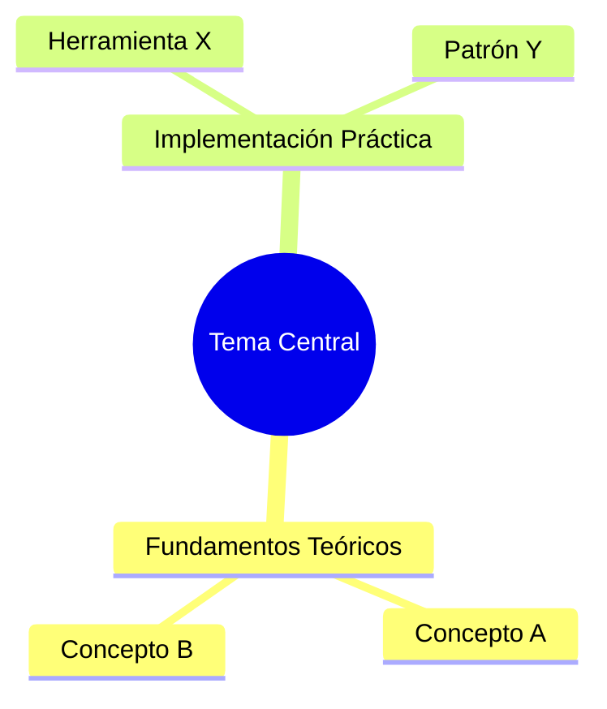

# 📚 Enhanced Learning Content

> **Contenido académico profundo para el Roadmap de Data Engineering**

Este directorio contiene material complementario de nivel universitario/profesional para cada bloque del roadmap. Diseñado para ingenieros que buscan excelencia, no solo copiar código.

---

## 🌐 Estructura Multiidioma

Cada archivo usa **YAML frontmatter** con soporte para 3 idiomas:

```yaml
---
id: "block-identifier"
title:
  es: "Título en Español"
  en: "English Title"
  pt: "Título em Português"
level: 1
phase: "python-pandas"
---
```

El contenido principal está en **español** con secciones claramente marcadas. Para renderizar en otros idiomas, usar el campo `lang` del frontmatter o el sistema de traducción de la plataforma.

---

## 📁 Estructura de Directorios

```
enhanced/
├── README.md                    # Este archivo
├── _template.md                 # Template para nuevos bloques
│
├── level1/                      # Nivel 1: Primer Trabajo
│   ├── 01-python-fundamentals.md
│   ├── 02-pandas-data-manipulation.md
│   ├── 03-sql-fundamentals.md
│   ├── 04-sql-advanced.md
│   ├── 05-git-version-control.md
│   ├── 06-apis-json.md
│   ├── 07-docker-containers.md
│   ├── 08-aws-basics.md
│   ├── 09-snowflake-intro.md
│   └── 10-dbt-fundamentals.md
│
├── level2/                      # Nivel 2: Jr → SSR
│   ├── 01-cloud-architecture.md
│   ├── 02-spark-distributed.md
│   ├── 03-airflow-orchestration.md
│   ├── 04-data-modeling.md
│   ├── 05-data-quality.md
│   └── 06-performance-optimization.md
│
├── level3/                      # Nivel 3: Senior+
│   ├── 01-system-design.md
│   ├── 02-distributed-systems.md
│   ├── 03-streaming-architecture.md
│   ├── 04-technical-leadership.md
│   └── 05-career-growth.md
│
└── specializations/             # Especializaciones
    ├── databricks/
    ├── aws-data/
    └── analytics-engineering/
```

---

## 📐 Formato de Cada Bloque

### Sección 1: Mapa Mental (Mermaid)



### Sección 2: Conexión con First Principles

Tabla que conecta conceptos de CS con implementaciones prácticas.

### Sección 3: Technical Cheat Sheet

- 🖥️ **Comandos CLI críticos**
- 📝 **Snippets de alta densidad**
- 🏗️ **Patrones de diseño**
- ⚠️ **Gotchas de nivel Senior**

### Sección 4: Bibliografía Académica

- 📖 Libros seminales
- 📄 Papers de investigación
- 📋 Whitepapers técnicos

---

## 🎨 Convenciones de Formato

### Emojis Semánticos

| Emoji | Significado |
|-------|-------------|
| 🧠 | Concepto teórico / First Principles |
| 💡 | Insight o tip importante |
| ⚠️ | Advertencia / Gotcha |
| 🔥 | Best practice crítica |
| 📊 | Métrica o benchmark |
| 🔗 | Referencia cruzada |
| ✅ | Correcto / Hacer |
| ❌ | Incorrecto / Evitar |

### Bloques de Código

```python
# ✅ CORRECTO: Código idiomático
df = df.groupby('category').agg({'sales': 'sum'})

# ❌ EVITAR: Anti-patrón
for i in range(len(df)):
    # Nunca iterar fila por fila en Pandas
```

### Callouts (para renderizado web)

```markdown
> [!NOTE]
> Información adicional útil

> [!TIP]
> Consejo de optimización

> [!WARNING]
> Cuidado con este edge case

> [!IMPORTANT]
> Concepto crítico que debes dominar
```

---

## 🔧 Renderizado

### Discord
Los archivos `.md` renderizan directamente. Mermaid no renderiza en Discord pero sí en la web.

### Web (React)
Usar `react-markdown` + `remark-gfm` + `mermaid` para renderizado completo.

### Notion
Copiar/pegar funciona. Mermaid requiere embed de código.

---

## 📝 Cómo Contribuir

1. Usar `_template.md` como base
2. Seguir la estructura de secciones
3. Incluir mínimo:
   - 1 mapa mental Mermaid
   - 5 comandos CLI
   - 3 patrones de diseño
   - 3 gotchas de Senior
   - 5 referencias bibliográficas
4. Verificar que el Mermaid renderiza en [mermaid.live](https://mermaid.live)

---

## 🌍 Traducciones

El contenido principal está en español. Para traducciones:

1. El frontmatter ya tiene los títulos en 3 idiomas
2. El contenido se traduce bajo demanda
3. Prioridad: ES → EN → PT

---

## 🚀 Integración en la Plataforma

Este contenido está **integrado directamente en la plataforma** como una nueva especialización:

### ✅ Acceso desde Especializaciones
- Ve a **Área de Miembros → Especializaciones**
- Encontrarás la nueva especialización **"Fundamentos Teóricos"** 🎓 con badge "NUEVO"
- Explora todos los Deep Dives organizados por categoría y nivel

### ✅ Hints en el Roadmap
- Al trabajar en cada fase del roadmap, verás un **hint sutil** mostrando Deep Dives disponibles
- El hint es completamente **opcional** y no bloquea el progreso
- Click en el hint para ir directamente al Deep Dive relevante

### ✅ XP Bonus
- Cada Deep Dive completado otorga **XP bonus** (40-150 XP según complejidad)
- Se trackea el progreso de forma separada del roadmap principal

### Archivos de Código Relacionados

```
src/
├── types/
│   └── deepDives.ts              # Tipos TypeScript
├── data/
│   └── deepDives/
│       └── index.ts              # Catálogo de Deep Dives y mappings
├── components/
│   └── members/
│       ├── DeepDiveHint.tsx      # Hint compacto para el roadmap
│       ├── DeepDiveViewer.tsx    # Visor de contenido individual
│       └── tabs/
│           └── DeepDivesTab.tsx  # Vista principal de la especialización
```

---

*Última actualización: Enero 2026*

