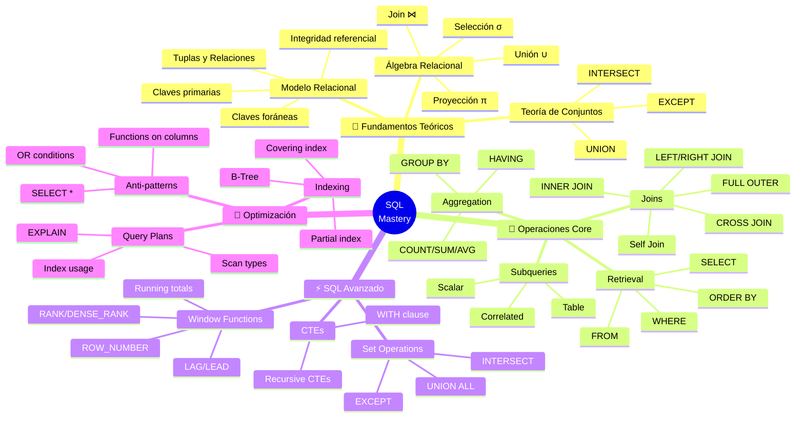

<!-- 
╔══════════════════════════════════════════════════════════════╗
║  📚 BLOQUE: SQL FUNDAMENTALS                                 ║
║  Nivel: 1 | Fase: Core Skills                                ║
╚══════════════════════════════════════════════════════════════╝
-->

# 🗃️ SQL: El Lenguaje Universal de los Datos

> **Objetivo**: Dominar SQL a nivel de entrevista técnica y producción. No solo escribir queries, sino entender cómo el motor las ejecuta y optimizarlas.

---

## 🧠 Mapa Conceptual



---

## 🔗 First Principles: De la Teoría a la Práctica

| Concepto CS | Qué significa | Implementación en SQL |
|-------------|---------------|----------------------|
| **Álgebra Relacional** | Operaciones matemáticas sobre relaciones (tablas) | SELECT = Proyección (π), WHERE = Selección (σ), JOIN = Producto natural (⋈). SQL es un lenguaje declarativo basado en álgebra relacional. |
| **Teoría de Conjuntos** | Operaciones entre conjuntos de elementos | UNION, INTERSECT, EXCEPT. Los resultados de queries son conjuntos de tuplas. |
| **Índices B-Tree** | Estructura de árbol balanceado para búsqueda O(log n) | CREATE INDEX. Sin índice = full table scan O(n). Con índice = búsqueda O(log n). Crítico para performance. |
| **Normalización** | Eliminar redundancia, evitar anomalías | 1NF, 2NF, 3NF. Reduce duplicación pero aumenta JOINs. Data Warehouses desnormalizan intencionalmente (Star Schema). |
| **ACID** | Atomicity, Consistency, Isolation, Durability | Transacciones garantizan integridad. En DW, priorizamos throughput sobre ACID estricto. |
| **Query Optimizer** | El motor decide HOW ejecutar tu query | Escribes QUÉ quieres (declarativo), el optimizador decide el plan. EXPLAIN muestra el plan elegido. |

> [!IMPORTANT]
> 🧠 **First Principle clave**: SQL es **declarativo**: describes QUÉ datos quieres, no CÓMO obtenerlos. El **Query Optimizer** del motor decide el plan de ejecución. Tu trabajo es escribir queries que el optimizador pueda optimizar (evitar anti-patterns).

---

## 📋 Technical Cheat Sheet

### 🖥️ Comandos Críticos por Motor

```sql
-- PostgreSQL: Ver plan de ejecución
EXPLAIN ANALYZE SELECT * FROM orders WHERE status = 'active';

-- Snowflake: Ver plan de ejecución
EXPLAIN USING TEXT SELECT * FROM orders WHERE status = 'active';

-- Ver estructura de tabla
\d orders                    -- PostgreSQL
DESCRIBE TABLE orders;       -- Snowflake/MySQL
sp_help 'orders';            -- SQL Server

-- Ver índices
\di orders                   -- PostgreSQL
SHOW INDEXES FROM orders;    -- MySQL

-- Estadísticas de tabla
ANALYZE orders;              -- PostgreSQL
ANALYZE TABLE orders;        -- Snowflake
```

### 📝 Snippets de Alta Densidad

#### Patrón 1: JOINs - La Base de Todo

```sql
-- 🔥 BEST PRACTICE: Entender EXACTAMENTE qué tipo de JOIN necesitas
-- INNER: Solo filas que coinciden en AMBAS tablas
-- LEFT: TODAS las filas de la izquierda + matches de la derecha
-- RIGHT: Inverso de LEFT
-- FULL OUTER: TODAS las filas de ambas tablas

-- INNER JOIN: Órdenes CON cliente
SELECT o.order_id, o.total, c.name
FROM orders o
INNER JOIN customers c ON o.customer_id = c.id;

-- LEFT JOIN: TODAS las órdenes, incluso sin cliente
SELECT o.order_id, o.total, c.name
FROM orders o
LEFT JOIN customers c ON o.customer_id = c.id;
-- c.name será NULL donde no hay match

-- Anti-Join: Órdenes SIN cliente (data quality check)
SELECT o.order_id, o.total
FROM orders o
LEFT JOIN customers c ON o.customer_id = c.id
WHERE c.id IS NULL;

-- Self-Join: Empleados y sus managers
SELECT 
    e.name AS employee,
    m.name AS manager
FROM employees e
LEFT JOIN employees m ON e.manager_id = m.id;

-- Multiple JOINs: Siempre LEFT desde la tabla de hechos
SELECT 
    o.order_id,
    c.name AS customer,
    p.name AS product,
    s.name AS store
FROM orders o
LEFT JOIN customers c ON o.customer_id = c.id
LEFT JOIN products p ON o.product_id = p.id
LEFT JOIN stores s ON o.store_id = s.id;
```

#### Patrón 2: GROUP BY y Agregaciones

```sql
-- 🔥 BEST PRACTICE: Regla de oro de GROUP BY
-- Toda columna en SELECT debe estar en GROUP BY o ser una agregación

-- Agregación básica
SELECT 
    category,
    COUNT(*) AS order_count,
    SUM(total) AS revenue,
    AVG(total) AS avg_order_value,
    MIN(order_date) AS first_order,
    MAX(order_date) AS last_order
FROM orders
GROUP BY category;

-- HAVING: Filtrar DESPUÉS de agregar
SELECT 
    category,
    SUM(total) AS revenue
FROM orders
GROUP BY category
HAVING SUM(total) > 10000;  -- Solo categorías con +$10K

-- Contar distintos
SELECT 
    category,
    COUNT(DISTINCT customer_id) AS unique_customers
FROM orders
GROUP BY category;

-- Agregación condicional (CASE dentro de agregación)
SELECT 
    category,
    COUNT(*) AS total_orders,
    COUNT(CASE WHEN status = 'completed' THEN 1 END) AS completed,
    COUNT(CASE WHEN status = 'cancelled' THEN 1 END) AS cancelled,
    ROUND(
        100.0 * COUNT(CASE WHEN status = 'completed' THEN 1 END) / COUNT(*), 
        2
    ) AS completion_rate
FROM orders
GROUP BY category;
```

#### Patrón 3: Subqueries y CTEs

```sql
-- 🔥 BEST PRACTICE: CTEs sobre subqueries anidadas para legibilidad
-- Los CTEs se leen de arriba hacia abajo, como código procedural

-- ❌ DIFÍCIL DE LEER - Subqueries anidadas
SELECT *
FROM orders
WHERE customer_id IN (
    SELECT id FROM customers 
    WHERE country IN (
        SELECT country FROM high_value_countries
    )
);

-- ✅ LEGIBLE - CTEs
WITH high_value_countries AS (
    SELECT country
    FROM countries
    WHERE gdp_per_capita > 30000
),
target_customers AS (
    SELECT id
    FROM customers
    WHERE country IN (SELECT country FROM high_value_countries)
)
SELECT *
FROM orders
WHERE customer_id IN (SELECT id FROM target_customers);

-- Subquery escalar (retorna un solo valor)
SELECT 
    order_id,
    total,
    total - (SELECT AVG(total) FROM orders) AS diff_from_avg
FROM orders;

-- EXISTS vs IN (EXISTS suele ser más eficiente)
-- Clientes que tienen al menos una orden
SELECT c.*
FROM customers c
WHERE EXISTS (
    SELECT 1 FROM orders o WHERE o.customer_id = c.id
);
```

#### Patrón 4: CASE Expressions

```sql
-- 🔥 BEST PRACTICE: CASE es tu if/else en SQL
-- Úsalo para categorización, limpieza, y lógica condicional

-- Categorización
SELECT 
    order_id,
    total,
    CASE 
        WHEN total >= 1000 THEN 'high'
        WHEN total >= 100 THEN 'medium'
        ELSE 'low'
    END AS order_tier
FROM orders;

-- NULL handling con COALESCE (shorthand para CASE)
SELECT 
    product_name,
    COALESCE(discount, 0) AS discount,  -- NULL → 0
    COALESCE(category, 'Uncategorized') AS category
FROM products;

-- NULLIF: Retorna NULL si los valores son iguales (evita división por 0)
SELECT 
    region,
    total_sales / NULLIF(total_orders, 0) AS avg_order_value
FROM sales_summary;

-- Pivoting con CASE (crosstab manual)
SELECT 
    product_id,
    SUM(CASE WHEN month = 1 THEN sales ELSE 0 END) AS jan_sales,
    SUM(CASE WHEN month = 2 THEN sales ELSE 0 END) AS feb_sales,
    SUM(CASE WHEN month = 3 THEN sales ELSE 0 END) AS mar_sales
FROM monthly_sales
GROUP BY product_id;
```

### 🏗️ Patrones de Diseño Aplicados

#### 1. Star Schema Query Pattern

```sql
-- El patrón más común en Data Warehousing
-- Tabla de hechos (facts) en el centro, dimensiones alrededor

/*
    ┌───────────┐     ┌───────────────┐     ┌───────────┐
    │  dim_date │     │  fact_sales   │     │ dim_store │
    └─────┬─────┘     │   (grain:     │     └─────┬─────┘
          │           │    1 row per  │           │
          └───────────│    sale)      │───────────┘
                      │               │
    ┌─────────────────┤               ├───────────────────┐
    │                 └───────────────┘                   │
┌───▼───────┐                                     ┌───────▼───┐
│dim_product│                                     │dim_customer│
└───────────┘                                     └───────────┘
*/

SELECT 
    d.year,
    d.quarter,
    s.store_name,
    p.category,
    SUM(f.quantity) AS units_sold,
    SUM(f.revenue) AS total_revenue
FROM fact_sales f
INNER JOIN dim_date d ON f.date_key = d.date_key
INNER JOIN dim_store s ON f.store_key = s.store_key
INNER JOIN dim_product p ON f.product_key = p.product_key
WHERE d.year = 2024
GROUP BY d.year, d.quarter, s.store_name, p.category
ORDER BY total_revenue DESC;
```

**Cuándo usar**: Cualquier query analítica en un Data Warehouse.

#### 2. Incremental Load Pattern

```sql
-- Cargar solo datos nuevos/modificados
-- Requiere columna de auditoría (updated_at, created_at)

-- Obtener marca de agua alta (último dato procesado)
WITH watermark AS (
    SELECT COALESCE(MAX(loaded_at), '1900-01-01') AS last_load
    FROM target_table
)
-- Seleccionar solo registros nuevos
SELECT s.*
FROM source_table s
CROSS JOIN watermark w
WHERE s.updated_at > w.last_load;
```

**Cuándo usar**: ETL incremental, evitar reprocesar todo cada vez.

#### 3. SCD Type 2 Pattern (Slowly Changing Dimensions)

```sql
-- Mantener historial de cambios en dimensiones
-- Cada cambio crea nueva fila con fechas de vigencia

/*
| customer_id | name     | email          | valid_from | valid_to   | is_current |
|-------------|----------|----------------|------------|------------|------------|
| 1           | John Doe | old@email.com  | 2023-01-01 | 2024-06-15 | false      |
| 1           | John Doe | new@email.com  | 2024-06-15 | 9999-12-31 | true       |
*/

-- Query: Estado actual
SELECT * FROM dim_customer WHERE is_current = true;

-- Query: Estado en una fecha específica
SELECT * 
FROM dim_customer 
WHERE customer_id = 1 
  AND '2024-01-01' BETWEEN valid_from AND valid_to;

-- MERGE para actualizar (Snowflake/SQL Server)
MERGE INTO dim_customer tgt
USING staging_customer src
ON tgt.customer_id = src.customer_id AND tgt.is_current = true
WHEN MATCHED AND tgt.email <> src.email THEN
    UPDATE SET 
        valid_to = CURRENT_DATE,
        is_current = false
WHEN NOT MATCHED THEN
    INSERT (customer_id, name, email, valid_from, valid_to, is_current)
    VALUES (src.customer_id, src.name, src.email, CURRENT_DATE, '9999-12-31', true);
```

### ⚠️ Gotchas de Nivel Senior

> [!WARNING]
> **Gotcha #1: NULL no es igual a nada (ni a sí mismo)**
> 
> NULL representa "desconocido", no "vacío" o "cero".
> 
> ```sql
> -- ❌ ESTO NO FUNCIONA COMO ESPERAS
> SELECT * FROM users WHERE status = NULL;     -- Siempre vacío!
> SELECT * FROM users WHERE status <> 'active'; -- No incluye NULLs!
> 
> -- ✅ CORRECTO
> SELECT * FROM users WHERE status IS NULL;
> SELECT * FROM users WHERE status IS DISTINCT FROM 'active';  -- Incluye NULLs
> SELECT * FROM users WHERE status <> 'active' OR status IS NULL;
> 
> -- NULL en agregaciones
> SELECT AVG(salary) FROM employees;  -- Ignora NULLs automáticamente
> SELECT COUNT(*) FROM employees;      -- Cuenta todas las filas
> SELECT COUNT(salary) FROM employees; -- Cuenta solo no-NULL
> ```

> [!WARNING]
> **Gotcha #2: DISTINCT en columnas con NULL**
> 
> DISTINCT trata múltiples NULLs como un solo valor.
> 
> ```sql
> -- Si tienes [1, 2, NULL, NULL, 3]
> SELECT DISTINCT category FROM products;
> -- Resultado: [1, 2, NULL, 3] -- Solo un NULL
> 
> -- COUNT DISTINCT también
> SELECT COUNT(DISTINCT category) FROM products;
> -- Resultado: 3 (no cuenta el NULL)
> ```

> [!WARNING]
> **Gotcha #3: Integer Division**
> 
> En muchos motores, división de enteros retorna entero.
> 
> ```sql
> -- ❌ RESULTADO INCORRECTO
> SELECT 5 / 2;  -- Resultado: 2 (no 2.5!)
> 
> -- ✅ FORZAR DIVISIÓN DECIMAL
> SELECT 5.0 / 2;         -- 2.5
> SELECT CAST(5 AS DECIMAL) / 2;  -- 2.5
> SELECT 5 / 2.0;         -- 2.5
> 
> -- Para porcentajes
> SELECT 100.0 * completados / total AS completion_rate;  -- Notar el .0
> ```

> [!WARNING]
> **Gotcha #4: ORDER BY y NULL**
> 
> El orden de NULLs varía según el motor.
> 
> ```sql
> -- PostgreSQL/Oracle: NULLs al final (ASC) o primero (DESC)
> -- SQL Server/MySQL: NULLs al principio (ASC)
> 
> -- ✅ SER EXPLÍCITO
> ORDER BY column ASC NULLS LAST;   -- PostgreSQL
> ORDER BY column ASC NULLS FIRST;
> 
> -- Para motores que no soportan NULLS FIRST/LAST
> ORDER BY CASE WHEN column IS NULL THEN 1 ELSE 0 END, column;
> ```

> [!WARNING]
> **Gotcha #5: NOT IN con NULL**
> 
> Si la subquery contiene NULL, NOT IN retorna vacío.
> 
> ```sql
> -- Si la lista contiene NULL, NINGÚN resultado!
> SELECT * FROM orders 
> WHERE customer_id NOT IN (SELECT id FROM blacklist);
> -- Si blacklist tiene un id NULL → resultado vacío
> 
> -- ✅ USAR NOT EXISTS en su lugar
> SELECT * FROM orders o
> WHERE NOT EXISTS (
>     SELECT 1 FROM blacklist b WHERE b.id = o.customer_id
> );
> 
> -- ✅ O filtrar NULLs explícitamente
> SELECT * FROM orders 
> WHERE customer_id NOT IN (
>     SELECT id FROM blacklist WHERE id IS NOT NULL
> );
> ```

---

## 📊 Métricas de Performance

| Tipo de operación | Sin índice | Con índice | Notas |
|-------------------|------------|------------|-------|
| Lookup por PK | O(n) | O(log n) | **Siempre indexar PKs** |
| WHERE con = | O(n) full scan | O(log n) | Crear índice si se filtra frecuentemente |
| WHERE con LIKE 'abc%' | O(n) | O(log n) | Índice usado solo si wildcard al final |
| WHERE con LIKE '%abc' | O(n) | O(n) | Índice NO usado con wildcard al inicio |
| JOIN sin índice | O(n × m) | O(n log m) | Índices en claves foráneas críticos |
| ORDER BY | O(n log n) | O(n) | Índice evita sort si ya está ordenado |

---

## 📚 Bibliografía Académica y Profesional

### 📖 Libros Seminales

| Libro | Autor | Capítulos relevantes | Por qué leerlo |
|-------|-------|---------------------|----------------|
| **SQL Performance Explained** | Markus Winand | Todo (es corto) | El mejor libro sobre optimización SQL. Explica índices y planes de ejecución. |
| **The Data Warehouse Toolkit** | Ralph Kimball | Caps. 1-4, 17-19 | Modelado dimensional, Star Schema. LA referencia para DW. |
| **Learning SQL** (3rd Ed) | Alan Beaulieu | Todo | Para reforzar fundamentos. Claro y completo. |
| **SQL Antipatterns** | Bill Karwin | Todo | Errores comunes y cómo evitarlos. Muy práctico. |

### 📄 Papers de Investigación

1. **"A Relational Model of Data for Large Shared Data Banks"** (1970) - E.F. Codd
   - 🔗 [Paper original](https://www.seas.upenn.edu/~zives/03f/cis550/codd.pdf)
   - 💡 **Insight clave**: El paper que inventó las bases de datos relacionales. Álgebra relacional original.

2. **"Access Path Selection in a Relational Database Management System"** (1979) - Selinger et al.
   - 🔗 [IBM Research](https://courses.cs.duke.edu/compsci516/cps216/spring03/papers/selinger-etal-1979.pdf)
   - 💡 **Insight clave**: Cómo funciona el query optimizer. Base de todos los optimizadores modernos.

3. **"The Design and Implementation of Modern Column-Oriented Database Systems"** (2012)
   - 🔗 [Foundations and Trends](https://stratos.seas.harvard.edu/files/stratos/files/columnstoresfntdbs.pdf)
   - 💡 **Insight clave**: Por qué los Data Warehouses usan almacenamiento columnar (Redshift, BigQuery, Snowflake).

### 📋 Whitepapers y Documentación Técnica

- **Use The Index, Luke**
  - 🔗 [use-the-index-luke.com](https://use-the-index-luke.com/)
  - Relevancia: Tutorial interactivo sobre índices y optimización SQL. Del autor de SQL Performance Explained.

- **PostgreSQL Documentation - Query Planning**
  - 🔗 [postgresql.org](https://www.postgresql.org/docs/current/planner-optimizer.html)
  - Relevancia: Entender cómo PostgreSQL optimiza queries.

- **Snowflake Query Optimization**
  - 🔗 [docs.snowflake.com](https://docs.snowflake.com/en/user-guide/performance-query-optimization)
  - Relevancia: Optimización específica para Data Warehouses cloud.

---

## 🔄 Conexiones con Otros Bloques

| Bloque relacionado | Tipo de conexión | Descripción |
|-------------------|------------------|-------------|
| **SQL Advanced** | Continuación directa | Window Functions, CTEs recursivos, optimización |
| **Pandas** | Paralelo | Mismas operaciones, diferente sintaxis |
| **Snowflake** (Nivel 1) | Aplicación | Usar SQL en un DW cloud moderno |
| **dbt** (Nivel 1) | Extensión | SQL + versionado + testing |
| **Data Modeling** (Nivel 2) | Profundización | Star Schema, normalización, SCDs |

---

## ✅ Checklist de Dominio

Antes de avanzar, verifica que puedes:

- [ ] Escribir JOINs sin pensar (INNER, LEFT, RIGHT)
- [ ] Usar GROUP BY + HAVING correctamente
- [ ] Escribir subqueries y CTEs
- [ ] Manejar NULLs sin bugs (IS NULL, COALESCE, etc.)
- [ ] Usar CASE para lógica condicional
- [ ] Explicar qué hace EXPLAIN
- [ ] Identificar cuándo falta un índice
- [ ] Escribir anti-joins (encontrar registros sin match)
- [ ] Resolver el problema "top N por grupo" (spoiler: Window Functions)
- [ ] Completar ejercicios Medium de DataLemur

---

## 💬 Preguntas de Autoevaluación

1. **Conceptual**: ¿Por qué `WHERE status = NULL` no funciona? ¿Qué filosofía de NULL sigue SQL?

2. **Práctica**: Tienes una tabla de eventos con 500M filas. Un query con `WHERE event_date = '2024-01-15'` tarda 30 segundos. ¿Qué investigarías primero? ¿Cómo lo acelerarías?

3. **Diseño**: Necesitas reportar ventas por producto, tienda y fecha. Los usuarios filtran por cualquier combinación de esas 3 dimensiones. ¿Cómo modelarías las tablas? ¿Qué índices crearías?

---

*Última actualización: Enero 2026 | Versión: 1.0.0*

