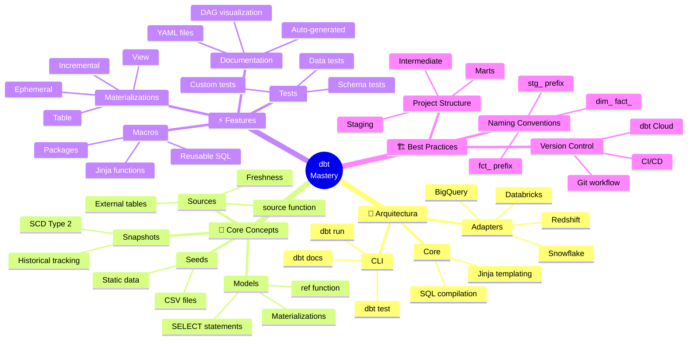

<!-- 
╔══════════════════════════════════════════════════════════════╗
║  📚 BLOQUE: dbt FUNDAMENTALS                                 ║
║  Nivel: 1 | Fase: Transformaciones                          ║
╚══════════════════════════════════════════════════════════════╝
-->

# 🔧 dbt: Transformaciones como Código

> **Objetivo**: Dominar dbt como herramienta de transformación de datos. Entender el paradigma ELT, macros, tests, y el rol de Analytics Engineer.

---

## 🧠 Mapa Conceptual



---

## 🔗 First Principles: De la Teoría a la Práctica

| Concepto | Qué significa | Implementación en dbt |
|----------|---------------|----------------------|
| **ELT vs ETL** | Cargar primero, transformar después | dbt asume datos ya en warehouse. Transforma con SQL, no extrae ni carga. |
| **Idempotencia** | Re-ejecutar produce mismo resultado | Cada `dbt run` recrea modelos. No hay side effects acumulativos. |
| **Lineage** | Seguir el origen de cada dato | La función `ref()` crea un grafo de dependencias automático. |
| **Materialización** | Cómo se persiste un modelo | Views para ligero, Tables para pesado, Incremental para append. |
| **Single Source of Truth** | Una definición por entidad | Un modelo `dim_customers` es LA definición del cliente en toda la org. |

> [!IMPORTANT]
> 🧠 **First Principle clave**: dbt convierte el warehouse en tu **runtime de transformación**. Aprovecha el poder de cómputo del warehouse (Snowflake, BigQuery) en lugar de mover datos a un servidor ETL.

---

## 📋 Technical Cheat Sheet

### 🖥️ Comandos CLI Críticos

```bash
# Inicializar proyecto dbt
dbt init my_project

# Verificar conexión al warehouse
dbt debug

# Compilar modelos (ver SQL generado sin ejecutar)
dbt compile

# Ejecutar todos los modelos
dbt run

# Ejecutar modelo específico
dbt run --select my_model

# Ejecutar modelo y sus dependencias upstream
dbt run --select +my_model

# Ejecutar modelo y sus dependientes downstream
dbt run --select my_model+

# Ejecutar tests
dbt test

# Ejecutar tests de un modelo específico
dbt test --select my_model

# Generar documentación
dbt docs generate

# Servir documentación localmente
dbt docs serve

# Ejecutar seeds (CSV → tabla)
dbt seed

# Ejecutar snapshots (SCD Type 2)
dbt snapshot

# Full refresh de modelo incremental
dbt run --full-refresh --select my_incremental_model

# Build = run + test (recomendado para CI/CD)
dbt build
```

### 📝 Snippets de Alta Densidad

#### Modelo Básico: Staging

```sql
-- models/staging/stg_orders.sql
-- 🔥 BEST PRACTICE: Staging = 1:1 con source, limpieza mínima

{{
  config(
    materialized='view',
    schema='staging'
  )
}}

with source as (
    select * from {{ source('raw', 'orders') }}
),

renamed as (
    select
        -- 🔑 Primary Key siempre primero
        id as order_id,
        
        -- 📅 Timestamps estandarizados
        created_at::timestamp as order_created_at,
        updated_at::timestamp as order_updated_at,
        
        -- 🔢 Campos numéricos con tipos explícitos
        amount::decimal(18, 2) as order_amount,
        
        -- 📝 Strings limpiados
        lower(trim(status)) as order_status,
        
        -- 🔗 Foreign Keys
        customer_id,
        
        -- 📊 Metadata
        _loaded_at as _stg_loaded_at

    from source
    where id is not null  -- Filtrar registros inválidos
)

select * from renamed
```

#### Modelo Intermedio: Transformación

```sql
-- models/intermediate/int_orders_enriched.sql
-- 🔥 BEST PRACTICE: Intermediate = lógica de negocio compleja

{{
  config(
    materialized='ephemeral'  -- No se persiste, solo se usa en otros modelos
  )
}}

with orders as (
    select * from {{ ref('stg_orders') }}
),

customers as (
    select * from {{ ref('stg_customers') }}
),

enriched as (
    select
        o.order_id,
        o.order_created_at,
        o.order_amount,
        o.order_status,
        
        -- Enriquecer con datos de cliente
        c.customer_name,
        c.customer_segment,
        c.customer_country,
        
        -- Campos calculados
        case 
            when o.order_amount >= 1000 then 'high_value'
            when o.order_amount >= 100 then 'medium_value'
            else 'low_value'
        end as order_tier,
        
        -- Flags de negocio
        o.order_status = 'completed' as is_completed,
        o.order_status in ('cancelled', 'refunded') as is_cancelled

    from orders o
    left join customers c on o.customer_id = c.customer_id
)

select * from enriched
```

#### Modelo de Mart: Fact Table

```sql
-- models/marts/core/fct_orders.sql
-- 🔥 BEST PRACTICE: Marts = tablas finales para consumo

{{
  config(
    materialized='incremental',
    unique_key='order_id',
    incremental_strategy='merge',
    on_schema_change='append_new_columns'
  )
}}

with orders as (
    select * from {{ ref('int_orders_enriched') }}
    
    where order_created_at > (select max(order_created_at) from {{ this }})
    
),

final as (
    select
        -- 🔑 Keys
        order_id,
        customer_id,
        
        -- 📅 Date dimensions (para joins con dim_date)
        {{ dbt_date.date_part('date', 'order_created_at') }} as order_date,
        {{ dbt_date.date_part('month', 'order_created_at') }} as order_month,
        {{ dbt_date.date_part('year', 'order_created_at') }} as order_year,
        
        -- 📊 Measures
        order_amount,
        1 as order_count,  -- Para SUM(order_count) en BI
        
        -- 🏷️ Attributes
        order_tier,
        order_status,
        is_completed,
        is_cancelled,
        
        -- 📋 Enriched attributes
        customer_name,
        customer_segment,
        customer_country,
        
        -- ⏰ Timestamps
        order_created_at,
        current_timestamp() as _dbt_updated_at

    from orders
)

select * from final
```

#### Macro Reutilizable

```sql
-- macros/cents_to_dollars.sql
-- 🔥 BEST PRACTICE: Macros para lógica repetitiva


    round({{ column_name }}::decimal / 100, {{ decimal_places }})


-- Uso en modelo:
-- select {{ cents_to_dollars('amount_cents') }} as amount_dollars
```

```sql
-- macros/generate_schema_name.sql
-- 🔥 BEST PRACTICE: Control de schemas por ambiente


    
    
        {{ default_schema }}
    
        {{ default_schema }}_{{ custom_schema_name }}
    

```

### 🏗️ Estructura de Proyecto Recomendada

```
my_dbt_project/
├── dbt_project.yml
├── profiles.yml          # Conexión al warehouse
├── packages.yml          # Dependencias externas
│
├── models/
│   ├── staging/          # 1:1 con sources
│   │   ├── _stg_sources.yml
│   │   ├── stg_orders.sql
│   │   └── stg_customers.sql
│   │
│   ├── intermediate/     # Lógica de negocio
│   │   ├── int_orders_enriched.sql
│   │   └── int_customer_metrics.sql
│   │
│   └── marts/            # Tablas para consumo
│       ├── core/
│       │   ├── _core_models.yml
│       │   ├── dim_customers.sql
│       │   └── fct_orders.sql
│       └── marketing/
│           └── fct_campaigns.sql
│
├── macros/
│   ├── cents_to_dollars.sql
│   └── generate_schema_name.sql
│
├── seeds/
│   └── country_codes.csv
│
├── snapshots/
│   └── customers_snapshot.sql
│
└── tests/
    └── assert_positive_amount.sql
```

### ⚠️ Gotchas de Nivel Senior

> [!WARNING]
> **Gotcha #1: Incremental sin unique_key**
> 
> Sin `unique_key`, los modelos incrementales duplican registros.
> 
> ```sql
> -- ❌ PELIGROSO - Duplica registros en cada run
> {{ config(materialized='incremental') }}
> select * from source
> 
> -- ✅ CORRECTO - Merge por key
> {{ config(
>     materialized='incremental',
>     unique_key='order_id',
>     incremental_strategy='merge'
> ) }}
> ```

> [!WARNING]
> **Gotcha #2: ref() en Jinja condicional**
> 
> dbt necesita ver todas las `ref()` para construir el DAG.
> 
> ```sql
> -- ❌ BUG - ref() dentro de if no se detecta
> 
>     select * from {{ ref('my_model') }}
> 
> 
> -- ✅ CORRECTO - ref() siempre visible
> 
> 
>     select * from {{ my_model }}
> 
> ```

> [!WARNING]
> **Gotcha #3: source() freshness sin configurar**
> 
> Freshness checks fallan silenciosamente si no están configurados.
> 
> ```yaml
> # sources.yml
> sources:
>   - name: raw
>     freshness:
>       warn_after: {count: 12, period: hour}
>       error_after: {count: 24, period: hour}
>     loaded_at_field: _loaded_at  # ¡CRÍTICO!
>     tables:
>       - name: orders
> ```

> [!WARNING]
> **Gotcha #4: Tests en CI sin datos**
> 
> Tests de schema pueden fallar en CI si la tabla está vacía.
> 
> ```yaml
> # Usar where para evitar falsos positivos
> - name: order_id
>   tests:
>     - unique:
>         config:
>           where: "order_created_at >= current_date - 7"
> ```

---

## 📊 Comparativa de Materializaciones

| Materialización | Cuándo usar | Pros | Contras |
|-----------------|-------------|------|---------|
| **View** | Modelos staging, datos pequeños | Sin storage, siempre actualizado | Query lento si lógica compleja |
| **Table** | Modelos finales, queries frecuentes | Query rápido | Rebuild completo cada run |
| **Incremental** | Fact tables grandes, datos append-only | Eficiente en tiempo y costo | Complejidad, edge cases |
| **Ephemeral** | CTEs reutilizables, intermedios | Sin storage, se inlinea | No visible en warehouse |

---

## 📚 Bibliografía Académica y Profesional

### 📖 Libros y Recursos Seminales

| Recurso | Autor | Por qué consumirlo |
|---------|-------|-------------------|
| **dbt Documentation** | dbt Labs | La fuente de verdad oficial. Excelente y completa. |
| **The Analytics Engineering Guide** | dbt Labs | Filosofía y principios del rol de AE. |
| **Data Modeling with dbt** | dbt Learn | Curso interactivo oficial. |
| **The Data Warehouse Toolkit** | Ralph Kimball | Fundamentos de modelado dimensional que dbt implementa. |

### 📄 Recursos Clave

1. **dbt Best Practices**
   - 🔗 [docs.getdbt.com/best-practices](https://docs.getdbt.com/best-practices)
   - 💡 **Insight clave**: Estructura de proyecto, naming, estilos.

2. **dbt Discourse**
   - 🔗 [discourse.getdbt.com](https://discourse.getdbt.com)
   - 💡 **Insight clave**: Comunidad activa, Q&A, patterns avanzados.

3. **Fishtown Analytics Blog**
   - 🔗 [blog.getdbt.com](https://blog.getdbt.com)
   - 💡 **Insight clave**: Evolución del producto, casos de uso.

---

## ✅ Checklist de Dominio

Antes de avanzar, verifica que puedes:

- [ ] Crear un proyecto dbt desde cero con `dbt init`
- [ ] Explicar la diferencia entre `ref()` y `source()`
- [ ] Escribir modelos staging siguiendo convenciones
- [ ] Configurar materializaciones según el caso de uso
- [ ] Crear y ejecutar tests de schema y datos
- [ ] Escribir macros Jinja reutilizables
- [ ] Configurar incrementales con `unique_key` y `is_incremental()`
- [ ] Generar y navegar la documentación con `dbt docs`
- [ ] Explicar qué es un snapshot y cuándo usarlo
- [ ] Estructurar un proyecto con staging/intermediate/marts

---

*Última actualización: Enero 2026 | Versión: 1.0.0*

