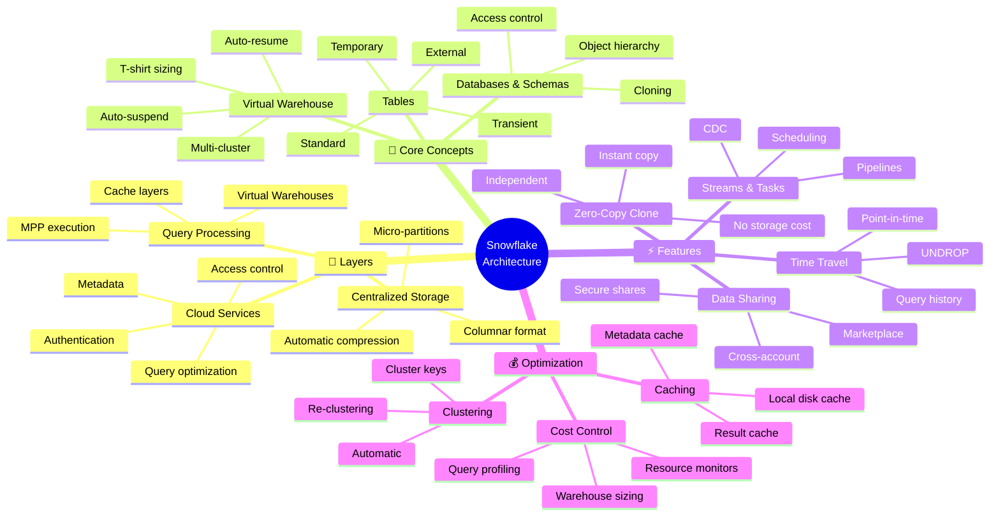

<!-- 
╔══════════════════════════════════════════════════════════════╗
║  📚 BLOQUE: SNOWFLAKE ARCHITECTURE                          ║
║  Nivel: 1 | Fase: Cloud Data Warehouse                      ║
╚══════════════════════════════════════════════════════════════╝
-->

# ❄️ Snowflake: Arquitectura Cloud-Native

> **Objetivo**: Entender la arquitectura revolucionaria de Snowflake. Dominar Virtual Warehouses, micro-partitions, clustering, y optimización de costos.

---

## 🧠 Mapa Conceptual



---

## 🔗 First Principles: De la Teoría a la Práctica

| Concepto | Qué significa | Implementación en Snowflake |
|----------|---------------|----------------------------|
| **Separación Storage/Compute** | Storage y cómputo son independientes | Puedes escalar compute sin afectar storage. Múltiples warehouses acceden a los mismos datos. |
| **Columnar Storage** | Datos almacenados por columna | Queries analíticos (SELECT col1, col2) solo leen columnas necesarias. Compresión eficiente. |
| **Micro-partitions** | Archivos inmutables de 50-500MB | Automatic partitioning. Pruning basado en metadata. No necesitas particionar manualmente. |
| **MPP (Massively Parallel Processing)** | Query distribuido en múltiples nodos | Cada warehouse tiene múltiples nodos que procesan en paralelo. |
| **Zero-Copy Clone** | Copia por referencia, no por valor | Clone de 10TB tarda segundos y no consume storage adicional hasta que hay cambios. |

> [!IMPORTANT]
> 🧠 **First Principle clave**: Snowflake es **software as a service**. No hay infra que manejar, no hay tuning de JVM, no hay clusters que configurar. Pagas por lo que usas: storage + compute time.

---

## 📋 Technical Cheat Sheet

### 🖥️ Comandos SQL Críticos

```sql
-- ═══════════════════════════════════════════════════
-- VIRTUAL WAREHOUSES
-- ═══════════════════════════════════════════════════

-- Crear warehouse con auto-suspend
CREATE WAREHOUSE analytics_wh
  WITH WAREHOUSE_SIZE = 'MEDIUM'
  AUTO_SUSPEND = 60           -- Segundos de inactividad
  AUTO_RESUME = TRUE
  INITIALLY_SUSPENDED = TRUE;

-- Cambiar tamaño en caliente (sin downtime)
ALTER WAREHOUSE analytics_wh SET WAREHOUSE_SIZE = 'LARGE';

-- Multi-cluster warehouse (para alta concurrencia)
CREATE WAREHOUSE reporting_wh
  WITH WAREHOUSE_SIZE = 'SMALL'
  MIN_CLUSTER_COUNT = 1
  MAX_CLUSTER_COUNT = 4
  SCALING_POLICY = 'STANDARD';

-- Suspender manualmente
ALTER WAREHOUSE analytics_wh SUSPEND;

-- ═══════════════════════════════════════════════════
-- TIME TRAVEL
-- ═══════════════════════════════════════════════════

-- Tabla estándar con 90 días de time travel
CREATE TABLE orders (
    order_id INT,
    amount DECIMAL(18,2),
    created_at TIMESTAMP
) DATA_RETENTION_TIME_IN_DAYS = 90;

-- Query de hace 1 hora
SELECT * FROM orders AT(OFFSET => -3600);

-- Query de momento específico
SELECT * FROM orders AT(TIMESTAMP => '2026-01-05 10:00:00'::TIMESTAMP);

-- Query antes de un statement específico
SELECT * FROM orders BEFORE(STATEMENT => '8e5d0ca9-005e-44e6-b858-a8f5b37c5726');

-- Restaurar tabla borrada
UNDROP TABLE orders;

-- ═══════════════════════════════════════════════════
-- ZERO-COPY CLONE
-- ═══════════════════════════════════════════════════

-- Clonar tabla (instantáneo, sin costo de storage)
CREATE TABLE orders_backup CLONE orders;

-- Clonar schema completo
CREATE SCHEMA dev_schema CLONE prod_schema;

-- Clonar base de datos completa
CREATE DATABASE dev_db CLONE prod_db;

-- Clone de punto en el tiempo
CREATE TABLE orders_yesterday CLONE orders 
  AT(OFFSET => -86400);

-- ═══════════════════════════════════════════════════
-- CLUSTERING
-- ═══════════════════════════════════════════════════

-- Definir cluster key
ALTER TABLE orders CLUSTER BY (order_date, customer_id);

-- Ver clustering info
SELECT SYSTEM$CLUSTERING_INFORMATION('orders', '(order_date)');

-- Ver clustering depth (0 = perfect, higher = more overlap)
SELECT SYSTEM$CLUSTERING_DEPTH('orders');

-- ═══════════════════════════════════════════════════
-- PERFORMANCE ANALYSIS
-- ═══════════════════════════════════════════════════

-- Ver query profile (después de ejecutar query)
-- Click en Query ID en la UI para ver plan gráfico

-- Ver queries lentas
SELECT 
    query_id,
    query_text,
    total_elapsed_time / 1000 as seconds,
    bytes_scanned / 1e9 as gb_scanned,
    rows_produced
FROM TABLE(INFORMATION_SCHEMA.QUERY_HISTORY())
WHERE total_elapsed_time > 10000  -- > 10 segundos
ORDER BY total_elapsed_time DESC
LIMIT 20;

-- Ver partitions pruned
SELECT 
    query_id,
    partitions_scanned,
    partitions_total,
    round(100 * (1 - partitions_scanned / partitions_total), 2) as prune_pct
FROM TABLE(INFORMATION_SCHEMA.QUERY_HISTORY())
WHERE partitions_total > 0
ORDER BY start_time DESC
LIMIT 20;
```

### 📝 Patrones de Optimización

#### Patrón 1: Partition Pruning Eficiente

```sql
-- 🔥 BEST PRACTICE: Filtrar por cluster key
-- Snowflake prune micro-partitions automáticamente

-- ❌ EVITAR - Función en columna impide pruning
SELECT * FROM orders
WHERE DATE(created_at) = '2026-01-05';

-- ✅ CORRECTO - Predicado directo permite pruning
SELECT * FROM orders
WHERE created_at >= '2026-01-05' 
  AND created_at < '2026-01-06';

-- ✅ MEJOR - Si tienes una columna date pre-calculada
SELECT * FROM orders
WHERE order_date = '2026-01-05';
```

#### Patrón 2: Evitar SELECT *

```sql
-- ❌ EVITAR - Lee todas las columnas (costoso en columnar)
SELECT * FROM large_table WHERE id = 123;

-- ✅ CORRECTO - Solo columnas necesarias
SELECT id, name, amount FROM large_table WHERE id = 123;
```

#### Patrón 3: Materializar Subqueries Costosas

```sql
-- ❌ EVITAR - Subquery ejecutada muchas veces
SELECT *
FROM orders o
WHERE customer_id IN (
    SELECT customer_id FROM customers WHERE segment = 'enterprise'
);

-- ✅ CORRECTO - CTE materializado una vez
WITH enterprise_customers AS (
    SELECT customer_id FROM customers WHERE segment = 'enterprise'
)
SELECT o.*
FROM orders o
INNER JOIN enterprise_customers ec ON o.customer_id = ec.customer_id;
```

### 🏗️ Arquitectura Recomendada

```
┌─────────────────────────────────────────────────────────────┐
│                    SNOWFLAKE ACCOUNT                        │
├─────────────────────────────────────────────────────────────┤
│                                                             │
│  ┌─────────────────┐  ┌─────────────────┐                 │
│  │   RAW_DB        │  │   ANALYTICS_DB  │                 │
│  │   (Landing)     │  │   (Curated)     │                 │
│  │                 │  │                 │                 │
│  │  • raw.orders   │  │  • staging.*    │                 │
│  │  • raw.users    │  │  • marts.*      │                 │
│  │  • raw.events   │  │  • reporting.*  │                 │
│  └────────┬────────┘  └────────┬────────┘                 │
│           │                    │                           │
│           └──────────┬─────────┘                           │
│                      ▼                                     │
│  ┌─────────────────────────────────────────────────────┐  │
│  │              VIRTUAL WAREHOUSES                      │  │
│  │                                                      │  │
│  │  [ETL_WH]     [ANALYTICS_WH]     [REPORTING_WH]    │  │
│  │   X-Large         Medium            Small          │  │
│  │   Auto-suspend    Multi-cluster     Auto-suspend   │  │
│  │   5 min           Max 4 clusters    2 min          │  │
│  └─────────────────────────────────────────────────────┘  │
│                                                             │
└─────────────────────────────────────────────────────────────┘
```

### ⚠️ Gotchas de Nivel Senior

> [!WARNING]
> **Gotcha #1: Warehouse auto-suspend vs caching**
> 
> Si suspendes muy rápido, pierdes el cache local.
> 
> ```sql
> -- ❌ Muy agresivo - pierde cache constantemente
> ALTER WAREHOUSE wh SET AUTO_SUSPEND = 30;
> 
> -- ✅ Balance - mantiene cache para queries repetidos
> ALTER WAREHOUSE wh SET AUTO_SUSPEND = 300;  -- 5 minutos
> ```

> [!WARNING]
> **Gotcha #2: VARIANT queries sin optimizar**
> 
> Queries sobre VARIANT (JSON) pueden ser lentos si no materializas.
> 
> ```sql
> -- ❌ LENTO - Parsing JSON en cada query
> SELECT raw_json:customer:id::string FROM events;
> 
> -- ✅ MEJOR - Materializar columnas usadas frecuentemente
> CREATE TABLE events_flat AS
> SELECT 
>     raw_json:customer:id::string as customer_id,
>     raw_json:event_type::string as event_type,
>     raw_json:timestamp::timestamp as event_time
> FROM events;
> ```

> [!WARNING]
> **Gotcha #3: Transient tables y Time Travel**
> 
> Transient tables solo tienen 1 día de time travel, no 90.
> 
> ```sql
> -- Transient = sin Fail-safe, max 1 día Time Travel
> CREATE TRANSIENT TABLE staging_temp (...);
> 
> -- Usar solo para datos que puedes regenerar
> ```

> [!WARNING]
> **Gotcha #4: Clustering en tablas pequeñas**
> 
> Clustering tiene overhead. Solo beneficia tablas grandes (>1TB).
> 
> ```sql
> -- ❌ Innecesario - tabla pequeña
> ALTER TABLE lookup_table CLUSTER BY (id);
> 
> -- ✅ Solo para tablas grandes con queries filtrados
> ALTER TABLE fact_orders CLUSTER BY (order_date, customer_id);
> ```

---

## 📊 Comparativa de Table Types

| Tipo | Time Travel | Fail-safe | Uso recomendado |
|------|-------------|-----------|-----------------|
| **Standard** | 0-90 días | 7 días | Datos de producción |
| **Transient** | 0-1 día | No | ETL staging, datos regenerables |
| **Temporary** | 0-1 día | No | Session-only, CTEs materializados |
| **External** | No | No | Data lake, archivos en S3/GCS |

---

## 📚 Bibliografía Académica y Profesional

### 📖 Recursos Seminales

| Recurso | Autor | Por qué consumirlo |
|---------|-------|-------------------|
| **Snowflake Documentation** | Snowflake | Excelente documentación oficial. |
| **Snowflake: The Definitive Guide** | Joyce Kay Avila | Libro comprehensivo de O'Reilly. |
| **The Snowflake Elastic Data Warehouse** | Dageville et al. | Paper original de SIGMOD 2016. |

### 📄 Papers Clave

1. **"The Snowflake Elastic Data Warehouse"** (SIGMOD 2016)
   - 🔗 [Paper original](https://dl.acm.org/doi/10.1145/2882903.2903741)
   - 💡 **Insight clave**: Arquitectura de separación storage/compute.

2. **Snowflake Architecture Whitepaper**
   - 🔗 [snowflake.com/resources](https://www.snowflake.com/resources/)
   - 💡 **Insight clave**: Deep dive en micro-partitions y pruning.

---

## ✅ Checklist de Dominio

Antes de avanzar, verifica que puedes:

- [ ] Crear y configurar Virtual Warehouses con auto-suspend
- [ ] Explicar la arquitectura de 3 capas de Snowflake
- [ ] Usar Time Travel para recuperar datos históricos
- [ ] Crear Zero-Copy Clones para desarrollo/testing
- [ ] Analizar queries con Query Profile
- [ ] Configurar clustering keys para tablas grandes
- [ ] Diferenciar entre Standard, Transient y Temporary tables
- [ ] Optimizar queries evitando full table scans
- [ ] Configurar Resource Monitors para control de costos
- [ ] Usar INFORMATION_SCHEMA para análisis de performance

---

*Última actualización: Enero 2026 | Versión: 1.0.0*

