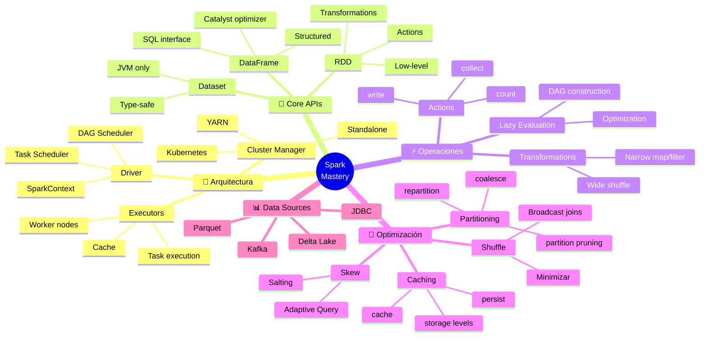

<!-- 
╔══════════════════════════════════════════════════════════════╗
║  📚 BLOQUE: APACHE SPARK                                     ║
║  Nivel: 2 | Fase: Big Data Processing                        ║
╚══════════════════════════════════════════════════════════════╝
-->

# ⚡ Apache Spark: Procesamiento Distribuido

> **Objetivo**: Dominar Spark para procesar datos a escala. Entender cuándo usarlo, cómo optimizarlo, y los conceptos de sistemas distribuidos subyacentes.

---

## 🧠 Mapa Conceptual



---

## 🔗 First Principles: De la Teoría a la Práctica

| Concepto CS | Qué significa | Implementación en Spark |
|-------------|---------------|------------------------|
| **MapReduce** | Dividir trabajo en map (transformar) y reduce (agregar) | Spark generaliza MapReduce con DAG de transformaciones. Más flexible que Hadoop MapReduce original. |
| **Lazy Evaluation** | No ejecutar hasta que sea necesario | Transformaciones construyen un plan (DAG). Actions disparan ejecución. Permite optimización global. |
| **Partitioning** | Dividir datos en chunks paralelos | Datos se dividen en particiones distribuidas en nodos. Más particiones = más paralelismo (hasta cierto punto). |
| **Shuffle** | Redistribuir datos entre nodos | Operaciones como `groupBy`, `join` requieren mover datos. MUY costoso. Minimizar shuffles es clave. |
| **Fault Tolerance** | Recuperarse de fallos de nodos | Spark guarda lineage (cómo reconstruir datos). Si un nodo falla, recomputa particiones perdidas. |
| **Data Locality** | Procesar datos donde están | Spark intenta ejecutar tasks cerca de los datos para minimizar transferencia de red. |

> [!IMPORTANT]
> 🧠 **First Principle clave**: Spark es un **motor de ejecución distribuida** que construye un **DAG de transformaciones** y lo ejecuta en paralelo sobre un cluster. La clave de performance es **minimizar shuffles** y **maximizar data locality**.

---

## 📋 Technical Cheat Sheet

### 🖥️ Inicialización y Configuración

```python
# PySpark básico
from pyspark.sql import SparkSession

# Crear sesión (punto de entrada)
spark = SparkSession.builder \
    .appName("MiApp") \
    .config("spark.sql.shuffle.partitions", "200") \
    .config("spark.executor.memory", "4g") \
    .config("spark.driver.memory", "2g") \
    .getOrCreate()

# Configuraciones críticas
# spark.sql.shuffle.partitions - particiones después de shuffle (default 200)
# spark.default.parallelism - paralelismo para RDDs
# spark.executor.memory - memoria por executor
# spark.executor.cores - cores por executor
# spark.sql.adaptive.enabled - Adaptive Query Execution (Spark 3+)

# Leer datos
df = spark.read.parquet("s3://bucket/data/")
df = spark.read.csv("path/to/file.csv", header=True, inferSchema=True)
df = spark.read.json("path/to/file.json")

# Con schema explícito (más rápido, más seguro)
from pyspark.sql.types import StructType, StructField, StringType, IntegerType

schema = StructType([
    StructField("id", IntegerType(), True),
    StructField("name", StringType(), True),
    StructField("amount", IntegerType(), True)
])
df = spark.read.schema(schema).parquet("path/")
```

### 📝 Snippets de Alta Densidad

#### Patrón 1: DataFrame Operations (API Preferida)

```python
# 🔥 BEST PRACTICE: Usar DataFrame API o Spark SQL
# DataFrame API está optimizada por Catalyst optimizer

from pyspark.sql import functions as F
from pyspark.sql.window import Window

# Selección y filtrado
df_filtered = (
    df
    .select("id", "name", "amount", "category")
    .filter(F.col("amount") > 100)
    .filter(F.col("category").isin(["A", "B", "C"]))
)

# Agregar columnas
df_enriched = df.withColumn(
    "amount_with_tax", 
    F.col("amount") * 1.21
).withColumn(
    "processed_date",
    F.current_date()
)

# Agregaciones
df_summary = (
    df
    .groupBy("category", "region")
    .agg(
        F.sum("amount").alias("total_amount"),
        F.avg("amount").alias("avg_amount"),
        F.countDistinct("customer_id").alias("unique_customers"),
        F.count("*").alias("num_transactions")
    )
)

# Window Functions (idénticas a SQL!)
window_spec = Window.partitionBy("category").orderBy(F.desc("amount"))

df_ranked = df.withColumn(
    "rank_in_category",
    F.row_number().over(window_spec)
).filter(F.col("rank_in_category") <= 10)  # Top 10 por categoría
```

#### Patrón 2: Joins Optimizados

```python
# 🔥 BEST PRACTICE: Elegir el tipo de join correcto

# Join básico (shuffle join por defecto)
df_joined = df_orders.join(
    df_customers,
    df_orders.customer_id == df_customers.id,
    "left"
)

# BROADCAST JOIN: Cuando una tabla es pequeña (<10MB default)
# Evita shuffle - MUCHO más rápido
from pyspark.sql.functions import broadcast

df_joined = df_orders.join(
    broadcast(df_small_lookup),  # Forzar broadcast
    "key"
)

# Verificar plan de ejecución
df_joined.explain()  # Ver si usa BroadcastHashJoin

# BUCKET JOIN: Para joins frecuentes entre tablas grandes
# Pre-particionar por la clave de join
df.write.bucketBy(100, "customer_id").saveAsTable("orders_bucketed")

# ANTI JOIN: Registros que NO tienen match
df_no_match = df_orders.join(
    df_customers,
    df_orders.customer_id == df_customers.id,
    "left_anti"
)
```

#### Patrón 3: Manejo de Particiones

```python
# 🔥 BEST PRACTICE: Entender y controlar particiones

# Ver número de particiones
df.rdd.getNumPartitions()

# Repartition: Redistribuye datos (causa shuffle)
# Usar cuando necesitas más particiones o redistribuir por columna
df_repartitioned = df.repartition(200)
df_repartitioned = df.repartition(200, "date")  # Por columna

# Coalesce: Reduce particiones SIN shuffle
# Usar para reducir particiones antes de escribir
df_coalesced = df.coalesce(10)

# Regla general:
# - 2-4x el número de cores del cluster
# - Particiones de 128MB-1GB es óptimo
# - Demasiadas particiones = overhead de scheduling
# - Muy pocas particiones = memoria insuficiente, no aprovechar paralelismo

# Escribir con partitioning (partition pruning en lectura)
df.write.partitionBy("year", "month").parquet("output/")

# Leer con partition pruning
df = spark.read.parquet("output/").filter(F.col("year") == 2024)
# Solo lee particiones de 2024, no escanea todo
```

#### Patrón 4: Caching Estratégico

```python
# 🔥 BEST PRACTICE: Cache solo cuando se reutiliza

# Cache en memoria (default)
df_cached = df.cache()

# O con nivel de storage específico
from pyspark import StorageLevel

df.persist(StorageLevel.MEMORY_AND_DISK)  # Si no cabe en memoria, usa disco
df.persist(StorageLevel.DISK_ONLY)        # Solo disco
df.persist(StorageLevel.MEMORY_ONLY_SER)  # Serializado (menos memoria, más CPU)

# IMPORTANTE: Cache es lazy, se materializa en primera action
df_cached.count()  # Ahora está en cache

# Liberar cache cuando no se necesita
df_cached.unpersist()

# Cuándo cachear:
# ✅ DataFrame usado múltiples veces
# ✅ Después de operaciones costosas (joins, agregaciones)
# ❌ DataFrames usados una sola vez
# ❌ Si no cabe en memoria del cluster
```

#### Patrón 5: Manejo de Data Skew

```python
# 🔥 BEST PRACTICE: Detectar y manejar skew

# Detectar skew: Ver distribución de particiones
df.groupBy(F.spark_partition_id()).count().show()

# Solución 1: Salting (añadir aleatoriedad a la key)
from pyspark.sql.functions import concat, lit, floor, rand

num_salts = 10

# Añadir salt a la tabla grande
df_large_salted = df_large.withColumn(
    "salted_key",
    concat(F.col("key"), lit("_"), (rand() * num_salts).cast("int"))
)

# Replicar la tabla pequeña con todos los salts
df_small_exploded = df_small.crossJoin(
    spark.range(num_salts).withColumnRenamed("id", "salt")
).withColumn(
    "salted_key",
    concat(F.col("key"), lit("_"), F.col("salt"))
)

# Join por salted key
df_joined = df_large_salted.join(df_small_exploded, "salted_key")

# Solución 2: Adaptive Query Execution (Spark 3+)
# spark.sql.adaptive.enabled = true
# spark.sql.adaptive.skewJoin.enabled = true
# Spark detecta y maneja skew automáticamente
```

### 🏗️ Patrones de Diseño Aplicados

#### 1. ETL Pipeline Structure

```python
# Estructura estándar de un job Spark

def extract(spark, config):
    """Leer datos de sources."""
    return (
        spark.read
        .option("header", "true")
        .csv(config.input_path)
    )

def transform(df):
    """Aplicar transformaciones de negocio."""
    return (
        df
        .filter(F.col("status") == "active")
        .withColumn("amount_usd", F.col("amount") * F.col("exchange_rate"))
        .groupBy("region", "date")
        .agg(F.sum("amount_usd").alias("total_revenue"))
    )

def load(df, config):
    """Escribir resultados."""
    (
        df
        .coalesce(10)  # Reducir archivos de salida
        .write
        .mode("overwrite")
        .partitionBy("date")
        .parquet(config.output_path)
    )

def main():
    spark = SparkSession.builder.appName("ETL").getOrCreate()
    config = load_config()
    
    df_raw = extract(spark, config)
    df_transformed = transform(df_raw)
    load(df_transformed, config)
    
    spark.stop()

if __name__ == "__main__":
    main()
```

#### 2. Incremental Processing

```python
# Procesamiento incremental con merge

def get_max_watermark(spark, target_path):
    """Obtener marca de agua alta del target."""
    try:
        return spark.read.parquet(target_path) \
            .agg(F.max("updated_at")).collect()[0][0]
    except:
        return "1900-01-01"

def incremental_load(spark, source_path, target_path):
    """Cargar solo datos nuevos."""
    watermark = get_max_watermark(spark, target_path)
    
    df_new = (
        spark.read.parquet(source_path)
        .filter(F.col("updated_at") > watermark)
    )
    
    # Append o merge según necesidad
    df_new.write.mode("append").parquet(target_path)
    
    return df_new.count()
```

### ⚠️ Gotchas de Nivel Senior

> [!WARNING]
> **Gotcha #1: collect() en datos grandes**
> 
> `collect()` trae TODOS los datos al driver. Con datasets grandes, crashea.
> 
> ```python
> # ❌ PELIGROSO - Puede crashear el driver
> all_data = df.collect()  # Trae millones de filas a memoria del driver
> 
> # ✅ CORRECTO - Limitar o usar take()
> sample = df.take(100)  # Solo 100 filas
> sample = df.limit(100).collect()
> 
> # ✅ Para debugging, usar show()
> df.show(20, truncate=False)
> 
> # ✅ Para iterar, procesar en cluster
> df.foreach(lambda row: process(row))  # Ejecuta en executors
> ```

> [!WARNING]
> **Gotcha #2: UDFs son lentos**
> 
> UDFs (User Defined Functions) serializan datos entre JVM y Python.
> 
> ```python
> # ❌ LENTO - UDF normal
> from pyspark.sql.functions import udf
> from pyspark.sql.types import StringType
> 
> @udf(StringType())
> def my_udf(x):
>     return x.upper()
> 
> df.withColumn("upper", my_udf("name"))  # Serialización JVM ↔ Python
> 
> # ✅ RÁPIDO - Usar funciones built-in
> df.withColumn("upper", F.upper("name"))
> 
> # ✅ Si necesitas UDF, usar Pandas UDF (vectorizado)
> from pyspark.sql.functions import pandas_udf
> 
> @pandas_udf(StringType())
> def vectorized_udf(s: pd.Series) -> pd.Series:
>     return s.str.upper()
> 
> df.withColumn("upper", vectorized_udf("name"))  # Procesa batches, mucho más rápido
> ```

> [!WARNING]
> **Gotcha #3: Shuffle excesivo**
> 
> Cada shuffle mueve datos por red entre todos los nodos.
> 
> ```python
> # ❌ MÚLTIPLES SHUFFLES
> df.groupBy("a").count().groupBy("b").count()  # 2 shuffles
> 
> # ❌ SHUFFLE INNECESARIO
> df.repartition(100).filter(F.col("x") > 0)  # Repartition antes de filter
> 
> # ✅ MINIMIZAR SHUFFLES
> df.filter(F.col("x") > 0).repartition(100)  # Filter primero, menos datos
> 
> # ✅ COALESCE en vez de REPARTITION cuando reduces
> df.repartition(10)  # SHUFFLE
> df.coalesce(10)     # NO shuffle, solo combina particiones
> ```

> [!WARNING]
> **Gotcha #4: Schema inference**
> 
> `inferSchema=True` lee los datos DOS veces.
> 
> ```python
> # ❌ LENTO - Lee datos 2 veces
> df = spark.read.csv(path, header=True, inferSchema=True)
> 
> # ✅ RÁPIDO - Schema explícito
> schema = StructType([
>     StructField("id", LongType()),
>     StructField("amount", DoubleType()),
>     StructField("date", DateType())
> ])
> df = spark.read.schema(schema).csv(path, header=True)
> ```

> [!WARNING]
> **Gotcha #5: Archivos pequeños**
> 
> Muchos archivos pequeños = mucho overhead de scheduling.
> 
> ```python
> # ❌ Problema: 10,000 archivos de 1MB cada uno
> # Spark crea 10,000 tasks, overhead domina el tiempo
> 
> # ✅ Solución 1: Coalesce al escribir
> df.coalesce(100).write.parquet("output/")  # 100 archivos
> 
> # ✅ Solución 2: Configurar tamaño de archivo
> spark.conf.set("spark.sql.files.maxPartitionBytes", "128m")
> 
> # ✅ Solución 3: Compactar archivos existentes
> spark.read.parquet("small_files/") \
>     .coalesce(100) \
>     .write.mode("overwrite") \
>     .parquet("compacted/")
> ```

---

## 📊 Métricas de Performance

| Operación | Narrow (sin shuffle) | Wide (con shuffle) |
|-----------|---------------------|-------------------|
| `select`, `filter`, `map` | ✅ Rápido | - |
| `groupBy`, `reduceByKey` | - | ⚠️ Shuffle |
| `join` (sin broadcast) | - | ⚠️ Shuffle |
| `join` (broadcast) | ✅ Rápido | - |
| `repartition` | - | ⚠️ Shuffle |
| `coalesce` | ✅ Sin shuffle | - |
| `sort` | - | ⚠️ Shuffle |

---

## 📚 Bibliografía Académica y Profesional

### 📖 Libros Seminales

| Libro | Autor | Capítulos relevantes | Por qué leerlo |
|-------|-------|---------------------|----------------|
| **Learning Spark** (2nd Ed) | Damji et al. | Todo | Libro oficial O'Reilly, actualizado para Spark 3 |
| **Spark: The Definitive Guide** | Chambers & Zaharia | Caps. 1-8, 15-19 | Mateo Zaharia es el creador de Spark |
| **High Performance Spark** | Karau & Warren | Caps. 4-7 | Optimización avanzada |

### 📄 Papers de Investigación

1. **"Resilient Distributed Datasets: A Fault-Tolerant Abstraction for In-Memory Cluster Computing"** (2012) - Zaharia et al.
   - 🔗 [NSDI Paper](https://www.usenix.org/system/files/conference/nsdi12/nsdi12-final138.pdf)
   - 💡 **Insight clave**: El paper original de Spark. Explica RDDs y fault tolerance.

2. **"Spark SQL: Relational Data Processing in Spark"** (2015) - Armbrust et al.
   - 🔗 [SIGMOD Paper](https://people.csail.mit.edu/matei/papers/2015/sigmod_spark_sql.pdf)
   - 💡 **Insight clave**: Catalyst optimizer, por qué DataFrames son más rápidos que RDDs.

3. **"Adaptive Query Execution"** (2020) - Databricks Blog
   - 🔗 [Databricks](https://www.databricks.com/blog/2020/05/29/adaptive-query-execution-speeding-up-spark-sql-at-runtime.html)
   - 💡 **Insight clave**: Cómo Spark 3 optimiza en runtime.

### 📋 Recursos Prácticos

- **Spark Documentation** - 🔗 [spark.apache.org](https://spark.apache.org/docs/latest/)
- **Databricks Academy** - 🔗 [academy.databricks.com](https://academy.databricks.com/) - Cursos gratuitos

---

## ✅ Checklist de Dominio

Antes de avanzar, verifica que puedes:

- [ ] Explicar diferencia entre transformations y actions
- [ ] Usar DataFrame API fluidamente
- [ ] Escribir Window Functions en Spark
- [ ] Identificar operaciones que causan shuffle
- [ ] Usar broadcast joins correctamente
- [ ] Configurar particiones apropiadamente
- [ ] Cachear DataFrames estratégicamente
- [ ] Leer y entender un plan de ejecución (explain)
- [ ] Manejar data skew con salting o AQE
- [ ] Escribir jobs que procesan 100GB+ de datos

---

*Última actualización: Enero 2026 | Versión: 1.0.0*

