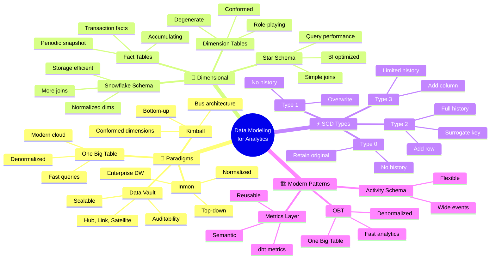

<!-- 
╔══════════════════════════════════════════════════════════════╗
║  📚 BLOQUE: DATA MODELING                                    ║
║  Nivel: 2 | Fase: Modelado de Datos                         ║
╚══════════════════════════════════════════════════════════════╝
-->

# 📐 Data Modeling: Kimball vs Inmon

> **Objetivo**: Dominar los paradigmas de modelado de datos. Diseñar modelos dimensionales eficientes para analytics y entender trade-offs entre enfoques.

---

## 🧠 Mapa Conceptual



---

## 🔗 First Principles: De la Teoría a la Práctica

| Concepto | Qué significa | Cuándo usar |
|----------|---------------|-------------|
| **Dimensional Modeling** | Organizar datos en facts y dimensions | Analytics, BI, reporting. Optimizado para queries humanos. |
| **Star Schema** | Fact central con dims alrededor | Default para analytics. Simple, performante. |
| **Snowflake Schema** | Dims normalizadas | Cuando storage importa más que performance de query. |
| **SCD Type 2** | Historial completo con versiones | Cuando necesitas "estado en fecha X". |
| **OBT (One Big Table)** | Todo denormalizado en una tabla | Cloud warehouses modernos. Evita joins en query time. |
| **Conformed Dimensions** | Misma dimensión en múltiples facts | Análisis cross-departmental consistente. |

> [!IMPORTANT]
> 🧠 **First Principle clave**: El modelado de datos para analytics optimiza para **lectura humana**, no para integridad transaccional. Denormalización es una feature, no un bug.

---

## 📋 Technical Cheat Sheet

### 📐 Star Schema Clásico

```
┌─────────────────────────────────────────────────────────────┐
│                      STAR SCHEMA                            │
│                                                             │
│    ┌──────────────┐                   ┌──────────────┐     │
│    │ dim_customer │                   │  dim_product │     │
│    │──────────────│                   │──────────────│     │
│    │ customer_key │◄──┐           ┌──►│ product_key  │     │
│    │ customer_id  │   │           │   │ product_id   │     │
│    │ name         │   │           │   │ name         │     │
│    │ segment      │   │           │   │ category     │     │
│    │ country      │   │           │   │ brand        │     │
│    └──────────────┘   │           │   └──────────────┘     │
│                       │           │                         │
│                   ┌───┴───────────┴───┐                    │
│    ┌──────────┐   │   fct_sales       │   ┌──────────┐    │
│    │ dim_date │   │───────────────────│   │ dim_store│    │
│    │──────────│   │ sales_key (SK)    │   │──────────│    │
│    │ date_key │◄──┤ date_key (FK)     ├──►│ store_key│    │
│    │ date     │   │ customer_key (FK) │   │ store_id │    │
│    │ month    │   │ product_key (FK)  │   │ name     │    │
│    │ quarter  │   │ store_key (FK)    │   │ region   │    │
│    │ year     │   │───────────────────│   └──────────┘    │
│    │ is_weekend│  │ quantity          │                    │
│    └──────────┘   │ unit_price        │                    │
│                   │ total_amount      │                    │
│                   │ discount_amount   │                    │
│                   └───────────────────┘                    │
│                                                             │
└─────────────────────────────────────────────────────────────┘
```

### 📝 Implementación de Dimension Tables

```sql
-- models/marts/core/dim_customers.sql
-- 🔥 BEST PRACTICE: Dimension con surrogate key y SCD Type 2

{{
  config(
    materialized='table',
    unique_key='customer_key'
  )
}}

with source as (
    select * from {{ ref('stg_customers') }}
),

-- Generamos surrogate key (SK)
with_surrogate as (
    select
        -- 🔑 Surrogate Key (hash determinístico)
        {{ dbt_utils.generate_surrogate_key(['customer_id', 'valid_from']) }} 
            as customer_key,
        
        -- 🆔 Natural Key (business key)
        customer_id,
        
        -- 📋 Attributes
        customer_name,
        email,
        phone,
        
        -- 🏷️ Classification
        segment,
        tier,
        
        -- 🌍 Geographic
        country,
        region,
        city,
        
        -- 📅 SCD Type 2 metadata
        valid_from,
        valid_to,
        is_current,
        
        -- 📊 Audit
        _loaded_at,
        _updated_at

    from source
)

select * from with_surrogate
```

### 📝 Implementación de Fact Tables

```sql
-- models/marts/core/fct_sales.sql
-- 🔥 BEST PRACTICE: Fact table con FKs a dimensions

{{
  config(
    materialized='incremental',
    unique_key='sales_key',
    incremental_strategy='merge'
  )
}}

with sales as (
    select * from {{ ref('stg_sales') }}
    
    where sale_date >= (select max(sale_date) from {{ this }}) - interval 1 day
    
),

customers as (
    select customer_key, customer_id 
    from {{ ref('dim_customers') }}
    where is_current = true  -- Solo current version para nuevas ventas
),

products as (
    select product_key, product_id
    from {{ ref('dim_products') }}
    where is_current = true
),

dates as (
    select date_key, date_day
    from {{ ref('dim_date') }}
),

stores as (
    select store_key, store_id
    from {{ ref('dim_stores') }}
),

final as (
    select
        -- 🔑 Surrogate Key del fact
        {{ dbt_utils.generate_surrogate_key([
            's.sale_id', 
            's.line_number'
        ]) }} as sales_key,
        
        -- 🔗 Foreign Keys a dimensions
        d.date_key,
        c.customer_key,
        p.product_key,
        st.store_key,
        
        -- 🆔 Degenerate Dimension (ID sin tabla propia)
        s.sale_id as transaction_id,
        s.line_number,
        
        -- 📊 Measures (facts)
        s.quantity,
        s.unit_price,
        s.quantity * s.unit_price as gross_amount,
        s.discount_amount,
        (s.quantity * s.unit_price) - s.discount_amount as net_amount,
        
        -- 📅 Timestamps
        s.sale_date,
        s.sale_timestamp,
        
        -- 📋 Metadata
        current_timestamp() as _dbt_updated_at

    from sales s
    left join customers c on s.customer_id = c.customer_id
    left join products p on s.product_id = p.product_id
    left join dates d on s.sale_date = d.date_day
    left join stores st on s.store_id = st.store_id
)

select * from final
```

### 📝 SCD Type 2 con Snapshots

```sql
-- snapshots/customers_snapshot.sql
-- 🔥 BEST PRACTICE: dbt snapshot para SCD Type 2 automático



{{
    config(
        target_schema='snapshots',
        unique_key='customer_id',
        strategy='timestamp',
        updated_at='updated_at',
        invalidate_hard_deletes=True
    )
}}

select
    customer_id,
    customer_name,
    email,
    segment,
    tier,
    country,
    updated_at
from {{ source('raw', 'customers') }}



-- Resultado: Tabla con dbt_valid_from, dbt_valid_to, dbt_scd_id
```

### 📝 One Big Table (OBT) Pattern

```sql
-- models/marts/obt/obt_sales.sql
-- 🔥 PATTERN MODERNO: Para cloud warehouses con cómputo barato

{{
  config(
    materialized='table',
    cluster_by=['sale_date', 'customer_segment']
  )
}}

with sales as (
    select * from {{ ref('fct_sales') }}
),

customers as (
    select * from {{ ref('dim_customers') }}
),

products as (
    select * from {{ ref('dim_products') }}
),

dates as (
    select * from {{ ref('dim_date') }}
),

-- 🎯 Denormalizamos TODO en una tabla
obt as (
    select
        -- === SALE FACTS ===
        s.sales_key,
        s.transaction_id,
        s.quantity,
        s.unit_price,
        s.gross_amount,
        s.net_amount,
        s.discount_amount,
        
        -- === DATE DIMENSION (inline) ===
        d.date_day as sale_date,
        d.day_of_week,
        d.month_name,
        d.quarter,
        d.year,
        d.is_weekend,
        d.is_holiday,
        
        -- === CUSTOMER DIMENSION (inline) ===
        c.customer_id,
        c.customer_name,
        c.email as customer_email,
        c.segment as customer_segment,
        c.tier as customer_tier,
        c.country as customer_country,
        c.region as customer_region,
        
        -- === PRODUCT DIMENSION (inline) ===
        p.product_id,
        p.product_name,
        p.category as product_category,
        p.subcategory as product_subcategory,
        p.brand as product_brand,
        p.cost as product_cost,
        
        -- === CALCULATED METRICS ===
        s.net_amount - (s.quantity * p.cost) as gross_profit,
        case 
            when s.discount_amount > 0 then 'discounted'
            else 'full_price'
        end as sale_type

    from sales s
    left join customers c on s.customer_key = c.customer_key
    left join products p on s.product_key = p.product_key
    left join dates d on s.date_key = d.date_key
)

select * from obt
```

### ⚠️ Gotchas de Nivel Senior

> [!WARNING]
> **Gotcha #1: Surrogate Keys vs Natural Keys**
> 
> Usar natural keys directamente rompe con cambios de source.
> 
> ```sql
> -- ❌ FRÁGIL - Si source cambia IDs, pierdes history
> customer_id as customer_key
> 
> -- ✅ ROBUSTO - SK independiente del source
> {{ dbt_utils.generate_surrogate_key(['customer_id', 'valid_from']) }}
> ```

> [!WARNING]
> **Gotcha #2: Late Arriving Dimensions**
> 
> Facts pueden llegar antes que su dimension row.
> 
> ```sql
> -- ✅ Usar default dimension member para registros sin match
> coalesce(c.customer_key, '-1') as customer_key  -- -1 = Unknown
> 
> -- Crear row "Unknown" en cada dimension
> INSERT INTO dim_customers (customer_key, customer_name)
> VALUES ('-1', 'Unknown Customer');
> ```

> [!WARNING]
> **Gotcha #3: Many-to-Many en Facts**
> 
> Facts deben ser grain único. M:M requiere bridge table.
> 
> ```sql
> -- ❌ INCORRECTO - Una venta con múltiples promos explota rows
> fct_sales con promotion_key directamente
> 
> -- ✅ CORRECTO - Bridge table para M:M
> bridge_sale_promotions(sale_key, promotion_key, allocation_pct)
> ```

> [!WARNING]
> **Gotcha #4: SCD Type 2 sin is_current flag**
> 
> Sin flag, joins simples retornan múltiples rows.
> 
> ```sql
> -- ❌ PROBLEMA - Retorna todas las versiones
> SELECT * FROM fct_sales s
> JOIN dim_customers c ON s.customer_id = c.customer_id
> 
> -- ✅ CORRECTO - Solo versión actual
> SELECT * FROM fct_sales s
> JOIN dim_customers c 
>   ON s.customer_id = c.customer_id 
>   AND c.is_current = true
> 
> -- ✅ PARA ANÁLISIS HISTÓRICO - Point-in-time
> JOIN dim_customers c 
>   ON s.customer_id = c.customer_id
>   AND s.sale_date BETWEEN c.valid_from AND c.valid_to
> ```

---

## 📊 Comparativa de Enfoques

| Enfoque | Pros | Contras | Cuándo usar |
|---------|------|---------|-------------|
| **Star Schema** | Simple, performante, BI-friendly | Requires upfront design | Classic BI, dimensional analytics |
| **Snowflake Schema** | Storage efficient, normalized | Complex queries, more joins | Storage-constrained environments |
| **Data Vault** | Auditable, scalable, flexible | Complex, learning curve | Enterprise, regulatory, data integration |
| **OBT** | No joins, fast queries | Redundancy, update complexity | Cloud DW, simple analytics |

---

## 📚 Bibliografía Académica y Profesional

### 📖 Libros Seminales

| Libro | Autor | Por qué leerlo |
|-------|-------|----------------|
| **The Data Warehouse Toolkit** | Ralph Kimball | LA biblia del modelado dimensional. Obligatorio. |
| **Building the Data Warehouse** | Bill Inmon | Perspectiva enterprise, normalizada. |
| **Data Vault 2.0** | Dan Linstedt | Para entender auditabilidad y escalabilidad. |
| **Fundamentals of Data Engineering** | Reis & Housley | Perspectiva moderna, incluye OBT. |

### 📄 Recursos Clave

1. **Kimball Group Design Tips**
   - 🔗 [kimballgroup.com](https://www.kimballgroup.com/data-warehouse-business-intelligence-resources/kimball-techniques/)
   - 💡 **Insight clave**: Tips específicos de diseño dimensional.

2. **dbt Dimensional Modeling Guide**
   - 🔗 [docs.getdbt.com](https://docs.getdbt.com/guides/best-practices/how-we-structure/dimensional-modeling)
   - 💡 **Insight clave**: Aplicación moderna de Kimball con dbt.

---

## ✅ Checklist de Dominio

Antes de avanzar, verifica que puedes:

- [ ] Diferenciar entre Kimball y Inmon
- [ ] Diseñar Star Schema con facts y dimensions
- [ ] Implementar SCD Type 2 con dbt snapshots
- [ ] Crear surrogate keys correctamente
- [ ] Manejar late arriving dimensions
- [ ] Construir OBT para analytics moderno
- [ ] Identificar grain correcto para fact tables
- [ ] Crear conformed dimensions para múltiples facts
- [ ] Manejar relaciones many-to-many con bridge tables
- [ ] Explicar trade-offs entre Star vs OBT

---

*Última actualización: Enero 2026 | Versión: 1.0.0*

