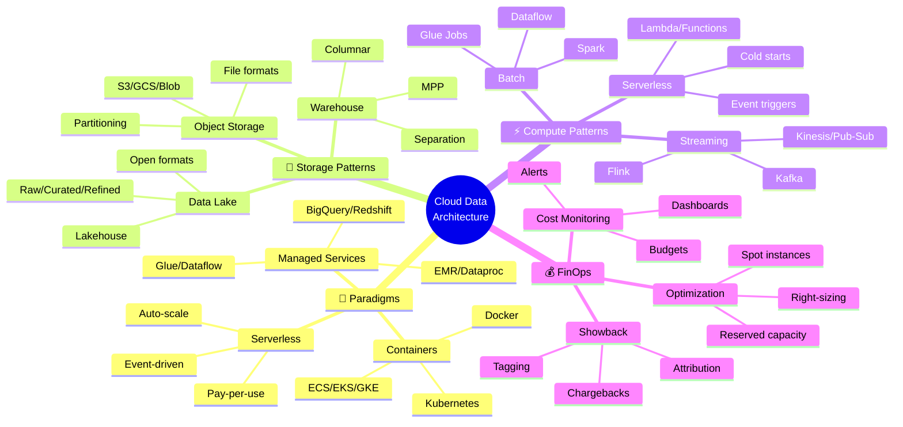

<!-- 
╔══════════════════════════════════════════════════════════════╗
║  📚 BLOQUE: CLOUD ARCHITECTURE                               ║
║  Nivel: 2 | Fase: Cloud Data Platforms                      ║
╚══════════════════════════════════════════════════════════════╝
-->

# ☁️ Cloud Architecture: Patrones para Data

> **Objetivo**: Dominar patrones de arquitectura cloud para data engineering. Serverless, object storage, y FinOps para pipelines eficientes.

---

## 🧠 Mapa Conceptual



---

## 🔗 First Principles: De la Teoría a la Práctica

| Concepto | Qué significa | Implementación Cloud |
|----------|---------------|---------------------|
| **Serverless** | No manejas servidores, solo código | Lambda/Cloud Functions. Pagas por ejecución, no por uptime. |
| **Object Storage** | Almacenamiento inmutable por objetos | S3/GCS. Partitioning por prefijos, file formats optimizados. |
| **Data Lake** | Repositorio central de datos raw | Raw zone con datos sin procesar, curated zone con datos limpios. |
| **Lakehouse** | Lake + Warehouse capabilities | Delta Lake, Iceberg. ACID sobre object storage. |
| **FinOps** | Operaciones financieras de cloud | Monitoreo continuo, optimization, allocation de costos. |

> [!IMPORTANT]
> 🧠 **First Principle clave**: En cloud, **pagas por lo que usas**. Esto cambia fundamentalmente cómo diseñas: optimizar para costo es tan importante como optimizar para performance.

---

## 📋 Technical Cheat Sheet

### 🖥️ AWS CLI para Data Engineering

```bash
# ═══════════════════════════════════════════════════
# S3 OPERATIONS
# ═══════════════════════════════════════════════════

# Listar buckets
aws s3 ls

# Listar objetos con prefijo (partición)
aws s3 ls s3://my-bucket/data/year=2026/month=01/ --recursive

# Copiar local a S3
aws s3 cp data.parquet s3://my-bucket/raw/data.parquet

# Sync directorio (solo archivos nuevos/modificados)
aws s3 sync ./local-data s3://my-bucket/data/ --exclude "*.tmp"

# Copiar entre buckets/regiones
aws s3 cp s3://source-bucket/data.parquet s3://dest-bucket/data.parquet

# Estadísticas de bucket
aws s3 ls s3://my-bucket --recursive --human-readable --summarize

# ═══════════════════════════════════════════════════
# GLUE OPERATIONS
# ═══════════════════════════════════════════════════

# Listar jobs
aws glue get-jobs --query "Jobs[].Name"

# Ejecutar job
aws glue start-job-run --job-name my-etl-job

# Ver estado de run
aws glue get-job-run --job-name my-etl-job --run-id jr_xxx

# Listar tablas en catalog
aws glue get-tables --database-name my_database

# ═══════════════════════════════════════════════════
# LAMBDA OPERATIONS
# ═══════════════════════════════════════════════════

# Listar funciones
aws lambda list-functions --query "Functions[].FunctionName"

# Invocar función
aws lambda invoke \
  --function-name process-s3-event \
  --payload '{"bucket": "my-bucket", "key": "data.csv"}' \
  response.json

# Ver logs
aws logs tail /aws/lambda/process-s3-event --follow

# ═══════════════════════════════════════════════════
# COST EXPLORER
# ═══════════════════════════════════════════════════

# Costo últimos 30 días por servicio
aws ce get-cost-and-usage \
  --time-period Start=2026-01-01,End=2026-01-31 \
  --granularity MONTHLY \
  --metrics "BlendedCost" \
  --group-by Type=DIMENSION,Key=SERVICE
```

### 📝 Data Lake Structure

```
s3://company-data-lake/
│
├── raw/                          # 🔴 RAW ZONE - Datos sin procesar
│   ├── orders/
│   │   ├── year=2026/
│   │   │   ├── month=01/
│   │   │   │   ├── day=05/
│   │   │   │   │   ├── orders_20260105_001.json
│   │   │   │   │   └── orders_20260105_002.json
│   │
│   ├── customers/
│   │   └── full_export_20260105.csv
│   │
│   └── events/
│       └── year=2026/month=01/day=05/hour=10/
│           └── events.json.gz
│
├── curated/                      # 🟡 CURATED ZONE - Limpio, validado
│   ├── orders/
│   │   └── year=2026/month=01/
│   │       └── data.parquet      # Formato optimizado
│   │
│   └── customers/
│       └── latest/
│           └── customers.parquet
│
├── refined/                      # 🟢 REFINED ZONE - Agregados, marts
│   ├── daily_sales/
│   │   └── date=2026-01-05/
│   │       └── daily_sales.parquet
│   │
│   └── customer_360/
│       └── customer_360.parquet
│
└── _metadata/                    # 📋 Metadata y schemas
    ├── schemas/
    │   ├── orders_v1.json
    │   └── customers_v2.json
    └── manifests/
        └── orders_manifest.json
```

### 📝 Serverless ETL Pattern

```python
# lambda_handler.py
# 🔥 BEST PRACTICE: Lambda para procesamiento event-driven

import json
import boto3
import pandas as pd
from io import BytesIO
import logging

logger = logging.getLogger()
logger.setLevel(logging.INFO)

s3_client = boto3.client('s3')
glue_client = boto3.client('glue')

def lambda_handler(event, context):
    """
    Triggered by S3 event when new file lands in raw zone.
    Processes and moves to curated zone.
    """
    
    # Parsear evento S3
    bucket = event['Records'][0]['s3']['bucket']['name']
    key = event['Records'][0]['s3']['object']['key']
    
    logger.info(f"Processing: s3://{bucket}/{key}")
    
    try:
        # 1. Leer archivo desde S3
        response = s3_client.get_object(Bucket=bucket, Key=key)
        df = pd.read_json(BytesIO(response['Body'].read()), lines=True)
        
        # 2. Transformaciones básicas
        df = clean_and_validate(df)
        
        # 3. Escribir a curated zone en Parquet
        curated_key = key.replace('raw/', 'curated/').replace('.json', '.parquet')
        
        buffer = BytesIO()
        df.to_parquet(buffer, index=False, engine='pyarrow')
        buffer.seek(0)
        
        s3_client.put_object(
            Bucket=bucket,
            Key=curated_key,
            Body=buffer.getvalue()
        )
        
        logger.info(f"Written to: s3://{bucket}/{curated_key}")
        
        # 4. Actualizar Glue Catalog (opcional)
        # trigger_glue_crawler(curated_key)
        
        return {
            'statusCode': 200,
            'body': json.dumps({
                'message': 'Success',
                'records_processed': len(df),
                'output_path': f"s3://{bucket}/{curated_key}"
            })
        }
        
    except Exception as e:
        logger.error(f"Error processing {key}: {str(e)}")
        raise e

def clean_and_validate(df: pd.DataFrame) -> pd.DataFrame:
    """Limpieza y validación básica"""
    
    # Remover duplicados
    df = df.drop_duplicates()
    
    # Normalizar columnas
    df.columns = [c.lower().replace(' ', '_') for c in df.columns]
    
    # Validar campos requeridos
    required_cols = ['order_id', 'customer_id', 'amount']
    for col in required_cols:
        if col not in df.columns:
            raise ValueError(f"Missing required column: {col}")
    
    # Filtrar registros inválidos
    df = df[df['order_id'].notna()]
    df = df[df['amount'] >= 0]
    
    return df
```

### 📝 Infrastructure as Code (Terraform)

```hcl
# main.tf
# 🔥 BEST PRACTICE: IaC para reproducibilidad

terraform {
  required_providers {
    aws = {
      source  = "hashicorp/aws"
      version = "~> 5.0"
    }
  }
}

# ═══════════════════════════════════════════════════
# S3 DATA LAKE BUCKETS
# ═══════════════════════════════════════════════════

resource "aws_s3_bucket" "data_lake" {
  bucket = "${var.project_name}-data-lake-${var.environment}"
  
  tags = {
    Environment = var.environment
    Project     = var.project_name
    Team        = "data-engineering"
    CostCenter  = "DE-001"
  }
}

resource "aws_s3_bucket_lifecycle_configuration" "data_lake_lifecycle" {
  bucket = aws_s3_bucket.data_lake.id
  
  # Raw zone: mover a Glacier después de 90 días
  rule {
    id     = "raw-to-glacier"
    status = "Enabled"
    
    filter {
      prefix = "raw/"
    }
    
    transition {
      days          = 90
      storage_class = "GLACIER"
    }
    
    expiration {
      days = 365
    }
  }
  
  # Curated zone: mantener en Standard por más tiempo
  rule {
    id     = "curated-lifecycle"
    status = "Enabled"
    
    filter {
      prefix = "curated/"
    }
    
    transition {
      days          = 180
      storage_class = "STANDARD_IA"
    }
  }
}

# ═══════════════════════════════════════════════════
# GLUE CATALOG DATABASE
# ═══════════════════════════════════════════════════

resource "aws_glue_catalog_database" "main" {
  name = "${var.project_name}_${var.environment}"
  
  create_table_default_permission {
    permissions = ["SELECT"]
  }
}

# ═══════════════════════════════════════════════════
# LAMBDA FUNCTION
# ═══════════════════════════════════════════════════

resource "aws_lambda_function" "process_s3" {
  function_name = "${var.project_name}-process-s3-${var.environment}"
  role          = aws_iam_role.lambda_role.arn
  handler       = "lambda_handler.lambda_handler"
  runtime       = "python3.11"
  timeout       = 300
  memory_size   = 1024
  
  filename         = "lambda.zip"
  source_code_hash = filebase64sha256("lambda.zip")
  
  environment {
    variables = {
      ENVIRONMENT = var.environment
      BUCKET_NAME = aws_s3_bucket.data_lake.id
    }
  }
  
  tags = {
    Environment = var.environment
    CostCenter  = "DE-001"
  }
}

# Trigger Lambda on S3 events
resource "aws_s3_bucket_notification" "lambda_trigger" {
  bucket = aws_s3_bucket.data_lake.id
  
  lambda_function {
    lambda_function_arn = aws_lambda_function.process_s3.arn
    events              = ["s3:ObjectCreated:*"]
    filter_prefix       = "raw/"
    filter_suffix       = ".json"
  }
}
```

### ⚠️ Gotchas de Nivel Senior

> [!WARNING]
> **Gotcha #1: Lambda cold starts**
> 
> Funciones que no se ejecutan regularmente tienen cold starts de segundos.
> 
> ```python
> # ✅ Provisioned concurrency para funciones críticas
> # En terraform:
> # provisioned_concurrent_executions = 5
> 
> # ✅ Mantener lambdas warm con scheduled events
> ```

> [!WARNING]
> **Gotcha #2: S3 listing es O(n)**
> 
> Listar millones de objetos es lento y costoso.
> 
> ```python
> # ❌ LENTO - List completo
> s3_client.list_objects_v2(Bucket='bucket', Prefix='data/')
> 
> # ✅ MEJOR - Usar manifests o Glue Catalog
> glue_client.get_partitions(DatabaseName='db', TableName='table')
> ```

> [!WARNING]
> **Gotcha #3: S3 Eventual Consistency (legacy)**
> 
> Desde 2020 S3 es strongly consistent, pero patrones legacy aún existen.
> 
> ```python
> # ✅ S3 ahora es strongly consistent para PUT/GET
> # Ya no necesitas workarounds como sleep o check-then-read
> ```

> [!WARNING]
> **Gotcha #4: Cross-region data transfer costs**
> 
> Mover datos entre regiones es caro.
> 
> ```python
> # ❌ CARO - Procesar en región diferente a datos
> # Lambda en us-east-1, datos en eu-west-1
> 
> # ✅ BARATO - Colocar compute cerca de datos
> # Lambda y S3 en misma región
> ```

---

## 📊 Comparativa de Servicios Cloud

| Servicio | AWS | GCP | Azure | Cuándo usar |
|----------|-----|-----|-------|-------------|
| **Object Storage** | S3 | GCS | Blob Storage | Data lake, archivos |
| **Warehouse** | Redshift | BigQuery | Synapse | Analytics SQL |
| **ETL Managed** | Glue | Dataflow | Data Factory | Pipelines batch |
| **Serverless** | Lambda | Cloud Functions | Functions | Event processing |
| **Streaming** | Kinesis | Pub/Sub | Event Hubs | Real-time |
| **Catalog** | Glue Catalog | Data Catalog | Purview | Metadata |

---

## 📚 Bibliografía Académica y Profesional

### 📖 Recursos Seminales

| Recurso | Autor | Por qué consumirlo |
|---------|-------|-------------------|
| **Fundamentals of Data Engineering** | Reis & Housley | Perspectiva moderna de arquitectura. |
| **Data Engineering on AWS** | Gareth Eagar | Patrones específicos de AWS. |
| **Cloud FinOps** | J.R. Storment | Gestión de costos cloud. |

### 📄 Whitepapers Clave

1. **AWS Well-Architected Framework - Data Analytics Lens**
   - 🔗 [AWS Docs](https://docs.aws.amazon.com/wellarchitected/latest/analytics-lens/)
   - 💡 **Insight clave**: Best practices oficiales de AWS.

2. **Google Cloud Architecture Framework**
   - 🔗 [cloud.google.com](https://cloud.google.com/architecture/framework)
   - 💡 **Insight clave**: Patrones de diseño GCP.

---

## ✅ Checklist de Dominio

Antes de avanzar, verifica que puedes:

- [ ] Diseñar estructura de data lake con zonas raw/curated/refined
- [ ] Implementar partitioning eficiente en object storage
- [ ] Crear pipelines serverless con Lambda/Cloud Functions
- [ ] Escribir Infrastructure as Code con Terraform
- [ ] Configurar lifecycle policies para optimizar costos
- [ ] Monitorear costos con tagging y budgets
- [ ] Elegir entre servicios managed vs self-managed
- [ ] Implementar event-driven architecture con S3 events
- [ ] Optimizar para cold starts en serverless
- [ ] Diseñar para disaster recovery multi-region

---

*Última actualización: Enero 2026 | Versión: 1.0.0*

