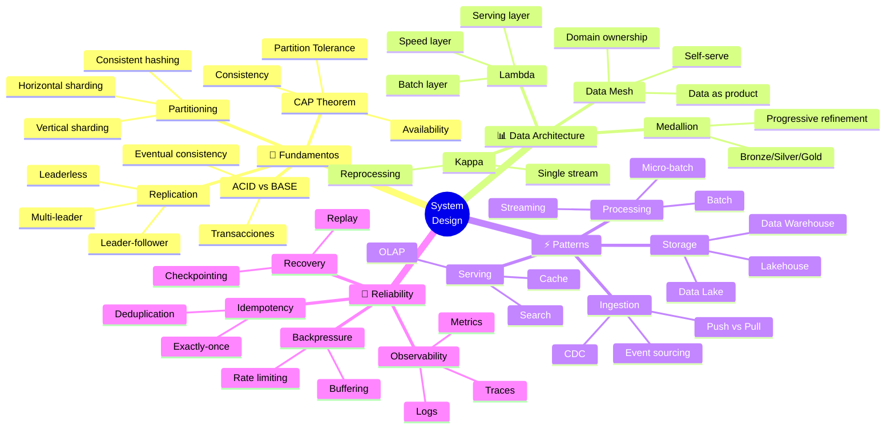

<!-- 
╔══════════════════════════════════════════════════════════════╗
║  📚 BLOQUE: SYSTEM DESIGN                                    ║
║  Nivel: 3 | Fase: Arquitectura Senior                        ║
╚══════════════════════════════════════════════════════════════╝
-->

# 🏗️ System Design para Data Engineering

> **Objetivo**: Diseñar sistemas de datos que escalen, sean resilientes y mantenibles. El skill que define a un Senior/Staff Engineer.

---

## 🧠 Mapa Conceptual



---

## 🔗 First Principles: De la Teoría a la Práctica

| Concepto CS | Qué significa | Aplicación en Data Engineering |
|-------------|---------------|-------------------------------|
| **Teorema CAP** | Solo puedes elegir 2 de 3: Consistency, Availability, Partition tolerance | En sistemas distribuidos, network partitions ocurren. Debes elegir entre C y A. Data Lakes favorecen A, bases transaccionales favorecen C. |
| **Consistencia Eventual** | Eventualmente todos los nodos tendrán el mismo dato | Aceptable para analytics. Un dashboard puede mostrar datos de hace 1 minuto. No aceptable para sistemas financieros. |
| **Idempotencia** | f(f(x)) = f(x) | CRÍTICO. Pipelines deben producir mismo resultado si corren múltiples veces. Usa UPSERT, no INSERT. |
| **Particionamiento** | Dividir datos para distribuir carga | Particionar por fecha es común. Elegir mal la key = data skew = un nodo saturado. |
| **Backpressure** | Controlar flujo cuando consumidor es más lento que productor | Kafka retiene mensajes. Spark Streaming tiene rate limiting. Sin backpressure = OOM. |
| **Trade-offs** | No hay solución perfecta, solo trade-offs | Latencia vs Throughput, Costo vs Performance, Consistencia vs Disponibilidad. Documenta tus decisiones. |

> [!IMPORTANT]
> 🧠 **First Principle clave**: El diseño de sistemas es el **arte de gestionar trade-offs**. No existe la arquitectura perfecta. Existe la arquitectura correcta para TUS requisitos, restricciones y recursos.

---

## 📋 Technical Cheat Sheet

### 🔢 Números que Debes Saber

```
Latencias aproximadas:
┌─────────────────────────────────────────────────────────────┐
│ L1 cache reference                         0.5 ns           │
│ L2 cache reference                           7 ns           │
│ Main memory reference                      100 ns           │
│ SSD random read                         16,000 ns  (16 μs)  │
│ HDD seek                            10,000,000 ns  (10 ms)  │
│ Network round trip same datacenter     500,000 ns  (0.5 ms) │
│ Network round trip cross-region     150,000,000 ns  (150 ms)│
└─────────────────────────────────────────────────────────────┘

Throughput aproximado:
┌─────────────────────────────────────────────────────────────┐
│ SSD sequential read              500 MB/s - 3 GB/s          │
│ HDD sequential read              100-200 MB/s               │
│ Network 1 Gbps                   125 MB/s                   │
│ Network 10 Gbps                  1.25 GB/s                  │
│ Kafka single partition           100K+ msgs/s               │
│ PostgreSQL writes                10K-50K rows/s             │
│ Redis operations                 100K+ ops/s                │
│ Spark cluster (100 nodes)        TB/hour processing         │
└─────────────────────────────────────────────────────────────┘

Escalas de datos:
┌─────────────────────────────────────────────────────────────┐
│ 1 GB   → Pandas en laptop                                   │
│ 10 GB  → Pandas optimizado, Polars, DuckDB                  │
│ 100 GB → Spark single node, Dask                            │
│ 1 TB   → Spark cluster pequeño                              │
│ 10 TB  → Spark cluster mediano, Data Warehouse              │
│ 100 TB → Data Lake, Spark cluster grande                    │
│ 1 PB   → Distributed Data Lake, custom infrastructure       │
└─────────────────────────────────────────────────────────────┘
```

### 📝 Framework para System Design Interview

```
1. REQUIREMENTS (5 min)
   ├── Functional: ¿Qué debe hacer el sistema?
   ├── Non-functional: Latencia, throughput, availability
   ├── Scale: ¿Cuántos usuarios? ¿Cuántos datos? ¿Crecimiento?
   └── Constraints: Presupuesto, equipo, timeline

2. CAPACITY ESTIMATION (5 min)
   ├── QPS/TPS: Requests por segundo
   ├── Storage: Datos por día/mes/año
   ├── Bandwidth: Ingesta y egreso
   └── Memory: Para cache, buffers

3. HIGH-LEVEL DESIGN (10 min)
   ├── Componentes principales
   ├── Flujo de datos
   ├── Diagrama de arquitectura
   └── APIs entre componentes

4. DETAILED DESIGN (15 min)
   ├── Data model / Schema
   ├── Algoritmos clave
   ├── Component deep-dive
   └── API design

5. SCALABILITY & RELIABILITY (10 min)
   ├── Bottlenecks y cómo resolverlos
   ├── Failure modes y mitigación
   ├── Monitoring y alerting
   └── Evolution / versioning

6. TRADE-OFFS (5 min)
   ├── Decisiones tomadas y por qué
   ├── Alternativas consideradas
   └── Qué cambiaría con más tiempo/recursos
```

### 🏗️ Arquitecturas de Referencia

#### 1. Real-time Analytics Pipeline

```
┌─────────────────────────────────────────────────────────────────────────┐
│                     REAL-TIME ANALYTICS PIPELINE                        │
├─────────────────────────────────────────────────────────────────────────┤
│                                                                         │
│  ┌─────────┐    ┌─────────┐    ┌─────────┐    ┌─────────────────────┐  │
│  │ Sources │───▶│  Kafka  │───▶│  Flink  │───▶│  Serving Layer      │  │
│  │         │    │         │    │         │    │  ┌────────────────┐ │  │
│  │ - Apps  │    │ Topics: │    │ Jobs:   │    │  │ Redis (hot)    │ │  │
│  │ - IoT   │    │ - events│    │ - enrich│    │  │ Druid (OLAP)   │ │  │
│  │ - CDC   │    │ - clicks│    │ - agg   │    │  │ ES (search)    │ │  │
│  └─────────┘    │ - logs  │    │ - alert │    │  └────────────────┘ │  │
│                 └─────────┘    └─────────┘    └─────────────────────┘  │
│                      │                                   │              │
│                      │         ┌─────────────┐          │              │
│                      └────────▶│ Data Lake   │◀─────────┘              │
│                                │ (S3/Delta)  │                         │
│                                │ - raw       │                         │
│                                │ - enriched  │                         │
│                                │ - aggregated│                         │
│                                └─────────────┘                         │
│                                       │                                 │
│                                       ▼                                 │
│                                ┌─────────────┐                         │
│                                │  Batch Jobs │                         │
│                                │  (Spark)    │                         │
│                                │  - ML train │                         │
│                                │  - Reports  │                         │
│                                └─────────────┘                         │
└─────────────────────────────────────────────────────────────────────────┘

Decisiones clave:
- Kafka: Durabilidad, replay, backpressure
- Flink: Exactamente-once, low latency
- Lambda (batch + stream): Corregir errores de streaming con batch
- Multi-serving: Diferentes engines para diferentes query patterns
```

#### 2. Modern Data Stack (Batch-first)

```
┌─────────────────────────────────────────────────────────────────────────┐
│                      MODERN DATA STACK                                  │
├─────────────────────────────────────────────────────────────────────────┤
│                                                                         │
│  ┌─────────────────────────────────────────────────────────────────┐   │
│  │                         SOURCES                                   │   │
│  │   ┌─────────┐ ┌─────────┐ ┌─────────┐ ┌─────────┐              │   │
│  │   │ Postgres│ │ Salesforce│ │ Google │ │ S3 files│              │   │
│  │   └────┬────┘ └────┬────┘ └────┬────┘ └────┬────┘              │   │
│  └────────┼───────────┼───────────┼───────────┼──────────────────┘   │
│           │           │           │           │                       │
│           ▼           ▼           ▼           ▼                       │
│  ┌─────────────────────────────────────────────────────────────────┐   │
│  │                    INGESTION (Fivetran/Airbyte)                  │   │
│  │                    - CDC, full refresh, incremental              │   │
│  └──────────────────────────────┬──────────────────────────────────┘   │
│                                 │                                      │
│                                 ▼                                      │
│  ┌─────────────────────────────────────────────────────────────────┐   │
│  │                    WAREHOUSE (Snowflake/BigQuery)                │   │
│  │   ┌───────────┐  ┌───────────┐  ┌───────────┐                  │   │
│  │   │  RAW      │─▶│  STAGING  │─▶│   MARTS   │                  │   │
│  │   │  (Bronze) │  │  (Silver) │  │   (Gold)  │                  │   │
│  │   └───────────┘  └───────────┘  └───────────┘                  │   │
│  │        ▲               ▲               ▲                        │   │
│  │        └───────────────┴───────────────┘                        │   │
│  │                    dbt (transformations)                         │   │
│  └──────────────────────────────┬──────────────────────────────────┘   │
│                                 │                                      │
│                                 ▼                                      │
│  ┌─────────────────────────────────────────────────────────────────┐   │
│  │                    CONSUMPTION                                    │   │
│  │   ┌─────────┐ ┌─────────┐ ┌─────────┐ ┌─────────┐              │   │
│  │   │ Looker  │ │ Tableau │ │ Python  │ │ Reverse │              │   │
│  │   │         │ │         │ │ /ML     │ │  ETL    │              │   │
│  │   └─────────┘ └─────────┘ └─────────┘ └─────────┘              │   │
│  └─────────────────────────────────────────────────────────────────┘   │
│                                                                         │
│  ┌─────────────────────────────────────────────────────────────────┐   │
│  │                    ORCHESTRATION (Airflow)                        │   │
│  │                    QUALITY (Great Expectations)                   │   │
│  │                    OBSERVABILITY (Monte Carlo)                    │   │
│  └─────────────────────────────────────────────────────────────────┘   │
└─────────────────────────────────────────────────────────────────────────┘
```

#### 3. Data Mesh Architecture

```
┌─────────────────────────────────────────────────────────────────────────┐
│                        DATA MESH                                        │
├─────────────────────────────────────────────────────────────────────────┤
│                                                                         │
│   DOMAIN 1: SALES                 DOMAIN 2: MARKETING                  │
│   ┌───────────────────────┐       ┌───────────────────────┐           │
│   │ Data Product:         │       │ Data Product:         │           │
│   │ "Customer 360"        │       │ "Campaign Analytics"  │           │
│   │                       │       │                       │           │
│   │ - Schema registry     │       │ - Schema registry     │           │
│   │ - SLAs defined        │       │ - SLAs defined        │           │
│   │ - Self-serve access   │       │ - Self-serve access   │           │
│   │ - Owned by domain     │       │ - Owned by domain     │           │
│   └───────────┬───────────┘       └───────────┬───────────┘           │
│               │                               │                        │
│               ▼                               ▼                        │
│   ┌─────────────────────────────────────────────────────────────────┐ │
│   │                    FEDERATED GOVERNANCE                          │ │
│   │  - Global policies (security, privacy)                          │ │
│   │  - Interoperability standards                                   │ │
│   │  - Data catalog (searchable)                                    │ │
│   │  - Quality metrics                                              │ │
│   └─────────────────────────────────────────────────────────────────┘ │
│                                                                         │
│   ┌─────────────────────────────────────────────────────────────────┐ │
│   │                    SELF-SERVE PLATFORM                           │ │
│   │  - Infrastructure as code                                       │ │
│   │  - Template pipelines                                           │ │
│   │  - Monitoring/alerting                                          │ │
│   │  - Compute provisioning                                         │ │
│   └─────────────────────────────────────────────────────────────────┘ │
└─────────────────────────────────────────────────────────────────────────┘

Principios:
1. Domain ownership: Cada dominio posee sus datos
2. Data as product: Datos con SLAs, docs, calidad
3. Self-serve platform: Infraestructura compartida
4. Federated governance: Políticas globales, ejecución local
```

### ⚠️ Gotchas de Nivel Senior

> [!WARNING]
> **Gotcha #1: Diseño prematuro para escala**
> 
> No necesitas Kafka para 100 eventos/segundo.
> 
> ```
> PREGUNTA ANTES DE COMPLEJIZAR:
> 
> - ¿Cuál es el volumen ACTUAL?
> - ¿Cuál es el crecimiento proyectado REALISTA?
> - ¿Cuál es el costo de cambiar después?
> 
> A veces, PostgreSQL es suficiente:
> - < 10K writes/s: PostgreSQL probablemente suficiente
> - < 100 GB: No necesitas Spark, usa Pandas/DuckDB
> - < 1M usuarios: Un solo servidor bien configurado
> 
> KISS: Keep It Simple, Stupid
> ```

> [!WARNING]
> **Gotcha #2: Ignorar el modelo de datos**
> 
> La arquitectura perfecta con mal modelo de datos = desastre.
> 
> ```
> PREGUNTAS SOBRE MODELO DE DATOS:
> 
> 1. ¿Cuáles son las queries más frecuentes?
>    → El modelo debe optimizar para esas queries
> 
> 2. ¿Cuál es el patrón de escritura vs lectura?
>    → Write-heavy: Normalizar
>    → Read-heavy: Desnormalizar
> 
> 3. ¿Cómo evoluciona el schema?
>    → Schema evolution strategy desde día 1
> 
> 4. ¿Cuál es el grain (granularidad)?
>    → Un registro = ¿una transacción? ¿un día? ¿un usuario?
> ```

> [!WARNING]
> **Gotcha #3: No considerar fallos**
> 
> TODO falla eventualmente. ¿Qué pasa cuando falla?
> 
> ```
> LISTA DE FALLOS A CONSIDERAR:
> 
> □ Network partition (nodos no pueden comunicarse)
> □ Node failure (servidor muere)
> □ Disk failure (datos perdidos)
> □ Slow node (un nodo lento frena todo)
> □ Corrupted data (datos inválidos entran)
> □ Schema change rompedor
> □ Dependency failure (API externa caída)
> □ Thundering herd (todos los clientes reconectan a la vez)
> 
> PARA CADA UNO:
> - ¿Cómo detectamos?
> - ¿Cómo recuperamos?
> - ¿Cuál es el impacto?
> ```

> [!WARNING]
> **Gotcha #4: SLA sin métricas**
> 
> "El sistema es rápido" no es un SLA.
> 
> ```
> SLAs ESPECÍFICOS:
> 
> LATENCIA:
> - p50 latencia < 100ms
> - p99 latencia < 500ms
> - p999 latencia < 2s
> 
> DISPONIBILIDAD:
> - 99.9% uptime = 8.76 horas de downtime/año
> - 99.99% uptime = 52 minutos de downtime/año
> 
> FRESHNESS:
> - Datos disponibles < 5 minutos después del evento
> - Reportes actualizados cada hora
> 
> CORRECTNESS:
> - < 0.1% de registros duplicados
> - 100% de transacciones financieras correctas
> ```

---

## 📚 Bibliografía Académica y Profesional

### 📖 Libros Seminales

| Libro | Autor | Por qué leerlo |
|-------|-------|----------------|
| **Designing Data-Intensive Applications** | Martin Kleppmann | LA BIBLIA. Obligatorio para cualquier Senior DE. |
| **System Design Interview** (Vol 1 & 2) | Alex Xu | Casos prácticos, excelente para entrevistas. |
| **Building Microservices** | Sam Newman | Arquitectura distribuida, patterns de comunicación. |
| **Data Mesh** | Zhamak Dehghani | El futuro de la arquitectura de datos en grandes orgs. |
| **Streaming Systems** | Tyler Akidau | Deep dive en procesamiento de streams. |

### 📄 Papers Fundamentales

1. **"Dynamo: Amazon's Highly Available Key-value Store"** (2007)
   - 🔗 [Amazon Paper](https://www.allthingsdistributed.com/files/amazon-dynamo-sosp2007.pdf)
   - 💡 Eventual consistency, consistent hashing, vector clocks.

2. **"The Google File System"** (2003)
   - 🔗 [Google Paper](https://static.googleusercontent.com/media/research.google.com/en//archive/gfs-sosp2003.pdf)
   - 💡 Diseño de sistemas de archivos distribuidos.

3. **"MapReduce: Simplified Data Processing on Large Clusters"** (2004)
   - 🔗 [Google Paper](https://static.googleusercontent.com/media/research.google.com/en//archive/mapreduce-osdi04.pdf)
   - 💡 El paper que inició la era del Big Data.

4. **"Kafka: a Distributed Messaging System for Log Processing"** (2011)
   - 🔗 [LinkedIn Paper](https://notes.stephenholiday.com/Kafka.pdf)
   - 💡 Diseño de sistemas de mensajería distribuida.

5. **"The Dataflow Model"** (2015)
   - 🔗 [Google Paper](https://research.google/pubs/pub43864/)
   - 💡 Unificación de batch y streaming. Base de Beam/Flink/Spark Streaming.

### 📋 Recursos Adicionales

- **System Design Primer** - 🔗 [github.com/donnemartin/system-design-primer](https://github.com/donnemartin/system-design-primer)
- **ByteByteGo** - 🔗 [bytebytego.com](https://bytebytego.com/) - Visualizaciones de arquitectura

---

## ✅ Checklist de Dominio

Antes de considerarte Senior, verifica que puedes:

- [ ] Explicar el teorema CAP con ejemplos concretos
- [ ] Diseñar una arquitectura end-to-end en 45 minutos
- [ ] Estimar capacidad (storage, throughput, latencia)
- [ ] Identificar bottlenecks y proponer soluciones
- [ ] Defender tus decisiones de arquitectura con trade-offs
- [ ] Diseñar para failure (qué pasa cuando X falla)
- [ ] Elegir correctamente entre batch, micro-batch, y streaming
- [ ] Diseñar schemas evolutivos
- [ ] Implementar idempotencia en pipelines
- [ ] Leer y entender papers técnicos de sistemas distribuidos

---

*Última actualización: Enero 2026 | Versión: 1.0.0*

