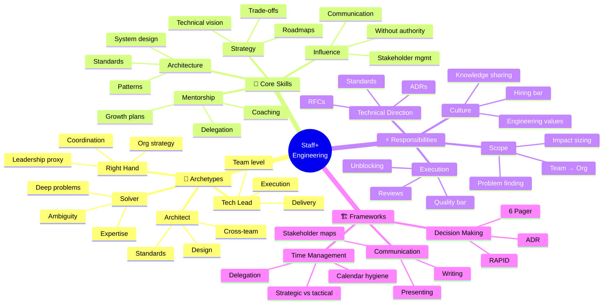

<!-- 
╔══════════════════════════════════════════════════════════════╗
║  📚 BLOQUE: TECHNICAL LEADERSHIP                             ║
║  Nivel: 3 | Fase: Staff+ Engineering                        ║
╚══════════════════════════════════════════════════════════════╝
-->

# 👑 Technical Leadership: Staff+ Engineering

> **Objetivo**: Desarrollar habilidades de liderazgo técnico para roles de Staff Engineer y superiores. Influencia, estrategia técnica, y multiplicación de impacto.

---

## 🧠 Mapa Conceptual



---

## 🔗 First Principles: De la Teoría a la Práctica

| Concepto | Qué significa | Aplicación Práctica |
|----------|---------------|---------------------|
| **Influence without Authority** | Lograr cambio sin reportes directos | Construir credibilidad, comunicar claramente, alinear incentivos. |
| **Technical Strategy** | Visión de largo plazo del stack | Roadmaps técnicos, migration paths, build vs buy decisions. |
| **Multiplier Effect** | Tu impacto × número de personas | Documentar, enseñar, crear herramientas. Un día tuyo multiplica productividad del equipo. |
| **Scope Expansion** | De tareas a problemas a direcciones | Seniors resuelven tareas, Staff+ encuentra qué problemas resolver. |
| **Glue Work** | Trabajo invisible pero crítico | Reuniones, onboarding, code reviews, documentación. Esencial pero a menudo no reconocido. |

> [!IMPORTANT]
> 🧠 **First Principle clave**: El impacto de un Staff Engineer se mide en **cuánto mejor hace al equipo**, no en cuánto código escribe. Escribir el código correcto para un ingeniero junior que aprende vale más que escribirlo tú mismo.

---

## 📋 Frameworks y Plantillas

### 📝 Architecture Decision Record (ADR)

```markdown
# ADR-001: Migración de Airflow a Dagster

## Status
Proposed | Accepted | Deprecated | Superseded

## Context
Nuestro orquestador actual (Airflow 2.2) presenta los siguientes problemas:
- Debugging complejo: Logs dispersos, difícil trazar errores
- Testing local: Requiere levantar toda la infra para probar DAGs
- Development velocity: Ciclo de desarrollo de 30+ minutos

El equipo ha crecido de 3 a 12 personas en 18 meses y la complejidad
de los pipelines ha aumentado proporcionalmente.

## Decision
Migraremos a Dagster 1.x por las siguientes razones:

1. **Software-defined assets**: Modelo mental más simple
2. **Testing nativo**: Pytest integration out of the box
3. **Local development**: `dagster dev` levanta UI local en segundos
4. **Observability**: Lineage y catalogación built-in

## Consequences

### Positivas
- Reducción de 70% en tiempo de debugging estimado
- Testing local sin Docker
- Mejor onboarding (2 semanas → 3 días)

### Negativas
- 3 meses de migración estimados
- Equipo necesita re-training
- Menos talento disponible en mercado (vs Airflow)

### Neutrales
- Costo similar (ambos open source + cloud hosting)

## Alternatives Considered

1. **Prefect 2.0**: Descartado por modelo de pricing incierto
2. **Mage**: Muy nuevo, community pequeña
3. **Upgrade Airflow 2.8**: No resuelve problemas fundamentales

## References
- [Dagster vs Airflow Comparison](https://dagster.io/vs/airflow)
- [Migration Guide](https://docs.dagster.io/migration)
- Internal doc: Airflow Pain Points (confluence/xyz)
```

### 📝 RFC Template

```markdown
# RFC: Implementación de Data Contracts

**Author**: Tu Nombre
**Status**: Draft | In Review | Approved | Implemented
**Created**: 2026-01-05
**Reviewers**: @alice, @bob, @charlie

## Summary
Propuesta para implementar data contracts entre equipos productores
y consumidores de datos, reduciendo incidentes de pipeline en 50%.

## Motivation
En los últimos 6 meses:
- 23 incidentes causados por cambios de schema no comunicados
- 4 horas promedio de MTTR para problemas de data quality
- 3 equipos bloqueados por cambios breaking

## Detailed Design

### Contract Schema
```yaml
apiVersion: datacontract.com/v1
kind: DataContract
spec:
  schema: ...
  quality: ...
  sla: ...
```

### Implementation Phases

| Phase | Duration | Scope |
|-------|----------|-------|
| 1 | 4 weeks | Core contract format, 3 pilot tables |
| 2 | 6 weeks | CI/CD integration, breaking change detection |
| 3 | 4 weeks | Org rollout, documentation, training |

### Migration Path
1. Contractless → Contract optional → Contract required

## Drawbacks
- Overhead inicial de documentar contratos
- Resistencia de equipos que "siempre funcionó así"

## Alternatives
1. **Schema Registry only**: No cubre SLAs ni ownership
2. **Great Expectations everywhere**: No es un contrato, es validación

## Open Questions
- [ ] ¿Quién es owner de contratos cross-team?
- [ ] ¿Cómo manejamos breaking changes en emergencias?

## Success Metrics
- Reducción de 50% en incidentes de schema
- < 1 hora para detectar breaking changes
- 100% de tablas críticas con contrato
```

### 📝 Stakeholder Communication

```markdown
# Weekly Technical Update - Data Platform

**Week of**: January 5, 2026
**Audience**: Engineering Leadership, PM, Data Science Leads

## 🎯 Key Accomplishments

| Initiative | Status | Impact |
|------------|--------|--------|
| Spark 3.5 Migration | ✅ Complete | 40% cost reduction in batch jobs |
| Real-time CDC | 🟡 In Progress | 3 tables migrated, 7 remaining |
| Data Quality Framework | 🟡 In Progress | Pilot running on orders table |

## 🚧 Blockers & Risks

1. **CDC Migration Blocked**
   - **Issue**: Legacy Oracle DB doesn't support log-based CDC
   - **Impact**: 2 week delay in timeline
   - **Ask**: Decision on query-based CDC vs DB upgrade
   - **Owner**: @platform-team, needs input from @dba

## 📊 Metrics

| Metric | This Week | Last Week | Target |
|--------|-----------|-----------|--------|
| Pipeline Success Rate | 98.5% | 97.2% | >99% |
| P50 Latency (batch) | 12 min | 15 min | <15 min |
| Data Quality Score | 94% | 92% | >95% |

## 🔮 Next Week Focus

1. Complete CDC for `customers` and `products` tables
2. Begin Phase 2 of Data Quality rollout
3. Interview 2 candidates for Senior DE position
```

### 🏗️ Time Allocation Framework

```
┌─────────────────────────────────────────────────────────────┐
│              STAFF ENGINEER TIME ALLOCATION                 │
│                                                             │
│  ┌─────────────────────────────────────────────────────┐  │
│  │  30% - Technical Direction & Strategy               │  │
│  │  • ADRs, RFCs, roadmaps                             │  │
│  │  • Architecture reviews                              │  │
│  │  • Technology evaluation                             │  │
│  └─────────────────────────────────────────────────────┘  │
│                                                             │
│  ┌─────────────────────────────────────────────────────┐  │
│  │  25% - Multiplier Work                               │  │
│  │  • Code reviews (teaching, not gatekeeping)         │  │
│  │  • Pair programming with juniors                    │  │
│  │  • Documentation & knowledge sharing                │  │
│  └─────────────────────────────────────────────────────┘  │
│                                                             │
│  ┌─────────────────────────────────────────────────────┐  │
│  │  20% - Hands-on Technical Work                       │  │
│  │  • Complex/ambiguous problems                        │  │
│  │  • Prototypes & proof of concepts                   │  │
│  │  • Critical path items                               │  │
│  └─────────────────────────────────────────────────────┘  │
│                                                             │
│  ┌─────────────────────────────────────────────────────┐  │
│  │  15% - Cross-Team Collaboration                      │  │
│  │  • Stakeholder alignment                             │  │
│  │  • Dependencies management                           │  │
│  │  • Platform/infra coordination                      │  │
│  └─────────────────────────────────────────────────────┘  │
│                                                             │
│  ┌─────────────────────────────────────────────────────┐  │
│  │  10% - People & Culture                              │  │
│  │  • 1:1s, mentoring                                   │  │
│  │  • Hiring (interviews, bar-raising)                 │  │
│  │  • Team health & culture                             │  │
│  └─────────────────────────────────────────────────────┘  │
│                                                             │
└─────────────────────────────────────────────────────────────┘
```

### ⚠️ Anti-Patterns de Nivel Senior

> [!WARNING]
> **Anti-Pattern #1: Hero Mode**
> 
> Resolver todo tú mismo no escala.
> 
> ```
> ❌ "Es más rápido si lo hago yo"
> 
> ✅ "Voy a invertir 2 horas en enseñar esto para que
>     el equipo pueda resolver las próximas 20 instancias"
> ```

> [!WARNING]
> **Anti-Pattern #2: Ivory Tower Architect**
> 
> Diseñar sin feedback ni implementación.
> 
> ```
> ❌ Crear arquitecturas que nadie pidió ni puede implementar
> 
> ✅ Involucrar a implementadores desde el inicio
> ✅ Validar con prototipos antes de documentar
> ```

> [!WARNING]
> **Anti-Pattern #3: Always Saying Yes**
> 
> Aceptar todo diluye tu impacto.
> 
> ```
> ❌ "Sí, puedo hacer eso también"
> 
> ✅ "Dado mi bandwidth actual, puedo hacer A o B. 
>     ¿Cuál tiene más impacto para el negocio?"
> ```

> [!WARNING]
> **Anti-Pattern #4: Invisible Work**
> 
> Hacer trabajo importante sin comunicarlo.
> 
> ```
> ❌ Arreglar problemas silenciosamente sin que nadie sepa
> 
> ✅ Documentar, comunicar, crear visibilidad
> ✅ "Fixed X which was causing Y, here's how to prevent"
> ```

---

## 📊 Career Ladder Comparison

| Aspecto | Senior Engineer | Staff Engineer | Principal Engineer |
|---------|----------------|----------------|-------------------|
| **Scope** | Feature/Project | Team/Multi-team | Org/Company |
| **Ambiguity** | Well-defined | Some ambiguity | High ambiguity |
| **Influence** | Direct | Team + adjacent | Org-wide |
| **IC Work** | 70%+ | 30-50% | 10-30% |
| **Strategy** | Receives | Contributes | Defines |
| **Mentoring** | Informal | Structured | Systemic |

---

## 📚 Bibliografía Académica y Profesional

### 📖 Libros Seminales

| Libro | Autor | Por qué leerlo |
|-------|-------|----------------|
| **Staff Engineer** | Will Larson | EL libro sobre el rol. Obligatorio. |
| **The Manager's Path** | Camille Fournier | Aunque es para managers, capítulos de Tech Lead aplican. |
| **An Elegant Puzzle** | Will Larson | Sistemas de engineering management. |
| **Thinking in Systems** | Donella Meadows | Pensar en sistemas complejos. |

### 📄 Recursos Online

1. **StaffEng.com**
   - 🔗 [staffeng.com](https://staffeng.com/)
   - 💡 **Insight clave**: Historias de Staff+ engineers en distintas empresas.

2. **The Pragmatic Engineer Newsletter**
   - 🔗 [pragmaticengineer.com](https://newsletter.pragmaticengineer.com/)
   - 💡 **Insight clave**: Insights de Big Tech y scaling.

3. **LeadDev**
   - 🔗 [leaddev.com](https://leaddev.com/)
   - 💡 **Insight clave**: Artículos y conferencias de engineering leadership.

---

## ✅ Checklist de Dominio

Antes de considerarte Staff-level, verifica que puedes:

- [ ] Escribir ADRs que el equipo adopta y referencia
- [ ] Facilitar decisiones técnicas sin imponer tu opinión
- [ ] Identificar el problema correcto antes de solucionarlo
- [ ] Comunicar estado técnico a audiencias no técnicas
- [ ] Delegar efectivamente sin micromanagement
- [ ] Dar feedback constructivo en code reviews
- [ ] Balancear tu tiempo entre IC work y multiplier work
- [ ] Navegar conflictos técnicos entre equipos
- [ ] Mentor a ingenieros más junior con planes concretos
- [ ] Medir y comunicar tu impacto más allá de líneas de código

---

*Última actualización: Enero 2026 | Versión: 1.0.0*

