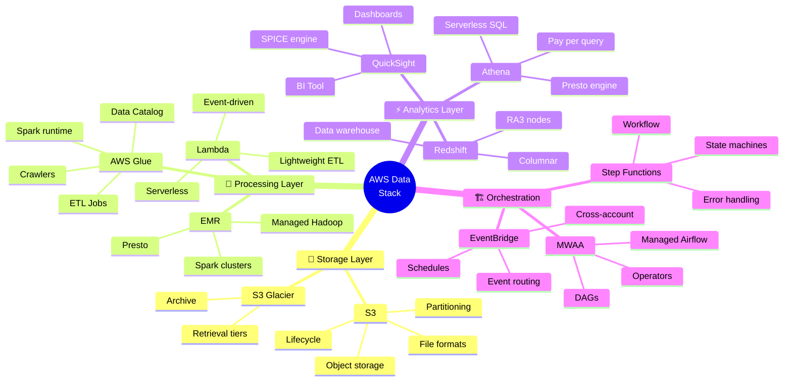

<!-- 
╔══════════════════════════════════════════════════════════════╗
║  📚 BLOQUE: AWS DATA STACK                                   ║
║  Especialización: AWS Data Engineering                       ║
╚══════════════════════════════════════════════════════════════╝
-->

# ☁️ AWS Data Stack: S3, Glue y Redshift

> **Objetivo**: Dominar el stack de datos de AWS. S3 como data lake, Glue para ETL, Athena para queries ad-hoc, y Redshift como warehouse.

---

## 🧠 Mapa Conceptual



---

## 🔗 First Principles: De la Teoría a la Práctica

| Concepto | Qué significa | Servicio AWS |
|----------|---------------|--------------|
| **Object Storage** | Almacenamiento por objetos, no archivos | S3: Durabilidad 99.999999999%, infinitely scalable. |
| **Serverless ETL** | Ejecuta transformaciones sin manejar servers | Glue Jobs: Pagas solo por DPU-hora de ejecución. |
| **Serverless SQL** | Query sin provisionar cluster | Athena: $5/TB escaneado. Ideal para exploración. |
| **Columnar Warehouse** | Optimizado para analytics (SELECT columns) | Redshift: Compresión automática, distribución paralela. |
| **Data Catalog** | Metadata centralizado de todos los datasets | Glue Catalog: Schema discovery automático, integra con Athena/Redshift. |

> [!IMPORTANT]
> 🧠 **First Principle clave**: AWS cobra por **lo que usas**. Optimizar para costo = optimizar formatos de archivo, particionar datos, y elegir el servicio correcto para cada workload.

---

## 📋 Technical Cheat Sheet

### 🖥️ AWS CLI - S3 Operations

```bash
# ═══════════════════════════════════════════════════
# S3 DATA LAKE OPERATIONS
# ═══════════════════════════════════════════════════

# Crear bucket con configuración óptima
aws s3api create-bucket \
  --bucket my-data-lake-prod \
  --region us-east-1 \
  --create-bucket-configuration LocationConstraint=us-east-1

# Habilitar versioning (recomendado para producción)
aws s3api put-bucket-versioning \
  --bucket my-data-lake-prod \
  --versioning-configuration Status=Enabled

# Sync con exclusiones
aws s3 sync ./data s3://my-bucket/raw/ \
  --exclude "*.tmp" \
  --exclude "*.log" \
  --storage-class STANDARD_IA

# Copiar con metadata
aws s3 cp data.parquet s3://my-bucket/curated/ \
  --metadata "source=etl-job-123,processed_at=2026-01-05"

# Análisis de storage por prefijo
aws s3 ls s3://my-bucket/raw/ --recursive --human-readable --summarize

# Configurar lifecycle (via JSON)
aws s3api put-bucket-lifecycle-configuration \
  --bucket my-data-lake-prod \
  --lifecycle-configuration file://lifecycle.json
```

### 📝 S3 Partitioning Strategy

```
# 🔥 BEST PRACTICE: Partitioning Hive-style

s3://my-data-lake/
├── raw/
│   └── orders/
│       ├── year=2026/
│       │   ├── month=01/
│       │   │   ├── day=01/
│       │   │   │   ├── orders_001.json.gz
│       │   │   │   └── orders_002.json.gz
│       │   │   └── day=02/
│       │   │       └── orders_001.json.gz
│       │   └── month=02/
│       │       └── ...
│       └── year=2025/
│           └── ...
│
└── curated/
    └── orders/
        ├── year=2026/
        │   └── month=01/
        │       └── orders.parquet  # Archivos más grandes, menos archivos
        └── ...

# ⚠️ EVITAR:
# - Demasiadas particiones pequeñas (>10K particiones)
# - Archivos muy pequeños (<128MB en Parquet)
# - Particiones por columnas de alta cardinalidad (user_id)

# ✅ RECOMENDADO:
# - Particionar por date (year/month/day)
# - Archivos de 128MB-1GB
# - Parquet con compresión Snappy
```

### 📝 AWS Glue ETL Job

```python
# glue_etl_job.py
# 🔥 BEST PRACTICE: Glue job optimizado

import sys
from awsglue.transforms import *
from awsglue.utils import getResolvedOptions
from pyspark.context import SparkContext
from awsglue.context import GlueContext
from awsglue.job import Job
from awsglue.dynamicframe import DynamicFrame
from pyspark.sql.functions import col, year, month, dayofmonth, current_timestamp

# Inicialización
args = getResolvedOptions(sys.argv, ['JOB_NAME', 'source_path', 'target_path'])
sc = SparkContext()
glueContext = GlueContext(sc)
spark = glueContext.spark_session
job = Job(glueContext)
job.init(args['JOB_NAME'], args)

# ═══════════════════════════════════════════════════
# EXTRACT - Leer desde S3
# ═══════════════════════════════════════════════════

# Opción 1: DynamicFrame (Glue native)
raw_dyf = glueContext.create_dynamic_frame.from_options(
    connection_type="s3",
    connection_options={
        "paths": [args['source_path']],
        "recurse": True,
        "groupFiles": "inPartition",  # Combinar archivos pequeños
        "groupSize": "134217728"       # 128MB
    },
    format="json",
    format_options={"multiLine": False}
)

# Opción 2: Desde Glue Catalog
raw_dyf = glueContext.create_dynamic_frame.from_catalog(
    database="raw_db",
    table_name="orders",
    transformation_ctx="raw_orders"
)

# Convertir a Spark DataFrame para transformaciones complejas
df = raw_dyf.toDF()

# ═══════════════════════════════════════════════════
# TRANSFORM
# ═══════════════════════════════════════════════════

# Limpieza y normalización
df_clean = df \
    .dropDuplicates(["order_id"]) \
    .filter(col("order_id").isNotNull()) \
    .withColumn("order_amount", col("order_amount").cast("decimal(18,2)")) \
    .withColumn("order_status", col("order_status").lower()) \
    .withColumn("_processed_at", current_timestamp())

# Agregar columnas de partición
df_partitioned = df_clean \
    .withColumn("year", year(col("order_date"))) \
    .withColumn("month", month(col("order_date"))) \
    .withColumn("day", dayofmonth(col("order_date")))

# Convertir de vuelta a DynamicFrame
output_dyf = DynamicFrame.fromDF(df_partitioned, glueContext, "output")

# ═══════════════════════════════════════════════════
# LOAD - Escribir a S3 en Parquet particionado
# ═══════════════════════════════════════════════════

glueContext.write_dynamic_frame.from_options(
    frame=output_dyf,
    connection_type="s3",
    connection_options={
        "path": args['target_path'],
        "partitionKeys": ["year", "month", "day"]
    },
    format="parquet",
    format_options={
        "compression": "snappy"
    }
)

# ═══════════════════════════════════════════════════
# UPDATE CATALOG
# ═══════════════════════════════════════════════════

# Opción: Escribir directamente al catalog
glueContext.write_dynamic_frame.from_catalog(
    frame=output_dyf,
    database="curated_db",
    table_name="orders_curated",
    additional_options={
        "enableUpdateCatalog": True,
        "updateBehavior": "UPDATE_IN_DATABASE",
        "partitionKeys": ["year", "month", "day"]
    }
)

job.commit()
```

### 📝 Athena Queries Optimizadas

```sql
-- 🔥 BEST PRACTICE: Queries que minimizan costo

-- ═══════════════════════════════════════════════════
-- SIEMPRE: Usar particiones en WHERE
-- ═══════════════════════════════════════════════════

-- ❌ CARO - Escanea TODO el dataset ($$$)
SELECT * FROM orders WHERE order_status = 'completed';

-- ✅ BARATO - Solo escanea particiones necesarias
SELECT * FROM orders 
WHERE year = 2026 AND month = 1  -- Partition pruning
  AND order_status = 'completed';

-- ═══════════════════════════════════════════════════
-- SIEMPRE: Seleccionar solo columnas necesarias
-- ═══════════════════════════════════════════════════

-- ❌ CARO - Lee todas las columnas
SELECT * FROM orders WHERE year = 2026;

-- ✅ BARATO - Solo lee columnas seleccionadas (Parquet columnar)
SELECT order_id, customer_id, order_amount 
FROM orders 
WHERE year = 2026;

-- ═══════════════════════════════════════════════════
-- OPTIMIZACIÓN: CTAS para materializar
-- ═══════════════════════════════════════════════════

-- Crear tabla materializada con formato optimizado
CREATE TABLE curated_db.orders_aggregated
WITH (
    format = 'PARQUET',
    parquet_compression = 'SNAPPY',
    partitioned_by = ARRAY['year', 'month'],
    external_location = 's3://my-bucket/curated/orders_agg/'
) AS
SELECT 
    customer_id,
    date_trunc('day', order_date) as order_day,
    COUNT(*) as order_count,
    SUM(order_amount) as total_amount,
    year(order_date) as year,
    month(order_date) as month
FROM raw_db.orders
GROUP BY 1, 2, year(order_date), month(order_date);

-- ═══════════════════════════════════════════════════
-- UNLOAD: Exportar resultados
-- ═══════════════════════════════════════════════════

UNLOAD (
    SELECT * FROM orders WHERE year = 2026 AND month = 1
)
TO 's3://my-bucket/exports/orders_jan/'
WITH (format = 'PARQUET', compression = 'SNAPPY');
```

### 📝 Redshift Best Practices

```sql
-- 🔥 BEST PRACTICE: Diseño de tablas Redshift

-- ═══════════════════════════════════════════════════
-- DISTRIBUTION STYLES
-- ═══════════════════════════════════════════════════

-- EVEN: Default, distribuye uniformemente
-- KEY: Co-localiza rows con mismo key (para JOINs)
-- ALL: Copia completa en cada nodo (tablas pequeñas)

-- Fact table: Distribution por key de JOIN frecuente
CREATE TABLE fct_orders (
    order_id BIGINT ENCODE az64,
    customer_id BIGINT ENCODE az64,
    product_id BIGINT ENCODE az64,
    order_date DATE ENCODE az64,
    order_amount DECIMAL(18,2) ENCODE az64,
    order_status VARCHAR(20) ENCODE bytedict
)
DISTKEY (customer_id)    -- Distribuir por customer para JOINs
SORTKEY (order_date)     -- Ordenar por fecha para range queries
;

-- Dimension pequeña: ALL distribution
CREATE TABLE dim_products (
    product_id BIGINT ENCODE az64,
    product_name VARCHAR(200) ENCODE lzo,
    category VARCHAR(100) ENCODE bytedict,
    brand VARCHAR(100) ENCODE bytedict
)
DISTSTYLE ALL            -- Copia en cada nodo
SORTKEY (product_id)
;

-- ═══════════════════════════════════════════════════
-- COPY FROM S3
-- ═══════════════════════════════════════════════════

COPY fct_orders
FROM 's3://my-bucket/curated/orders/'
IAM_ROLE 'arn:aws:iam::123456789:role/RedshiftLoadRole'
FORMAT PARQUET
;

-- Con manifest (lista explícita de archivos)
COPY fct_orders
FROM 's3://my-bucket/manifests/orders_manifest.json'
IAM_ROLE 'arn:aws:iam::123456789:role/RedshiftLoadRole'
FORMAT PARQUET
MANIFEST
;

-- ═══════════════════════════════════════════════════
-- VACUUM & ANALYZE
-- ═══════════════════════════════════════════════════

-- Después de DELETEs/UPDATEs: recuperar espacio
VACUUM FULL fct_orders;

-- Después de cargas: actualizar estadísticas
ANALYZE fct_orders;

-- Ver estado de vacuum
SELECT * FROM svv_table_info WHERE "table" = 'fct_orders';

-- ═══════════════════════════════════════════════════
-- QUERY MONITORING
-- ═══════════════════════════════════════════════════

-- Queries lentas
SELECT 
    query,
    substring(querytxt, 1, 100) as query_preview,
    execution_time / 1000000.0 as seconds,
    queue_time / 1000000.0 as queue_seconds
FROM stl_query
WHERE execution_time > 60000000  -- > 60 segundos
ORDER BY execution_time DESC
LIMIT 20;

-- Espacio por tabla
SELECT 
    "schema" || '.' || "table" as tablename,
    size as size_mb,
    tbl_rows as rows
FROM svv_table_info
ORDER BY size DESC
LIMIT 20;
```

### ⚠️ Gotchas de Nivel Senior

> [!WARNING]
> **Gotcha #1: S3 request costs**
> 
> Demasiados archivos pequeños = muchas requests = $$$
> 
> ```bash
> # ❌ CARO - 1 millón de archivos de 1KB
> # GET request = $0.0004 por 1000 → $400 solo en reads
> 
> # ✅ BARATO - Consolidar en archivos de 128MB-1GB
> # Usar Glue groupFiles o compactación
> ```

> [!WARNING]
> **Gotcha #2: Athena query timeout**
> 
> Queries muy complejas pueden timeout (30 min default).
> 
> ```sql
> -- ❌ Query enorme que escanea todo
> SELECT * FROM huge_table WHERE col LIKE '%pattern%'
> 
> -- ✅ Dividir en queries más pequeñas
> -- ✅ Pre-materializar con CTAS
> -- ✅ Mover a Redshift si es recurrente
> ```

> [!WARNING]
> **Gotcha #3: Glue Crawler schema conflicts**
> 
> Crawlers pueden detectar schemas incorrectos si datos son inconsistentes.
> 
> ```python
> # ❌ Crawler detecta "order_amount" como STRING en un archivo
> # y como DOUBLE en otro → conflict
> 
> # ✅ Validar schema ANTES de landing zone
> # ✅ Usar SchemaChangePolicy específica
> # ✅ Definir schema manualmente en casos críticos
> ```

> [!WARNING]
> **Gotcha #4: Redshift DISTKEY mal elegido**
> 
> Skew de datos causa que un nodo haga todo el trabajo.
> 
> ```sql
> -- ❌ DISTKEY en columna con 90% de valores iguales
> -- Un nodo tiene 90% de los datos
>
> -- ✅ Elegir DISTKEY con distribución uniforme
> -- ✅ O usar EVEN distribution si no hay JOINs frecuentes
>
> -- Verificar skew
> SELECT slice, COUNT(*) 
> FROM stv_blocklist 
> WHERE tbl = (SELECT id FROM stv_tbl_perm WHERE name = 'fct_orders')
> GROUP BY slice;
> ```

---

## 📊 Comparativa de Servicios AWS Data

| Aspecto | Athena | Redshift | EMR | Glue |
|---------|--------|----------|-----|------|
| **Modelo** | Serverless | Provisioned | Provisioned | Serverless |
| **Costo** | $5/TB scan | $/hora nodo | $/hora cluster | DPU-hora |
| **Latencia** | Segundos | Sub-segundo | Variable | Minutos |
| **Caso de uso** | Ad-hoc, exploración | BI, dashboards | Big Data, ML | ETL batch |
| **Concurrencia** | Alta | Media (WLM) | Baja | Alta |

---

## 📚 Bibliografía Académica y Profesional

### 📖 Recursos Seminales

| Recurso | Autor | Por qué consumirlo |
|---------|-------|-------------------|
| **AWS Documentation** | AWS | Documentación oficial, siempre actualizada. |
| **Data Engineering on AWS** | Gareth Eagar | Libro comprehensivo de O'Reilly. |
| **AWS Well-Architected Framework** | AWS | Best practices oficiales. |

### 📄 Whitepapers Clave

1. **AWS Well-Architected - Data Analytics Lens**
   - 🔗 [AWS Docs](https://docs.aws.amazon.com/wellarchitected/latest/analytics-lens/)
   - 💡 **Insight clave**: Framework oficial para arquitecturas de datos.

2. **Best Practices for Amazon Redshift**
   - 🔗 [Redshift Best Practices](https://docs.aws.amazon.com/redshift/latest/dg/best-practices.html)
   - 💡 **Insight clave**: Diseño de tablas, loading, querying.

3. **AWS Big Data Blog**
   - 🔗 [AWS Blog](https://aws.amazon.com/blogs/big-data/)
   - 💡 **Insight clave**: Casos de uso y patrones actualizados.

---

## ✅ Checklist de Dominio

Antes de avanzar, verifica que puedes:

- [ ] Diseñar estructura de data lake en S3 con partitioning
- [ ] Configurar lifecycle policies para optimización de costos
- [ ] Crear Glue ETL jobs con Spark
- [ ] Configurar Glue Crawlers y Data Catalog
- [ ] Escribir queries Athena optimizadas (partition pruning, columnar)
- [ ] Diseñar tablas Redshift con DISTKEY/SORTKEY correctos
- [ ] Cargar datos a Redshift con COPY
- [ ] Monitorear costos con Cost Explorer y budgets
- [ ] Orquestar pipelines con Step Functions
- [ ] Elegir entre Athena vs Redshift según caso de uso

---

*Última actualización: Enero 2026 | Versión: 1.0.0*

