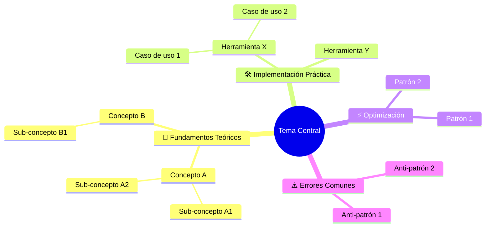

---
# ============================================
# METADATA - No modificar estructura
# ============================================
id: "block-id"
version: "1.0.0"
lastUpdated: "2026-01-05"

title:
  es: "Título del Bloque"
  en: "Block Title"
  pt: "Título do Bloco"

subtitle:
  es: "Subtítulo descriptivo"
  en: "Descriptive subtitle"
  pt: "Subtítulo descritivo"

level: 1  # 1, 2, 3 o "specialization"
phase: "phase-id"
estimatedTime: "2-3 horas"

prerequisites:
  - "prerequisite-block-id"

tags:
  - "python"
  - "data-engineering"

# Conexiones teóricas principales
theoreticalFoundations:
  - "Concepto CS 1"
  - "Concepto CS 2"
---

<!-- 
╔══════════════════════════════════════════════════════════════╗
║  📚 BLOQUE: [NOMBRE DEL BLOQUE]                              ║
║  Nivel: X | Fase: Y                                          ║
╚══════════════════════════════════════════════════════════════╝
-->

# 🎯 [Título del Bloque]

> **Objetivo**: Describir en una oración qué dominarás al completar este bloque.

---

## 🧠 Mapa Conceptual



---

## 🔗 First Principles: De la Teoría a la Práctica

| Concepto CS | Qué significa | Implementación práctica |
|-------------|---------------|------------------------|
| **Concepto 1** | Explicación breve | Cómo se aplica en [herramienta] |
| **Concepto 2** | Explicación breve | Cómo se aplica en [herramienta] |
| **Concepto 3** | Explicación breve | Cómo se aplica en [herramienta] |

> [!IMPORTANT]
> 🧠 **First Principle clave**: Explicar el principio fundamental que subyace a todo el bloque.

---

## 📋 Technical Cheat Sheet

### 🖥️ Comandos CLI Críticos

```bash
# Descripción del comando 1
comando1 --flag valor

# Descripción del comando 2  
comando2 --option

# Descripción del comando 3
comando3 -a -b -c

# Verificar estado/versión
comando --version

# Comando de debugging
comando --debug --verbose
```

### 📝 Snippets de Alta Densidad

#### Patrón 1: [Nombre del Patrón]

```python
# 🔥 BEST PRACTICE: [Descripción]
# Cuándo usar: [Caso de uso]

def patron_ejemplo():
    """
    Docstring explicativo.
    """
    pass
```

#### Patrón 2: [Nombre del Patrón]

```python
# 🔥 BEST PRACTICE: [Descripción]
# Cuándo usar: [Caso de uso]

def otro_patron():
    pass
```

#### Patrón 3: [Nombre del Patrón]

```sql
-- 🔥 BEST PRACTICE: [Descripción]
-- Cuándo usar: [Caso de uso]

SELECT 
    columna,
    funcion_agregada() OVER (PARTITION BY grupo ORDER BY orden) as metrica
FROM tabla
```

### 🏗️ Patrones de Diseño Aplicados

#### 1. [Nombre del Patrón]

```
┌─────────────────┐     ┌─────────────────┐     ┌─────────────────┐
│   Componente A  │────▶│   Componente B  │────▶│   Componente C  │
└─────────────────┘     └─────────────────┘     └─────────────────┘
         │                       │                       │
         ▼                       ▼                       ▼
    [Descripción]          [Descripción]          [Descripción]
```

**Cuándo usar**: Descripción del caso de uso.

**Ejemplo real**: Cómo se aplica en producción.

#### 2. [Nombre del Patrón]

**Problema**: Qué problema resuelve.

**Solución**: Cómo lo resuelve.

**Trade-offs**: 
- ✅ Ventaja 1
- ✅ Ventaja 2
- ❌ Desventaja 1

### ⚠️ Gotchas de Nivel Senior

> [!WARNING]
> **Gotcha #1: [Título]**
> 
> Descripción del problema común que los juniors no conocen.
> 
> ```python
> # ❌ EVITAR
> codigo_problematico()
> 
> # ✅ CORRECTO
> codigo_correcto()
> ```

> [!WARNING]
> **Gotcha #2: [Título]**
> 
> Descripción del problema.

> [!WARNING]
> **Gotcha #3: [Título]**
> 
> Descripción del problema.

---

## 📊 Métricas y Benchmarks

| Escenario | Enfoque naive | Enfoque optimizado | Mejora |
|-----------|---------------|-------------------|--------|
| Caso 1 | X segundos | Y segundos | Z% |
| Caso 2 | X MB | Y MB | Z% |

---

## 📚 Bibliografía Académica y Profesional

### 📖 Libros Seminales

| Libro | Autor | Capítulos relevantes | Por qué leerlo |
|-------|-------|---------------------|----------------|
| **Título 1** | Autor | Caps. X-Y | Razón |
| **Título 2** | Autor | Caps. X-Y | Razón |
| **Título 3** | Autor | Caps. X-Y | Razón |

### 📄 Papers de Investigación

1. **"Título del Paper"** (Año) - Autores
   - 🔗 [Link al paper](url)
   - 💡 **Insight clave**: Qué aprender de este paper

2. **"Título del Paper 2"** (Año) - Autores
   - 🔗 [Link al paper](url)
   - 💡 **Insight clave**: Qué aprender

### 📋 Whitepapers y Documentación Técnica

- **[Título]** - Empresa/Organización
  - 🔗 [Link](url)
  - Relevancia: Por qué es importante

### 🎓 Cursos y Recursos Adicionales

- **[Nombre del curso]** - Plataforma
  - Duración: X horas
  - Nivel: Intermedio/Avanzado

---

## 🔄 Conexiones con Otros Bloques

| Bloque relacionado | Tipo de conexión | Descripción |
|-------------------|------------------|-------------|
| [Bloque anterior] | Prerequisito | Qué necesitas saber antes |
| [Bloque siguiente] | Continuación | Qué viene después |
| [Bloque paralelo] | Complementario | Conocimiento que potencia este |

---

## ✅ Checklist de Dominio

Antes de avanzar, verifica que puedes:

- [ ] Competencia 1
- [ ] Competencia 2
- [ ] Competencia 3
- [ ] Competencia 4
- [ ] Competencia 5

---

## 💬 Preguntas de Autoevaluación

1. **Pregunta conceptual**: ¿Por qué...?
2. **Pregunta práctica**: ¿Cómo implementarías...?
3. **Pregunta de diseño**: ¿Qué trade-offs considerarías para...?

---

*Última actualización: [Fecha] | Versión: [X.X.X]*

