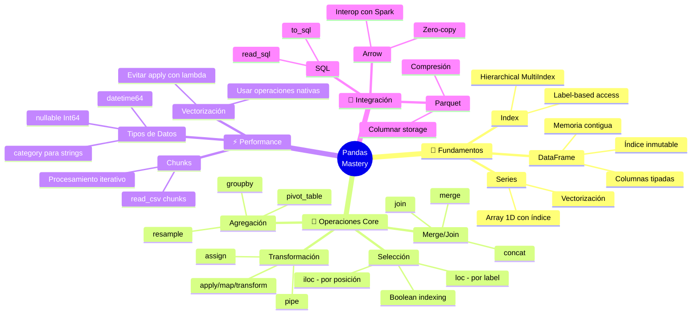

<!-- 
╔══════════════════════════════════════════════════════════════╗
║  📚 BLOQUE: PANDAS DATA MANIPULATION                         ║
║  Nivel: 1 | Fase: Manipulación de Datos                      ║
╚══════════════════════════════════════════════════════════════╝
-->

# 🐼 Pandas: Manipulación de Datos a Escala

> **Objetivo**: Dominar Pandas como herramienta de transformación de datos profesional, entendiendo cuándo usarlo y cuándo necesitas algo más potente (Spark, Polars).

---

## 🧠 Mapa Conceptual



---

## 🔗 First Principles: De la Teoría a la Práctica

| Concepto CS | Qué significa | Implementación en Pandas |
|-------------|---------------|--------------------------|
| **Álgebra Relacional** | Operaciones matemáticas sobre conjuntos de tuplas | `merge` = JOIN, `groupby` = GROUP BY, boolean indexing = WHERE. Pandas implementa operaciones relacionales. |
| **Vectorización (SIMD)** | Una instrucción opera sobre múltiples datos | Operaciones como `df['col'] * 2` se ejecutan en C/NumPy, no Python. 100x más rápido que loops. |
| **Columnar Storage** | Datos almacenados por columna, no por fila | Parquet agrupa valores del mismo tipo → mejor compresión y lectura selectiva de columnas. |
| **Immutability** | Objetos que no cambian después de crearse | El Index de Pandas es inmutable. Muchas operaciones retornan copias, no modifican in-place. |
| **Locality of Reference** | Datos cercanos en memoria se acceden juntos | Arrays NumPy subyacentes son contiguos → cache-friendly → rápido. |
| **Lazy vs Eager** | Computar ahora vs computar cuando se necesite | Pandas es eager (ejecuta inmediatamente). Alternativas lazy: Polars, Dask, Spark. |

> [!IMPORTANT]
> 🧠 **First Principle clave**: Pandas está construido sobre **NumPy arrays contiguos en memoria**. Cada vez que iteras fila por fila, rompes esta optimización y pagas el costo de Python puro. **Piensa en columnas, no en filas.**

---

## 📋 Technical Cheat Sheet

### 🖥️ Comandos CLI / Inicio Rápido

```python
import pandas as pd
import numpy as np

# Configuración recomendada para desarrollo
pd.set_option('display.max_columns', None)
pd.set_option('display.max_rows', 100)
pd.set_option('display.width', None)
pd.set_option('display.float_format', '{:.2f}'.format)

# Leer archivos (especificar tipos mejora memoria 5-10x)
df = pd.read_csv('data.csv', 
    dtype={'category_col': 'category', 'id': 'int32'},
    parse_dates=['date_col'],
    usecols=['col1', 'col2', 'col3']  # Solo columnas necesarias
)

# Leer archivos grandes en chunks
chunks = pd.read_csv('huge.csv', chunksize=100_000)
for chunk in chunks:
    process(chunk)

# Parquet: SIEMPRE preferir sobre CSV para producción
df.to_parquet('data.parquet', compression='snappy', index=False)
df = pd.read_parquet('data.parquet', columns=['col1', 'col2'])
```

### 📝 Snippets de Alta Densidad

#### Patrón 1: Selección Eficiente (loc vs iloc)

```python
# 🔥 BEST PRACTICE: Entender loc vs iloc previene bugs sutiles
# loc = Label-based, iloc = Integer-position based

# Selección por label (nombres de columnas/índice)
df.loc[df['status'] == 'active', ['name', 'email']]

# Selección por posición (números)
df.iloc[0:100, [0, 2, 5]]  # Primeras 100 filas, columnas 0, 2, 5

# ⚠️ CUIDADO: Si el índice es numérico, loc y iloc difieren
df = pd.DataFrame({'a': [1,2,3]}, index=[10, 20, 30])
df.loc[10]   # Fila con índice label 10
df.iloc[0]   # Primera fila (índice posición 0)

# Boolean indexing (el más usado)
mask = (df['age'] > 25) & (df['country'].isin(['AR', 'CL', 'MX']))
df_filtered = df.loc[mask]

# Query syntax (más legible para condiciones complejas)
df.query('age > 25 and country in ["AR", "CL", "MX"]')
```

#### Patrón 2: Transformaciones Vectorizadas

```python
# 🔥 BEST PRACTICE: Vectorizar TODO lo posible
# Cuándo usar: SIEMPRE que transformes datos

# ❌ LENTO - apply con lambda (ejecuta Python por cada fila)
df['total'] = df.apply(lambda row: row['price'] * row['qty'], axis=1)

# ✅ RÁPIDO - Operación vectorizada (ejecuta en C)
df['total'] = df['price'] * df['qty']

# ❌ LENTO - Loop explícito
for idx, row in df.iterrows():
    df.loc[idx, 'upper'] = row['name'].upper()

# ✅ RÁPIDO - Métodos de string vectorizados
df['upper'] = df['name'].str.upper()

# Operaciones condicionales vectorizadas
df['category'] = np.where(df['value'] > 100, 'high', 'low')

# Múltiples condiciones con np.select
conditions = [
    df['value'] > 100,
    df['value'] > 50,
    df['value'] > 0
]
choices = ['high', 'medium', 'low']
df['category'] = np.select(conditions, choices, default='unknown')
```

#### Patrón 3: GroupBy como un Pro

```python
# 🔥 BEST PRACTICE: GroupBy es tu herramienta más poderosa
# Cuándo usar: Agregaciones, transformaciones por grupo

# Agregación básica
df.groupby('category')['sales'].sum()

# Múltiples agregaciones
df.groupby('category').agg({
    'sales': ['sum', 'mean', 'count'],
    'profit': 'sum',
    'customer_id': 'nunique'
})

# Named aggregations (Pandas 0.25+) - Más limpio
df.groupby('category').agg(
    total_sales=('sales', 'sum'),
    avg_sales=('sales', 'mean'),
    unique_customers=('customer_id', 'nunique')
)

# Transform: Retorna mismo shape que input (útil para normalización)
df['sales_pct_of_category'] = df.groupby('category')['sales'].transform(
    lambda x: x / x.sum()
)

# Filter: Filtrar grupos completos
# Solo categorías con más de 100 ventas
df.groupby('category').filter(lambda x: x['sales'].sum() > 100)
```

#### Patrón 4: Merge/Join Correctamente

```python
# 🔥 BEST PRACTICE: Validar siempre los resultados del merge
# Cuándo usar: Combinar tablas relacionadas

# Merge básico (inner por defecto)
df_merged = pd.merge(df_orders, df_customers, on='customer_id')

# Left join con validación
df_merged = pd.merge(
    df_orders, 
    df_customers, 
    on='customer_id',
    how='left',
    validate='m:1',  # Muchos orders, un customer
    indicator=True   # Añade columna _merge para debug
)

# Verificar el merge
print(df_merged['_merge'].value_counts())
# both          950  ← OK, match encontrado
# left_only      50  ← Órdenes sin customer (investigar!)
# right_only      0

# Merge con claves diferentes
df_merged = pd.merge(
    df_left, df_right,
    left_on='id_cliente',
    right_on='customer_id'
)

# Anti-join (registros que NO tienen match)
df_no_match = df_left.merge(df_right, on='id', how='left', indicator=True)
df_no_match = df_no_match[df_no_match['_merge'] == 'left_only']
```

#### Patrón 5: Manejo de Fechas

```python
# 🔥 BEST PRACTICE: Siempre parsear fechas al leer
# Cuándo usar: Cualquier dato temporal

# Al leer
df = pd.read_csv('data.csv', parse_dates=['fecha'])

# Convertir columna existente
df['fecha'] = pd.to_datetime(df['fecha'], format='%Y-%m-%d')

# Extraer componentes
df['year'] = df['fecha'].dt.year
df['month'] = df['fecha'].dt.month
df['day_of_week'] = df['fecha'].dt.dayofweek  # 0=Monday
df['is_weekend'] = df['fecha'].dt.dayofweek >= 5

# Resampling (agrupar por período)
df.set_index('fecha').resample('M')['ventas'].sum()  # Por mes
df.set_index('fecha').resample('W')['ventas'].mean()  # Por semana

# Rolling windows
df['sales_7d_avg'] = df['sales'].rolling(window=7).mean()
df['sales_30d_sum'] = df['sales'].rolling(window=30).sum()

# Shift (comparar con período anterior)
df['sales_yesterday'] = df['sales'].shift(1)
df['sales_diff'] = df['sales'] - df['sales'].shift(1)
df['sales_pct_change'] = df['sales'].pct_change()
```

### 🏗️ Patrones de Diseño Aplicados

#### 1. Method Chaining (Fluent Interface)

```python
# ✅ PATRÓN RECOMENDADO: Encadenar operaciones para código legible

result = (
    df
    .query('status == "active"')
    .assign(
        total=lambda x: x['price'] * x['quantity'],
        year=lambda x: x['date'].dt.year
    )
    .groupby(['year', 'category'])
    .agg(
        revenue=('total', 'sum'),
        orders=('order_id', 'count')
    )
    .reset_index()
    .sort_values('revenue', ascending=False)
)
```

**Cuándo usar**: Pipelines de transformación. Cada paso es una transformación pura.

**Trade-offs**:
- ✅ Muy legible, fácil de entender el flujo
- ✅ Cada paso es debuggeable (romper la cadena)
- ❌ No todos los métodos retornan DataFrame (verificar docs)

#### 2. Pipe Pattern para Funciones Reutilizables

```python
def clean_column_names(df: pd.DataFrame) -> pd.DataFrame:
    """Normaliza nombres de columnas."""
    df.columns = df.columns.str.lower().str.replace(' ', '_')
    return df

def remove_duplicates(df: pd.DataFrame, subset: list) -> pd.DataFrame:
    """Elimina duplicados manteniendo el primero."""
    return df.drop_duplicates(subset=subset, keep='first')

def add_audit_columns(df: pd.DataFrame) -> pd.DataFrame:
    """Añade columnas de auditoría."""
    return df.assign(
        _loaded_at=pd.Timestamp.now(),
        _source='pipeline_v1'
    )

# Usar con pipe
result = (
    df
    .pipe(clean_column_names)
    .pipe(remove_duplicates, subset=['id'])
    .pipe(add_audit_columns)
)
```

**Cuándo usar**: Funciones de transformación reutilizables entre pipelines.

#### 3. Accessor Pattern (Custom Methods)

```python
@pd.api.extensions.register_dataframe_accessor("de")
class DataEngineeringAccessor:
    """Custom accessor para operaciones comunes de DE."""
    
    def __init__(self, pandas_obj):
        self._obj = pandas_obj
    
    def profile(self):
        """Genera perfil rápido del DataFrame."""
        return pd.DataFrame({
            'dtype': self._obj.dtypes,
            'nulls': self._obj.isnull().sum(),
            'null_pct': (self._obj.isnull().sum() / len(self._obj) * 100).round(2),
            'unique': self._obj.nunique()
        })
    
    def to_warehouse(self, table_name: str, conn):
        """Escribe a warehouse con convenciones estándar."""
        df = self._obj.copy()
        df.columns = df.columns.str.lower()
        df.to_sql(table_name, conn, if_exists='append', index=False)

# Uso
df.de.profile()
df.de.to_warehouse('fact_sales', connection)
```

### ⚠️ Gotchas de Nivel Senior

> [!WARNING]
> **Gotcha #1: SettingWithCopyWarning (El más común)**
> 
> Pandas no sabe si estás modificando una vista o una copia.
> 
> ```python
> # ❌ PELIGROSO - Puede no modificar el original
> df[df['status'] == 'active']['price'] = 100
> 
> # ✅ CORRECTO - Usa .loc para modificación in-place
> df.loc[df['status'] == 'active', 'price'] = 100
> 
> # ✅ CORRECTO - Copia explícita si quieres una nueva variable
> df_active = df[df['status'] == 'active'].copy()
> df_active['price'] = 100
> ```

> [!WARNING]
> **Gotcha #2: Memory Explosion con Merge**
> 
> Un merge many-to-many puede explotar exponencialmente.
> 
> ```python
> # Si df1 tiene 1M filas y df2 tiene 1M filas,
> # un merge con claves duplicadas puede generar BILLONES de filas
> 
> # ✅ SIEMPRE verificar cardinalidad ANTES del merge
> print(f"df1 keys unique: {df1['key'].nunique()}")
> print(f"df2 keys unique: {df2['key'].nunique()}")
> print(f"df1 duplicates: {df1['key'].duplicated().sum()}")
> 
> # ✅ Usar validate para detectar problemas
> df.merge(df2, on='key', validate='one_to_one')  # Falla si hay duplicados
> ```

> [!WARNING]
> **Gotcha #3: Object dtype = Memory Hog**
> 
> El dtype `object` guarda punteros Python, no datos optimizados.
> 
> ```python
> # Ver uso de memoria
> df.info(memory_usage='deep')
> 
> # Columna de strings con pocos valores únicos
> # ❌ object dtype: 800 MB
> # ✅ category dtype: 50 MB
> 
> # Convertir a category
> df['country'] = df['country'].astype('category')
> 
> # Al leer
> df = pd.read_csv('data.csv', dtype={'country': 'category'})
> ```

> [!WARNING]
> **Gotcha #4: NaN Propagation**
> 
> NaN se propaga en operaciones matemáticas.
> 
> ```python
> # NaN + cualquier cosa = NaN
> pd.Series([1, 2, np.nan]).sum()   # 3.0 (NaN ignorado por defecto)
> pd.Series([1, 2, np.nan]).mean()  # 1.5 (NaN ignorado)
> 
> # Pero en operaciones elemento a elemento...
> pd.Series([1, 2, np.nan]) + 10  # [11, 12, NaN]
> 
> # ✅ Decidir explícitamente qué hacer con NaN
> df['total'] = df['price'].fillna(0) * df['qty'].fillna(0)
> ```

> [!WARNING]
> **Gotcha #5: inplace=True es un Anti-patrón**
> 
> `inplace=True` rompe method chaining y será deprecado.
> 
> ```python
> # ❌ EVITAR
> df.drop(columns=['temp'], inplace=True)
> df.reset_index(inplace=True)
> 
> # ✅ PREFERIR - Reasignar
> df = df.drop(columns=['temp'])
> df = df.reset_index()
> 
> # ✅ O mejor, encadenar
> df = df.drop(columns=['temp']).reset_index()
> ```

---

## 📊 Métricas y Benchmarks

| Operación (1M filas) | Loop Python | apply() | Vectorizado | Mejora |
|---------------------|-------------|---------|-------------|--------|
| Suma de columnas | 2.5s | 0.8s | 0.003s | **800x** |
| String upper | 4.2s | 1.2s | 0.15s | **28x** |
| Filtro booleano | 3.1s | N/A | 0.02s | **150x** |
| GroupBy sum | N/A | N/A | 0.05s | - |

| Formato archivo (100M filas) | Tamaño | Tiempo lectura | Notas |
|------------------------------|--------|----------------|-------|
| CSV sin compresión | 5.2 GB | 180s | ❌ Evitar en producción |
| CSV gzip | 1.1 GB | 220s | Menor tamaño pero más lento |
| Parquet snappy | 0.8 GB | 12s | ✅ **Recomendado** |
| Parquet + columnas selectas | N/A | 3s | Solo lee lo necesario |

---

## 📚 Bibliografía Académica y Profesional

### 📖 Libros Seminales

| Libro | Autor | Capítulos relevantes | Por qué leerlo |
|-------|-------|---------------------|----------------|
| **Python for Data Analysis** (3rd Ed) | Wes McKinney | Caps. 4-10 | El creador de Pandas explica el diseño interno. |
| **Effective Pandas** | Matt Harrison | Todo | Patrones modernos y optimización. Enfoque práctico. |
| **Pandas Cookbook** (2nd Ed) | Matt Harrison | Según necesidad | Recetas para problemas específicos. |

### 📄 Papers de Investigación

1. **"pandas: a Foundational Python Library for Data Analysis and Statistics"** (2010) - Wes McKinney
   - 🔗 [Paper original](https://www.dlr.de/sc/Portaldata/15/Resources/dokumente/pyhpc2011/submissions/pyhpc2011_submission_9.pdf)
   - 💡 **Insight clave**: Motivación original y decisiones de diseño de Pandas.

2. **"Apache Arrow: A Cross-language Development Platform for In-memory Analytics"** (2019)
   - 🔗 [arrow.apache.org](https://arrow.apache.org/)
   - 💡 **Insight clave**: El futuro de Pandas está en Arrow (PyArrow backend).

### 📋 Whitepapers y Documentación Técnica

- **Pandas User Guide**
  - 🔗 [pandas.pydata.org](https://pandas.pydata.org/docs/user_guide/)
  - Relevancia: Documentación oficial, siempre actualizada.

- **Pandas 2.0 Release Notes**
  - 🔗 [Release Notes](https://pandas.pydata.org/docs/whatsnew/v2.0.0.html)
  - Relevancia: PyArrow backend, nullable dtypes, breaking changes.

- **Polars User Guide**
  - 🔗 [pola.rs](https://pola.rs/user-guide/)
  - Relevancia: Alternativa más rápida a Pandas. Conocerla es ventaja competitiva.

### 🎓 Alternativas Modernas (Conocer el Ecosistema)

| Herramienta | Cuándo usar | Ventaja sobre Pandas |
|-------------|-------------|---------------------|
| **Polars** | Datos en memoria, performance crítica | 10-100x más rápido, lazy evaluation |
| **DuckDB** | SQL sobre archivos locales | Motor columnar optimizado |
| **Dask** | Datos que no caben en memoria | API compatible con Pandas, distribuido |
| **PySpark** | Big Data distribuido | Escala a petabytes |

---

## 🔄 Conexiones con Otros Bloques

| Bloque relacionado | Tipo de conexión | Descripción |
|-------------------|------------------|-------------|
| **Python Fundamentals** | Prerequisito | Necesitas dominar Python core primero |
| **SQL Fundamentals** | Paralelo | Mismo modelo mental (operaciones relacionales) |
| **dbt** (Nivel 1) | Alternativa | SQL para transformaciones, Pandas para exploración |
| **PySpark** (Nivel 2) | Evolución | Misma API pero distribuida |
| **Polars** (Nivel 2) | Alternativa moderna | Cuando Pandas es lento |

---

## ✅ Checklist de Dominio

Antes de avanzar, verifica que puedes:

- [ ] Leer CSV/Parquet especificando dtypes correctos
- [ ] Filtrar con boolean indexing sin pensar
- [ ] Usar `loc` vs `iloc` correctamente
- [ ] Escribir groupby con múltiples agregaciones
- [ ] Hacer merge con validación y indicator
- [ ] Manejar fechas con `.dt` accessor
- [ ] Evitar loops usando vectorización
- [ ] Explicar por qué `apply()` es lento
- [ ] Usar method chaining para pipelines legibles
- [ ] Identificar cuándo Pandas no es suficiente (→ Spark/Polars)

---

## 💬 Preguntas de Autoevaluación

1. **Conceptual**: ¿Por qué `df.apply(lambda x: x['a'] + x['b'], axis=1)` es 100x más lento que `df['a'] + df['b']`? Explica qué pasa a nivel de memoria.

2. **Práctica**: Tienes un CSV de 50GB. Tu laptop tiene 16GB RAM. ¿Cómo lo procesarías con Pandas? (Hay al menos 3 estrategias válidas)

3. **Diseño**: Necesitas un pipeline que se ejecute diariamente, lea de S3, transforme, y escriba a Redshift. El archivo crece 10% cada mes. ¿Usarías Pandas? ¿Por qué sí/no? ¿Qué alternativas considerarías?

---

*Última actualización: Enero 2026 | Versión: 1.0.0*

