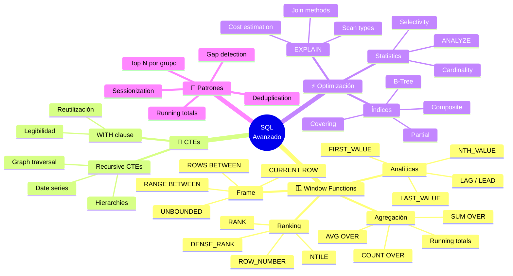

<!-- 
╔══════════════════════════════════════════════════════════════╗
║  📚 BLOQUE: SQL ADVANCED                                     ║
║  Nivel: 1 | Fase: SQL Avanzado                               ║
╚══════════════════════════════════════════════════════════════╝
-->

# 🚀 SQL Avanzado: Window Functions y Optimización

> **Objetivo**: Dominar Window Functions y CTEs a nivel de entrevista FAANG. Entender cómo optimizar queries mirando planes de ejecución.

---

## 🧠 Mapa Conceptual



---

## 🔗 First Principles: De la Teoría a la Práctica

| Concepto CS | Qué significa | Implementación en SQL |
|-------------|---------------|----------------------|
| **Ventana deslizante** | Subconjunto móvil de datos para cálculos | `OVER (ORDER BY fecha ROWS BETWEEN 7 PRECEDING AND CURRENT ROW)` - ventana de 7 días. |
| **Particionamiento** | Dividir datos en grupos independientes | `PARTITION BY` divide datos en ventanas independientes, cada una procesada por separado. |
| **Ordenamiento estable** | Elementos iguales mantienen orden original | `ROW_NUMBER` asigna números únicos incluso con empates (no determinístico sin ORDER BY completo). |
| **Recursión** | Función que se llama a sí misma | CTEs recursivos para traversar jerarquías (org charts, categorías anidadas). |
| **Query Plan** | Secuencia de operaciones para ejecutar query | EXPLAIN muestra: scans, joins, sorts. El optimizador elige el plan de menor costo estimado. |
| **Selectividad** | % de filas que pasan un filtro | Alta selectividad (pocos resultados) → índice útil. Baja selectividad → full scan puede ser mejor. |

> [!IMPORTANT]
> 🧠 **First Principle clave**: Window Functions operan sobre un **conjunto de filas relacionadas** con la fila actual, definido por `PARTITION BY` (el grupo) y `ORDER BY` (el orden dentro del grupo). A diferencia de `GROUP BY`, **no colapsan filas**.

---

## 📋 Technical Cheat Sheet

### 🖥️ Anatomía de una Window Function

```sql
-- Estructura completa de una Window Function
funcion(columna) OVER (
    PARTITION BY columna_grupo     -- Divide en grupos (opcional)
    ORDER BY columna_orden         -- Orden dentro del grupo (requerido para ranking)
    frame_clause                    -- Define la "ventana" de filas (opcional)
)

-- Ejemplos de frame_clause
ROWS BETWEEN UNBOUNDED PRECEDING AND CURRENT ROW     -- Desde inicio hasta fila actual
ROWS BETWEEN 3 PRECEDING AND 3 FOLLOWING             -- 3 filas antes y después
ROWS BETWEEN CURRENT ROW AND UNBOUNDED FOLLOWING     -- Desde fila actual hasta final
RANGE BETWEEN INTERVAL '7 days' PRECEDING AND CURRENT ROW  -- Últimos 7 días
```

### 📝 Snippets de Alta Densidad

#### Patrón 1: Ranking Functions

```sql
-- 🔥 BEST PRACTICE: Conocer la diferencia entre ROW_NUMBER, RANK, DENSE_RANK
-- Datos de ejemplo: [100, 90, 90, 80]

/*
| ventas | ROW_NUMBER | RANK | DENSE_RANK | NTILE(2) |
|--------|------------|------|------------|----------|
| 100    | 1          | 1    | 1          | 1        |
| 90     | 2          | 2    | 2          | 1        |
| 90     | 3          | 2    | 2          | 2        |
| 80     | 4          | 4    | 3          | 2        |
*/

-- ROW_NUMBER: Siempre único, empates asignados arbitrariamente
SELECT 
    product_name,
    sales,
    ROW_NUMBER() OVER (ORDER BY sales DESC) as row_num
FROM products;

-- RANK: Mismo número para empates, salta números
SELECT 
    product_name,
    sales,
    RANK() OVER (ORDER BY sales DESC) as rank
FROM products;

-- DENSE_RANK: Mismo número para empates, NO salta números
SELECT 
    product_name,
    sales,
    DENSE_RANK() OVER (ORDER BY sales DESC) as dense_rank
FROM products;

-- NTILE: Divide en N grupos iguales (útil para percentiles)
SELECT 
    customer_id,
    total_spent,
    NTILE(4) OVER (ORDER BY total_spent DESC) as quartile
FROM customer_summary;
-- quartile 1 = top 25%, quartile 4 = bottom 25%
```

#### Patrón 2: Top N por Grupo (Pregunta de entrevista #1)

```sql
-- 🔥 BEST PRACTICE: El patrón más preguntado en entrevistas
-- "Dame los 3 productos más vendidos por categoría"

WITH ranked_products AS (
    SELECT 
        category,
        product_name,
        sales,
        ROW_NUMBER() OVER (
            PARTITION BY category 
            ORDER BY sales DESC
        ) as rank_in_category
    FROM products
)
SELECT category, product_name, sales
FROM ranked_products
WHERE rank_in_category <= 3;

-- Variante: Si quieres incluir empates, usa RANK o DENSE_RANK
WITH ranked AS (
    SELECT 
        *,
        DENSE_RANK() OVER (PARTITION BY category ORDER BY sales DESC) as rnk
    FROM products
)
SELECT * FROM ranked WHERE rnk <= 3;
```

#### Patrón 3: LAG/LEAD - Comparar con Filas Anteriores/Siguientes

```sql
-- 🔥 BEST PRACTICE: LAG/LEAD para análisis temporal
-- Comparar con período anterior

SELECT 
    month,
    revenue,
    LAG(revenue, 1) OVER (ORDER BY month) as prev_month_revenue,
    revenue - LAG(revenue, 1) OVER (ORDER BY month) as mom_change,
    ROUND(
        100.0 * (revenue - LAG(revenue, 1) OVER (ORDER BY month)) 
        / LAG(revenue, 1) OVER (ORDER BY month),
        2
    ) as mom_pct_change
FROM monthly_revenue;

-- Comparar con mismo mes año anterior (YoY)
SELECT 
    year,
    month,
    revenue,
    LAG(revenue, 12) OVER (ORDER BY year, month) as same_month_last_year,
    ROUND(
        100.0 * (revenue - LAG(revenue, 12) OVER (ORDER BY year, month)) 
        / NULLIF(LAG(revenue, 12) OVER (ORDER BY year, month), 0),
        2
    ) as yoy_pct_change
FROM monthly_revenue;

-- LEAD: Ver el valor SIGUIENTE
SELECT 
    event_id,
    user_id,
    event_time,
    LEAD(event_time) OVER (PARTITION BY user_id ORDER BY event_time) as next_event_time,
    LEAD(event_time) OVER (PARTITION BY user_id ORDER BY event_time) - event_time as time_to_next
FROM user_events;
```

#### Patrón 4: Running Totals y Moving Averages

```sql
-- 🔥 BEST PRACTICE: Agregaciones acumulativas con frame clause

-- Running total (suma acumulada)
SELECT 
    date,
    daily_sales,
    SUM(daily_sales) OVER (
        ORDER BY date 
        ROWS BETWEEN UNBOUNDED PRECEDING AND CURRENT ROW
    ) as running_total
FROM sales;

-- Moving average (promedio móvil 7 días)
SELECT 
    date,
    daily_sales,
    AVG(daily_sales) OVER (
        ORDER BY date 
        ROWS BETWEEN 6 PRECEDING AND CURRENT ROW  -- 7 días incluyendo hoy
    ) as sales_7d_avg
FROM sales;

-- Moving sum (suma móvil 30 días)
SELECT 
    date,
    daily_sales,
    SUM(daily_sales) OVER (
        ORDER BY date 
        ROWS BETWEEN 29 PRECEDING AND CURRENT ROW
    ) as sales_30d_sum
FROM sales;

-- Porcentaje del total
SELECT 
    category,
    product,
    sales,
    ROUND(
        100.0 * sales / SUM(sales) OVER (PARTITION BY category),
        2
    ) as pct_of_category,
    ROUND(
        100.0 * sales / SUM(sales) OVER (),  -- Sin PARTITION = total global
        2
    ) as pct_of_total
FROM products;
```

#### Patrón 5: CTEs Recursivos

```sql
-- 🔥 BEST PRACTICE: CTEs recursivos para jerarquías y series

-- Generar serie de fechas (útil para llenar gaps)
WITH RECURSIVE date_series AS (
    -- Caso base
    SELECT DATE '2024-01-01' as date
    UNION ALL
    -- Caso recursivo
    SELECT date + INTERVAL '1 day'
    FROM date_series
    WHERE date < DATE '2024-12-31'
)
SELECT * FROM date_series;

-- Traversar jerarquía de empleados (org chart)
WITH RECURSIVE org_tree AS (
    -- Caso base: CEO (no tiene manager)
    SELECT 
        id, 
        name, 
        manager_id, 
        1 as level,
        name as path
    FROM employees 
    WHERE manager_id IS NULL
    
    UNION ALL
    
    -- Caso recursivo: empleados con manager
    SELECT 
        e.id, 
        e.name, 
        e.manager_id, 
        t.level + 1,
        t.path || ' > ' || e.name
    FROM employees e
    INNER JOIN org_tree t ON e.manager_id = t.id
)
SELECT * FROM org_tree ORDER BY path;

-- Categorías anidadas (árbol de categorías)
WITH RECURSIVE category_tree AS (
    SELECT id, name, parent_id, 0 as depth, ARRAY[name] as path
    FROM categories WHERE parent_id IS NULL
    UNION ALL
    SELECT c.id, c.name, c.parent_id, ct.depth + 1, ct.path || c.name
    FROM categories c
    INNER JOIN category_tree ct ON c.parent_id = ct.id
)
SELECT 
    REPEAT('  ', depth) || name as indented_name,
    depth,
    array_to_string(path, ' > ') as full_path
FROM category_tree;
```

### 🏗️ Patrones de Diseño Aplicados

#### 1. Deduplicación (Mantener solo el más reciente)

```sql
-- Problema: Múltiples registros por entidad, quedarse con el último
WITH ranked AS (
    SELECT 
        *,
        ROW_NUMBER() OVER (
            PARTITION BY customer_id 
            ORDER BY updated_at DESC
        ) as rn
    FROM customer_updates
)
SELECT * FROM ranked WHERE rn = 1;

-- Alternativa más eficiente en algunos motores: DISTINCT ON (PostgreSQL)
SELECT DISTINCT ON (customer_id) *
FROM customer_updates
ORDER BY customer_id, updated_at DESC;
```

#### 2. Gap Detection (Encontrar huecos en secuencias)

```sql
-- Problema: Encontrar días sin ventas
WITH all_dates AS (
    SELECT generate_series(
        (SELECT MIN(sale_date) FROM sales),
        (SELECT MAX(sale_date) FROM sales),
        INTERVAL '1 day'
    )::date as date
),
daily_sales AS (
    SELECT sale_date, SUM(amount) as total
    FROM sales
    GROUP BY sale_date
)
SELECT d.date as missing_date
FROM all_dates d
LEFT JOIN daily_sales s ON d.date = s.sale_date
WHERE s.sale_date IS NULL;
```

#### 3. Sessionization (Agrupar eventos por sesión)

```sql
-- Problema: Agrupar eventos de usuario en sesiones (30 min de inactividad = nueva sesión)
WITH time_gaps AS (
    SELECT 
        user_id,
        event_time,
        LAG(event_time) OVER (PARTITION BY user_id ORDER BY event_time) as prev_event,
        CASE 
            WHEN event_time - LAG(event_time) OVER (PARTITION BY user_id ORDER BY event_time) 
                 > INTERVAL '30 minutes'
            THEN 1 
            ELSE 0 
        END as is_new_session
    FROM user_events
),
sessions AS (
    SELECT 
        *,
        SUM(is_new_session) OVER (
            PARTITION BY user_id 
            ORDER BY event_time
        ) as session_id
    FROM time_gaps
)
SELECT 
    user_id,
    session_id,
    MIN(event_time) as session_start,
    MAX(event_time) as session_end,
    COUNT(*) as events_in_session
FROM sessions
GROUP BY user_id, session_id;
```

### ⚠️ Gotchas de Nivel Senior

> [!WARNING]
> **Gotcha #1: ROW_NUMBER sin ORDER BY completo es no determinístico**
> 
> Si hay empates, el orden es aleatorio entre ejecuciones.
> 
> ```sql
> -- ❌ NO DETERMINÍSTICO - Puede dar diferentes resultados
> ROW_NUMBER() OVER (PARTITION BY category ORDER BY sales DESC)
> -- Si dos productos tienen las mismas ventas, el orden es aleatorio
> 
> -- ✅ DETERMINÍSTICO - Añadir desempate
> ROW_NUMBER() OVER (
>     PARTITION BY category 
>     ORDER BY sales DESC, product_id  -- product_id como desempate
> )
> ```

> [!WARNING]
> **Gotcha #2: Default frame de Window Functions**
> 
> Sin frame explícito, el default puede no ser lo que esperas.
> 
> ```sql
> -- Con ORDER BY: default es RANGE BETWEEN UNBOUNDED PRECEDING AND CURRENT ROW
> SUM(x) OVER (ORDER BY date)  -- Running total hasta la fila actual (correcto)
> 
> -- Sin ORDER BY: default es RANGE BETWEEN UNBOUNDED PRECEDING AND UNBOUNDED FOLLOWING
> SUM(x) OVER (PARTITION BY category)  -- Suma TOTAL del grupo (no running)
> 
> -- ✅ Ser explícito cuando importa
> SUM(x) OVER (
>     ORDER BY date 
>     ROWS BETWEEN UNBOUNDED PRECEDING AND CURRENT ROW
> )
> ```

> [!WARNING]
> **Gotcha #3: ROWS vs RANGE**
> 
> ROWS cuenta filas físicas, RANGE agrupa valores iguales.
> 
> ```sql
> -- Datos: fecha=[1, 1, 1, 2, 3], valor=[10, 20, 30, 40, 50]
> 
> -- ROWS BETWEEN 2 PRECEDING AND CURRENT ROW
> -- Fila 3: suma filas 1,2,3 = 10+20+30 = 60
> 
> -- RANGE BETWEEN 2 PRECEDING AND CURRENT ROW
> -- Fila 3: suma todos donde fecha >= 1-2=−1 AND fecha <= 1 → filas 1,2,3 (todas fecha=1)
> 
> -- Para rolling windows numéricos, ROWS suele ser lo que quieres
> ```

> [!WARNING]
> **Gotcha #4: Performance de Window Functions**
> 
> Cada Window Function con diferente PARTITION/ORDER puede requerir un sort separado.
> 
> ```sql
> -- ❌ LENTO - 3 sorts diferentes
> SELECT 
>     ROW_NUMBER() OVER (ORDER BY a),
>     ROW_NUMBER() OVER (ORDER BY b),
>     ROW_NUMBER() OVER (ORDER BY c)
> FROM big_table;
> 
> -- ✅ MEJOR - Reutilizar la misma ventana
> SELECT 
>     ROW_NUMBER() OVER w,
>     SUM(x) OVER w,
>     AVG(x) OVER w
> FROM big_table
> WINDOW w AS (PARTITION BY category ORDER BY date);
> ```

> [!WARNING]
> **Gotcha #5: CTEs no son vistas materializadas**
> 
> En algunos motores, CTEs se re-ejecutan si se referencian múltiples veces.
> 
> ```sql
> -- PostgreSQL 11 y anterior: CTE se materializa (solo 1 ejecución)
> -- PostgreSQL 12+: CTE puede ser "inlined" (múltiples ejecuciones)
> 
> -- Si necesitas garantizar materialización:
> WITH expensive_cte AS MATERIALIZED (  -- PostgreSQL 12+
>     SELECT * FROM big_computation
> )
> SELECT * FROM expensive_cte a
> JOIN expensive_cte b ON ...;
> 
> -- Alternativa: tabla temporal
> CREATE TEMP TABLE temp_result AS SELECT * FROM big_computation;
> ```

---

## 📊 Complejidad y Performance

| Operación | Complejidad | Notas |
|-----------|------------|-------|
| Window Function con PARTITION BY | O(n log n) por partición | Requiere sort dentro de cada partición |
| Running total (ROWS UNBOUNDED) | O(n) | Scan secuencial una vez |
| CTE recursivo | O(depth × breadth) | Puede explotar en grafos densos |
| LAG/LEAD | O(n) | Muy eficiente, solo guarda 1 fila |
| NTILE(n) | O(n log n) | Requiere sort completo |

---

## 📚 Bibliografía Académica y Profesional

### 📖 Libros Seminales

| Libro | Autor | Capítulos relevantes | Por qué leerlo |
|-------|-------|---------------------|----------------|
| **SQL Performance Explained** | Markus Winand | Caps. 5-6 | Indexación avanzada, optimización de joins |
| **T-SQL Window Functions** | Itzik Ben-Gan | Todo | LA referencia para Window Functions |
| **SQL Antipatterns** | Bill Karwin | Caps. sobre queries | Errores comunes con CTEs y subqueries |

### 📄 Papers y Especificaciones

1. **SQL:2003 Window Functions Specification** - ISO/IEC
   - 💡 **Insight clave**: Especificación original de Window Functions que todos los motores implementan.

2. **"Efficient Processing of Window Functions in Analytical SQL Queries"** (2015) - Leis et al.
   - 🔗 [VLDB](http://www.vldb.org/pvldb/vol8/p1058-leis.pdf)
   - 💡 **Insight clave**: Cómo los motores modernos optimizan Window Functions.

### 📋 Recursos Prácticos

- **DataLemur SQL Questions**
  - 🔗 [datalemur.com](https://datalemur.com/questions)
  - Relevancia: Preguntas reales de FAANG, muchas con Window Functions.

- **LeetCode SQL Problems**
  - 🔗 [leetcode.com](https://leetcode.com/problemset/database/)
  - Relevancia: Práctica intensiva, problemas ordenados por dificultad.

- **Window Functions Cheat Sheet**
  - 🔗 [mode.com](https://mode.com/sql-tutorial/sql-window-functions/)
  - Relevancia: Referencia visual rápida.

---

## 🔄 Conexiones con Otros Bloques

| Bloque relacionado | Tipo de conexión | Descripción |
|-------------------|------------------|-------------|
| **SQL Fundamentals** | Prerequisito | JOINs y GROUP BY son base para Window Functions |
| **dbt** | Aplicación | Window Functions en transformaciones versionadas |
| **Data Modeling** (Nivel 2) | Complementario | Métricas como LTV, retention usan Window Functions |
| **Spark SQL** (Nivel 2) | Mismo concepto | Window Functions en Spark con sintaxis casi idéntica |

---

## ✅ Checklist de Dominio

Antes de avanzar, verifica que puedes:

- [ ] Explicar diferencia entre ROW_NUMBER, RANK, DENSE_RANK
- [ ] Resolver "Top N por grupo" sin pensar
- [ ] Usar LAG/LEAD para análisis temporal
- [ ] Calcular running totals y moving averages
- [ ] Escribir CTEs para queries complejas
- [ ] Escribir CTEs recursivos para jerarquías
- [ ] Explicar ROWS vs RANGE
- [ ] Identificar cuándo necesitas frame clause explícito
- [ ] Leer y entender un plan de ejecución básico
- [ ] Completar todos los Medium de DataLemur

---

## 💬 Preguntas de Autoevaluación

1. **Conceptual**: ¿Por qué Window Functions son más eficientes que self-joins para calcular valores de filas anteriores?

2. **Práctica**: Tienes una tabla de transacciones. Necesitas calcular el balance running y detectar cuándo el balance fue negativo. Escribe la query.

3. **Diseño**: Un reporte de retención de usuarios requiere calcular para cada usuario si volvió en los siguientes 7 días. La tabla tiene 100M de eventos. ¿Cómo lo optimizarías?

---

*Última actualización: Enero 2026 | Versión: 1.0.0*

