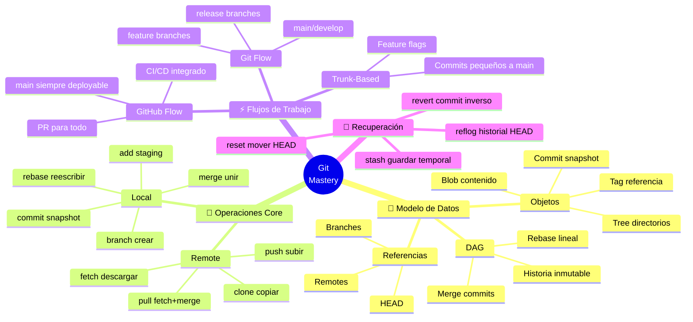

<!-- 
╔══════════════════════════════════════════════════════════════╗
║  📚 BLOQUE: GIT VERSION CONTROL                              ║
║  Nivel: 1 | Fase: Herramientas Profesionales                 ║
╚══════════════════════════════════════════════════════════════╝
-->

# 🌿 Git: Control de Versiones Profesional

> **Objetivo**: Dominar Git para trabajo en equipo profesional. No solo comandos básicos, sino flujos de trabajo, resolución de conflictos, y buenas prácticas.

---

## 🧠 Mapa Conceptual



---

## 🔗 First Principles: De la Teoría a la Práctica

| Concepto CS | Qué significa | Implementación en Git |
|-------------|---------------|----------------------|
| **DAG (Directed Acyclic Graph)** | Grafo donde las conexiones tienen dirección y no hay ciclos | La historia de Git es un DAG. Cada commit apunta a su(s) padre(s). Merge crea commit con 2 padres. |
| **Hash SHA-1** | Función que genera ID único de 40 caracteres | Cada objeto Git tiene un hash. El hash del commit incluye contenido + metadata + padre → historia inmutable. |
| **Snapshot vs Diff** | Guardar estado completo vs guardar cambios | Git guarda snapshots (estado completo), no diffs. Más espacio pero operaciones rápidas. |
| **Distributed System** | Cada nodo tiene copia completa | Cada `git clone` es un backup completo. Puedes trabajar offline. Push/pull sincronizan. |
| **Three-way merge** | Usar ancestro común para resolver conflictos | Git encuentra el "merge base" y combina los cambios de ambas ramas desde ese punto. |

> [!IMPORTANT]
> 🧠 **First Principle clave**: Git es un **content-addressable filesystem** con una capa de VCS encima. Los commits son **inmutables** (su hash cambia si cambias cualquier cosa). "Modificar historia" = crear nuevos commits con nuevos hashes.

---

## 📋 Technical Cheat Sheet

### 🖥️ Comandos CLI Críticos

```bash
# ═══════════════════════════════════════
# CONFIGURACIÓN INICIAL (una vez)
# ═══════════════════════════════════════
git config --global user.name "Tu Nombre"
git config --global user.email "tu@email.com"
git config --global init.defaultBranch main
git config --global pull.rebase false  # merge por defecto
git config --global core.editor "code --wait"  # VS Code como editor

# ═══════════════════════════════════════
# FLUJO DIARIO
# ═══════════════════════════════════════
# Ver estado (ÚSALO CONSTANTEMENTE)
git status
git status -s  # versión corta

# Ver diferencias
git diff                    # cambios no staged
git diff --staged           # cambios staged (listos para commit)
git diff main..feature      # diferencia entre branches

# Agregar cambios
git add archivo.py          # archivo específico
git add .                   # todo en directorio actual
git add -p                  # interactivo, elegir hunks

# Commit
git commit -m "Mensaje descriptivo"
git commit -am "Mensaje"    # add + commit (solo archivos tracked)

# ═══════════════════════════════════════
# BRANCHES
# ═══════════════════════════════════════
git branch                  # listar branches locales
git branch -a               # listar todas (incluye remotes)
git branch feature/nueva    # crear branch
git checkout feature/nueva  # cambiar a branch
git checkout -b feature/nueva  # crear Y cambiar (shortcut)
git switch feature/nueva    # alternativa moderna a checkout

# Eliminar branch
git branch -d feature/merged     # solo si ya está merged
git branch -D feature/abandoned  # forzar eliminación

# ═══════════════════════════════════════
# SINCRONIZACIÓN CON REMOTO
# ═══════════════════════════════════════
git fetch origin            # descargar cambios sin aplicar
git pull origin main        # fetch + merge
git push origin feature     # subir branch
git push -u origin feature  # subir y setear upstream

# Ver remotes
git remote -v

# ═══════════════════════════════════════
# MERGE Y REBASE
# ═══════════════════════════════════════
# Merge: Crea commit de merge, preserva historia
git checkout main
git merge feature/nueva

# Rebase: Reescribe historia, más lineal
git checkout feature/nueva
git rebase main

# ⚠️ NUNCA rebase branches públicos/compartidos

# ═══════════════════════════════════════
# DESHACER COSAS
# ═══════════════════════════════════════
# Deshacer cambios en working directory
git checkout -- archivo.py  # volver a último commit
git restore archivo.py      # alternativa moderna

# Deshacer staging
git reset HEAD archivo.py
git restore --staged archivo.py

# Deshacer último commit (mantener cambios)
git reset --soft HEAD~1

# Deshacer último commit (descartar cambios)
git reset --hard HEAD~1     # ⚠️ DESTRUCTIVO

# Crear commit que deshace otro (seguro para branches públicos)
git revert abc123

# ═══════════════════════════════════════
# DEBUGGING E INSPECCIÓN
# ═══════════════════════════════════════
git log --oneline --graph --all  # visualizar historia
git log -p archivo.py            # historia de un archivo con diffs
git blame archivo.py             # quién escribió cada línea
git show abc123                  # ver un commit específico
git reflog                       # historial de HEAD (recovery)
```

### 📝 Snippets de Alta Densidad

#### Patrón 1: Feature Branch Workflow

```bash
# 🔥 BEST PRACTICE: Flujo estándar en empresas

# 1. Actualizar main
git checkout main
git pull origin main

# 2. Crear feature branch
git checkout -b feature/add-user-validation

# 3. Trabajar, commit frecuente
git add .
git commit -m "Add email validation regex"
git add .
git commit -m "Add phone validation"

# 4. Antes de PR, actualizar con main
git fetch origin
git rebase origin/main
# Si hay conflictos, resolver y: git rebase --continue

# 5. Push y crear PR
git push -u origin feature/add-user-validation
# → Crear Pull Request en GitHub/GitLab

# 6. Después del merge, limpiar
git checkout main
git pull origin main
git branch -d feature/add-user-validation
```

#### Patrón 2: Resolución de Conflictos

```bash
# 🔥 BEST PRACTICE: Conflictos son normales, no los temas

# Git marca conflictos así:
<<<<<<< HEAD
código de la rama actual
=======
código de la rama que estás mergeando
>>>>>>> feature/otra-rama

# Pasos para resolver:
# 1. Abrir archivo con conflicto
# 2. Elegir qué código mantener (o combinar ambos)
# 3. Eliminar los marcadores (<<<<, ====, >>>>)
# 4. Agregar y continuar

git add archivo-resuelto.py
git merge --continue  # o git rebase --continue

# Tips:
# - VS Code tiene UI para elegir versiones
# - git diff --ours / git diff --theirs para ver cada lado
# - git checkout --ours / --theirs para elegir una versión completa
```

#### Patrón 3: Commits Atómicos y Mensajes

```bash
# 🔥 BEST PRACTICE: Un commit = un cambio lógico

# ❌ MALO
git commit -m "muchos cambios"
git commit -m "fix"
git commit -m "wip"

# ✅ BUENO - Formato: tipo(scope): descripción
git commit -m "feat(auth): add JWT token validation"
git commit -m "fix(api): handle null response from external service"
git commit -m "docs(readme): update installation instructions"
git commit -m "refactor(etl): extract common transformations to utils"
git commit -m "test(user): add unit tests for validation"

# Tipos comunes: feat, fix, docs, style, refactor, test, chore

# Si necesitas descripción larga:
git commit -m "feat(pipeline): add support for Parquet output" -m "
- Added pyarrow dependency
- Implemented ParquetWriter class
- Updated config to accept output_format parameter
"
```

### 🏗️ Patrones de Diseño Aplicados

#### 1. Git Flow (Proyectos con Releases)

```
main ─────●─────────────●─────────────●───→ (releases)
           \           / \           /
develop ────●───●───●──●───●───●───●──●───→ (integración)
             \     /     \     /
feature/a ────●───●       \   /
                           ● ─── feature/b
```

**Cuándo usar**: Software con versiones (v1.0, v2.0), necesidad de hotfixes.

#### 2. GitHub Flow (Despliegue Continuo)

```
main ────●────────●────────●────────●───→ (siempre deployable)
          \      / \      / \      /
           ●────●   ●────●   ●────●
           feature  feature  feature
```

**Cuándo usar**: Deployment continuo, main siempre listo para producción.

#### 3. Trunk-Based Development

```
main ──●──●──●──●──●──●──●──●──●──●───→
       │     │     │
      tiny  tiny  tiny commits
      
Feature flags: if (features.new_algo) { ... }
```

**Cuándo usar**: Equipos grandes, CI muy rápido, feature flags disponibles.

### ⚠️ Gotchas de Nivel Senior

> [!WARNING]
> **Gotcha #1: Rebase de branches públicos**
> 
> Rebase cambia los hashes de commits. Si alguien más basó trabajo en esos commits, su historia diverge.
> 
> ```bash
> # ❌ NUNCA hacer en branches que otros usan
> git checkout main
> git rebase feature  # MALO - cambia historia de main
> 
> # ✅ CORRECTO - rebase tu feature sobre main
> git checkout feature/mi-feature
> git rebase main  # OK - nadie más trabaja en mi-feature
> 
> # Si ya pusheaste y necesitas rebase:
> git push --force-with-lease  # más seguro que --force
> ```

> [!WARNING]
> **Gotcha #2: git pull sin especificar estrategia**
> 
> `git pull` hace fetch + merge por defecto, pero puede variar según config.
> 
> ```bash
> # Ser explícito
> git pull --rebase origin main  # fetch + rebase
> git pull --no-rebase origin main  # fetch + merge
> 
> # O configurar globalmente
> git config --global pull.rebase true   # siempre rebase
> git config --global pull.rebase false  # siempre merge
> ```

> [!WARNING]
> **Gotcha #3: Detached HEAD**
> 
> Checkout de un commit (no branch) te pone en "detached HEAD".
> 
> ```bash
> git checkout abc123  # checkout de commit
> # ⚠️ "You are in 'detached HEAD' state"
> 
> # Commits que hagas no pertenecen a ningún branch
> # Se pueden perder cuando cambies de branch
> 
> # ✅ Solución: crear branch si quieres mantener cambios
> git checkout -b recovery-branch
> ```

> [!WARNING]
> **Gotcha #4: .gitignore no ignora archivos ya tracked**
> 
> Añadir a .gitignore no elimina archivos que ya están en el repo.
> 
> ```bash
> # Archivo ya tracked, lo agregás a .gitignore
> echo "secrets.env" >> .gitignore
> git add .gitignore
> git commit -m "Ignore secrets"
> # El archivo sigue en el repo!
> 
> # ✅ Necesitas eliminarlo del tracking
> git rm --cached secrets.env  # elimina del repo, mantiene local
> git commit -m "Remove secrets from tracking"
> ```

> [!WARNING]
> **Gotcha #5: Merge vs Rebase - Cuándo cada uno**
> 
> ```bash
> # MERGE: Preserva historia real, muestra cuándo se integró
> # ✅ Para integrar features a main/develop
> # ✅ Para branches públicos/compartidos
> 
> # REBASE: Historia lineal, más fácil de leer
> # ✅ Para actualizar tu feature branch con main
> # ✅ Para limpiar commits antes de PR
> # ❌ NUNCA para branches que otros usan
> 
> # Squash merge (alternativa): Todos los commits de la feature → 1 commit
> git merge --squash feature
> git commit -m "feat: complete feature X"
> ```

---

## 📊 Comparativa de Estrategias

| Estrategia | Historia | Complejidad | Cuándo usar |
|------------|----------|-------------|-------------|
| **Merge** | Preservada, ramas visibles | Baja | Default para integración |
| **Rebase** | Lineal, limpia | Media | Actualizar feature branches |
| **Squash Merge** | 1 commit por feature | Baja | PRs con muchos commits WIP |
| **Fast-forward** | Lineal, sin merge commit | Baja | Si no divergió |

---

## 📚 Bibliografía Académica y Profesional

### 📖 Libros Seminales

| Libro | Autor | Capítulos relevantes | Por qué leerlo |
|-------|-------|---------------------|----------------|
| **Pro Git** (2nd Ed) | Scott Chacon | Caps. 1-3, 7 | Libro oficial, gratis online. Profundo pero accesible. |
| **Git Pocket Guide** | Richard Silverman | Todo (es corto) | Referencia rápida para el día a día. |

### 📋 Recursos Prácticos

- **Pro Git Book (gratis)**
  - 🔗 [git-scm.com/book](https://git-scm.com/book/en/v2)
  - Relevancia: LA referencia oficial, actualizada constantemente.

- **Learn Git Branching (interactivo)**
  - 🔗 [learngitbranching.js.org](https://learngitbranching.js.org/)
  - Relevancia: Visualización interactiva de comandos. Excelente para entender rebase.

- **Conventional Commits**
  - 🔗 [conventionalcommits.org](https://www.conventionalcommits.org/)
  - Relevancia: Estándar para mensajes de commit en equipos profesionales.

---

## ✅ Checklist de Dominio

Antes de avanzar, verifica que puedes:

- [ ] Crear y cambiar entre branches fluidamente
- [ ] Hacer merge sin miedo a conflictos
- [ ] Resolver conflictos sin pánico
- [ ] Usar rebase para limpiar historia de tu feature branch
- [ ] Recuperar trabajo con `git reflog`
- [ ] Escribir mensajes de commit claros y convencionales
- [ ] Explicar la diferencia entre merge y rebase
- [ ] Usar `git stash` para guardar trabajo temporal
- [ ] Configurar .gitignore correctamente
- [ ] Hacer PR con descripción clara y cambios atómicos

---

*Última actualización: Enero 2026 | Versión: 1.0.0*

