<!-- 
╔══════════════════════════════════════════════════════════════╗
║  📚 BLOQUE: APACHE AIRFLOW                                   ║
║  Nivel: 2 | Fase: Orquestación                               ║
╚══════════════════════════════════════════════════════════════╝
-->

# 🌊 Apache Airflow: Orquestación de Pipelines

> **Objetivo**: Dominar Airflow para orquestar pipelines de datos complejos. Entender DAGs, scheduling, dependencies, y best practices de producción.

---

## 🧠 Mapa Conceptual

```mermaid
mindmap
  root((Airflow
    Mastery))
    🔬 Arquitectura
      Webserver
        UI
        API
      Scheduler
        Parsing DAGs
        Triggering runs
      Workers
        Task execution
        Celery/K8s
      Metadatabase
        State
        History
    📖 Core Concepts
      DAG
        Directed Acyclic Graph
        Definición en Python
      Task
        Unidad de trabajo
        Operators
      Operator
        BashOperator
        PythonOperator
        Sensors
      Connections
        External systems
        Secrets
    ⚡ Scheduling
      Schedule Interval
        Cron expressions
        Presets
      Execution Date
        Data interval
        Logical date
      Backfill
        Historical runs
        Catchup
    🔧 Patterns
      Task Dependencies
        >> <<
        Cross-DAG
      Branching
        BranchOperator
        ShortCircuit
      Dynamic DAGs
        Jinja templating
        Macros
      XCom
        Task communication
        Small data only
```



---

## 🔗 First Principles: De la Teoría a la Práctica

| Concepto CS | Qué significa | Implementación en Airflow |
|-------------|---------------|--------------------------|
| **DAG (Grafo Acíclico Dirigido)** | Grafo con dirección sin ciclos | Un DAG define el orden de ejecución de tasks. No puedes crear dependencias circulares. |
| **Idempotencia** | Ejecutar N veces da mismo resultado que 1 vez | Tasks deben ser idempotentes. Re-ejecutar un task no debe crear duplicados o side effects. |
| **Scheduling** | Ejecutar tareas en momentos específicos | Airflow usa cron-like scheduling. El scheduler determina qué DAG runs crear. |
| **Data Interval** | Período de datos que un run procesa | Un run con `execution_date=2024-01-15` procesa datos de 2024-01-14 00:00 a 2024-01-15 00:00. |
| **Dependency Resolution** | Determinar orden de ejecución | Topological sort del DAG. Tasks upstream deben completar antes de downstream. |

> [!IMPORTANT]
> 🧠 **First Principle clave**: Airflow es un **orquestador**, no un ejecutor de datos. No mueve datos; **dispara tasks** que mueven datos. Cada task debe ser **idempotente** y **atómico**.

---

## 📋 Technical Cheat Sheet

### 🖥️ Comandos CLI Críticos

```bash
# Inicializar base de datos (primera vez)
airflow db init

# Crear usuario admin
airflow users create \
    --username admin \
    --firstname Admin \
    --lastname User \
    --role Admin \
    --email admin@example.com

# Listar DAGs
airflow dags list

# Validar DAG (syntax check)
airflow dags test my_dag 2024-01-01

# Trigger DAG manualmente
airflow dags trigger my_dag

# Trigger con config
airflow dags trigger my_dag --conf '{"key": "value"}'

# Backfill (ejecutar para fechas pasadas)
airflow dags backfill my_dag \
    --start-date 2024-01-01 \
    --end-date 2024-01-31

# Ver logs de un task
airflow tasks logs my_dag my_task 2024-01-01

# Ejecutar task individualmente (testing)
airflow tasks test my_dag my_task 2024-01-01

# Limpiar estado de tasks (para re-ejecutar)
airflow tasks clear my_dag \
    --start-date 2024-01-01 \
    --end-date 2024-01-31
```

### 📝 Snippets de Alta Densidad

#### Patrón 1: DAG Básico Moderno (Airflow 2.0+)

```python
# 🔥 BEST PRACTICE: Usar TaskFlow API para código limpio

from datetime import datetime, timedelta
from airflow.decorators import dag, task

default_args = {
    'owner': 'data-engineering',
    'depends_on_past': False,
    'email_on_failure': True,
    'email_on_retry': False,
    'retries': 3,
    'retry_delay': timedelta(minutes=5),
}

@dag(
    dag_id='etl_daily_sales',
    default_args=default_args,
    description='ETL diario de ventas',
    schedule='0 6 * * *',  # 6 AM UTC diario
    start_date=datetime(2024, 1, 1),
    catchup=False,
    tags=['sales', 'etl', 'production'],
)
def etl_daily_sales():
    
    @task()
    def extract():
        """Extraer datos de source."""
        import pandas as pd
        df = pd.read_csv('/data/sales.csv')
        return df.to_dict()  # XCom solo para datos pequeños
    
    @task()
    def transform(raw_data: dict):
        """Transformar datos."""
        import pandas as pd
        df = pd.DataFrame(raw_data)
        df['amount_with_tax'] = df['amount'] * 1.21
        return df.to_dict()
    
    @task()
    def load(transformed_data: dict):
        """Cargar a warehouse."""
        import pandas as pd
        df = pd.DataFrame(transformed_data)
        df.to_parquet('/output/sales_processed.parquet')
        return len(df)
    
    # Define dependencies con sintaxis funcional
    raw = extract()
    transformed = transform(raw)
    load(transformed)

# Instanciar el DAG
etl_daily_sales()
```

#### Patrón 2: Operators Tradicionales

```python
# 🔥 BEST PRACTICE: Operators para integraciones específicas

from airflow import DAG
from airflow.operators.python import PythonOperator
from airflow.operators.bash import BashOperator
from airflow.providers.postgres.operators.postgres import PostgresOperator
from airflow.providers.amazon.aws.operators.s3 import S3ListOperator
from airflow.sensors.filesystem import FileSensor

with DAG(
    dag_id='mixed_operators_example',
    schedule='@daily',
    start_date=datetime(2024, 1, 1),
    catchup=False,
) as dag:
    
    # Esperar a que exista un archivo
    wait_for_file = FileSensor(
        task_id='wait_for_file',
        filepath='/data/input/{{ ds }}.csv',
        poke_interval=60,  # Revisar cada 60 segundos
        timeout=3600,      # Timeout después de 1 hora
        mode='reschedule', # Liberar worker mientras espera
    )
    
    # Ejecutar SQL
    create_staging = PostgresOperator(
        task_id='create_staging_table',
        postgres_conn_id='warehouse',
        sql="""
            CREATE TABLE IF NOT EXISTS staging.sales_{{ ds_nodash }} (
                id SERIAL PRIMARY KEY,
                amount DECIMAL(10,2),
                date DATE
            );
        """,
    )
    
    # Ejecutar Python
    def process_data(**context):
        execution_date = context['ds']
        # Lógica de procesamiento
        return f"Processed data for {execution_date}"
    
    process = PythonOperator(
        task_id='process_data',
        python_callable=process_data,
    )
    
    # Ejecutar comando bash
    cleanup = BashOperator(
        task_id='cleanup',
        bash_command='rm -f /tmp/staging_*',
    )
    
    # Dependencies
    wait_for_file >> create_staging >> process >> cleanup
```

#### Patrón 3: Branching y Condicionales

```python
# 🔥 BEST PRACTICE: Branching para flujos condicionales

from airflow.operators.python import BranchPythonOperator
from airflow.operators.empty import EmptyOperator

def choose_branch(**context):
    """Decide qué branch ejecutar."""
    execution_date = context['ds']
    day_of_week = datetime.strptime(execution_date, '%Y-%m-%d').weekday()
    
    if day_of_week < 5:  # Lunes a Viernes
        return 'weekday_processing'
    else:
        return 'weekend_processing'

with DAG('branching_example', ...) as dag:
    
    start = EmptyOperator(task_id='start')
    
    branch = BranchPythonOperator(
        task_id='branch_by_day',
        python_callable=choose_branch,
    )
    
    weekday = PythonOperator(
        task_id='weekday_processing',
        python_callable=process_weekday,
    )
    
    weekend = PythonOperator(
        task_id='weekend_processing',
        python_callable=process_weekend,
    )
    
    # Join después de branches (trigger_rule importante!)
    join = EmptyOperator(
        task_id='join',
        trigger_rule='none_failed_min_one_success',
    )
    
    end = EmptyOperator(task_id='end')
    
    start >> branch >> [weekday, weekend] >> join >> end
```

#### Patrón 4: Templating con Jinja

```python
# 🔥 BEST PRACTICE: Usar templating para DAGs dinámicos

# Variables disponibles en templates:
# {{ ds }}             - 2024-01-15
# {{ ds_nodash }}      - 20240115
# {{ execution_date }} - datetime object
# {{ prev_ds }}        - 2024-01-14
# {{ next_ds }}        - 2024-01-16
# {{ data_interval_start }} - inicio del intervalo
# {{ data_interval_end }}   - fin del intervalo
# {{ params.my_param }}     - parámetros custom

BashOperator(
    task_id='load_partition',
    bash_command='''
        aws s3 cp s3://bucket/data/{{ ds }}/ /local/data/
        python process.py --date {{ ds }} --output /output/{{ ds_nodash }}/
    ''',
)

PostgresOperator(
    task_id='insert_data',
    sql="""
        INSERT INTO target_table
        SELECT * FROM staging_table
        WHERE date = '{{ ds }}'
        AND processed_at >= '{{ data_interval_start }}'
        AND processed_at < '{{ data_interval_end }}';
    """,
)

# Con params
@task()
def process_with_params(**context):
    params = context['params']
    table = params['target_table']
    # ...

# En el DAG
process_with_params.override(params={'target_table': 'sales'})()
```

### 🏗️ Patrones de Diseño Aplicados

#### 1. Sensor + Process + Load

```python
# Patrón común: esperar datos, procesar, cargar

with DAG('sensor_pattern', ...) as dag:
    
    # Sensor: esperar a que datos estén disponibles
    wait_for_data = S3KeySensor(
        task_id='wait_for_data',
        bucket_name='raw-data',
        bucket_key='sales/{{ ds }}/*.parquet',
        aws_conn_id='aws_default',
        mode='reschedule',
        poke_interval=300,  # 5 minutos
        timeout=7200,       # 2 horas
    )
    
    # Process: transformar
    process = SparkSubmitOperator(
        task_id='spark_transform',
        application='/opt/spark/jobs/transform.py',
        conn_id='spark_default',
        application_args=['--date', '{{ ds }}'],
    )
    
    # Load: cargar a warehouse
    load = PostgresOperator(
        task_id='load_warehouse',
        sql='sql/load_sales.sql',
    )
    
    # Quality check
    quality = PythonOperator(
        task_id='quality_check',
        python_callable=run_quality_checks,
    )
    
    wait_for_data >> process >> load >> quality
```

#### 2. Dynamic DAG Generation

```python
# Generar tasks dinámicamente

def create_table_tasks(tables: list):
    """Crear tasks para cada tabla."""
    tasks = []
    for table in tables:
        task = PythonOperator(
            task_id=f'process_{table}',
            python_callable=process_table,
            op_kwargs={'table_name': table},
        )
        tasks.append(task)
    return tasks

TABLES = ['customers', 'orders', 'products', 'inventory']

with DAG('dynamic_tables', ...) as dag:
    start = EmptyOperator(task_id='start')
    end = EmptyOperator(task_id='end')
    
    table_tasks = create_table_tasks(TABLES)
    
    start >> table_tasks >> end  # Parallel processing
```

### ⚠️ Gotchas de Nivel Senior

> [!WARNING]
> **Gotcha #1: XCom para datos grandes**
> 
> XCom está diseñado para metadata pequeña, no para datasets.
> 
> ```python
> # ❌ MALO - XCom en base de datos, límite ~48KB (depende del backend)
> @task()
> def extract():
>     df = pd.read_csv('huge.csv')  # 100MB
>     return df.to_dict()  # Explota
> 
> # ✅ CORRECTO - Usar almacenamiento externo
> @task()
> def extract():
>     df = pd.read_csv('huge.csv')
>     path = f's3://bucket/staging/{execution_date}.parquet'
>     df.to_parquet(path)
>     return path  # Solo retornar el path
> 
> @task()
> def transform(path: str):
>     df = pd.read_parquet(path)
>     # ...
> ```

> [!WARNING]
> **Gotcha #2: Imports al nivel del módulo**
> 
> Imports lentos en el nivel del archivo ralentizan el scheduler.
> 
> ```python
> # ❌ LENTO - Import al parsear el DAG
> import pandas as pd
> import tensorflow as tf  # Muy pesado
> 
> @task()
> def process():
>     df = pd.read_csv(...)
> 
> # ✅ RÁPIDO - Import dentro del task
> @task()
> def process():
>     import pandas as pd
>     import tensorflow as tf  # Solo cuando ejecuta el task
>     df = pd.read_csv(...)
> ```

> [!WARNING]
> **Gotcha #3: Execution Date confusion**
> 
> `execution_date` es el INICIO del intervalo, no cuándo corre.
> 
> ```python
> # Schedule: @daily, start_date: 2024-01-01
> # El run de 2024-01-02 tiene execution_date = 2024-01-01
> # Procesa datos del 2024-01-01 00:00 al 2024-01-02 00:00
> 
> # Airflow 2.2+ usa data_interval que es más claro:
> @task()
> def process(**context):
>     start = context['data_interval_start']  # 2024-01-01 00:00
>     end = context['data_interval_end']      # 2024-01-02 00:00
>     logical_date = context['logical_date']  # 2024-01-01 (alias de execution_date)
> ```

> [!WARNING]
> **Gotcha #4: depends_on_past en cadena**
> 
> `depends_on_past=True` puede bloquear el DAG completamente si falla un run.
> 
> ```python
> # ❌ RIESGOSO - Un fallo bloquea todos los runs futuros
> default_args = {
>     'depends_on_past': True,
> }
> 
> # ✅ MEJOR - Solo para tasks específicos que lo necesitan
> sensitive_task = PythonOperator(
>     task_id='sensitive',
>     python_callable=func,
>     depends_on_past=True,  # Solo este task
> )
> ```

---

## 📚 Bibliografía Académica y Profesional

### 📖 Libros y Recursos

| Recurso | Tipo | Por qué leerlo |
|---------|------|----------------|
| **Data Pipelines with Apache Airflow** | Libro - Harenslak & de Ruiter | LA referencia completa para Airflow |
| **Airflow Documentation** | Docs oficiales | Siempre actualizado, ejemplos abundantes |
| **Astronomer Guides** | Blog técnico | Best practices de producción |

### 📋 Recursos Prácticos

- **Airflow Documentation** - 🔗 [airflow.apache.org](https://airflow.apache.org/docs/)
- **Astronomer Academy** - 🔗 [academy.astronomer.io](https://academy.astronomer.io/) - Cursos gratuitos
- **Awesome Airflow** - 🔗 [github.com/jghoman/awesome-apache-airflow](https://github.com/jghoman/awesome-apache-airflow)

---

## ✅ Checklist de Dominio

Antes de avanzar, verifica que puedes:

- [ ] Escribir DAGs con TaskFlow API
- [ ] Usar templating Jinja efectivamente
- [ ] Configurar sensors correctamente (mode='reschedule')
- [ ] Implementar branching y trigger rules
- [ ] Manejar XCom correctamente (solo metadata)
- [ ] Debuggear DAGs con `airflow tasks test`
- [ ] Explicar la diferencia entre execution_date y run_date
- [ ] Configurar retries y alertas
- [ ] Hacer backfill de datos históricos
- [ ] Diseñar DAGs idempotentes

---

*Última actualización: Enero 2026 | Versión: 1.0.0*

