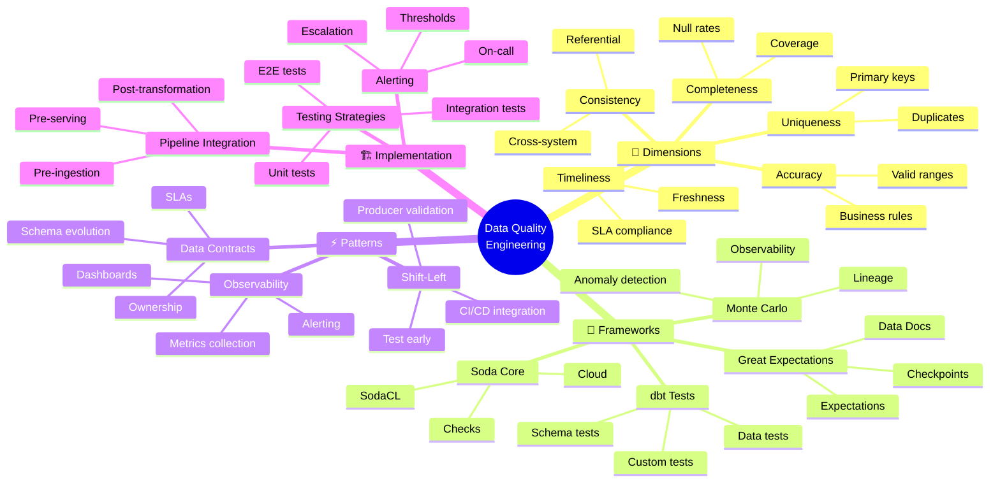

<!-- 
╔══════════════════════════════════════════════════════════════╗
║  📚 BLOQUE: DATA QUALITY                                     ║
║  Nivel: 2 | Fase: Quality Engineering                       ║
╚══════════════════════════════════════════════════════════════╝
-->

# ✅ Data Quality: Frameworks y Testing

> **Objetivo**: Implementar data quality como parte integral del pipeline. Dominar Great Expectations, data contracts, y estrategias de testing para datos.

---

## 🧠 Mapa Conceptual



---

## 🔗 First Principles: De la Teoría a la Práctica

| Concepto | Qué significa | Implementación Práctica |
|----------|---------------|------------------------|
| **Schema Validation** | Estructura de datos correcta | Verificar tipos, columnas requeridas, formatos antes de procesar. |
| **Statistical Profiling** | Entender distribución de datos | Detectar anomalías comparando con perfiles históricos. |
| **Data Contracts** | Acuerdo entre productor y consumidor | Schema, SLAs, y ownership documentados y versionados. |
| **Shift-Left Testing** | Detectar problemas lo antes posible | Validar en ingesta, no solo al final del pipeline. |
| **Observability** | Saber el estado de los datos en todo momento | Métricas, logs, y alertas sobre calidad de datos. |

> [!IMPORTANT]
> 🧠 **First Principle clave**: La calidad de datos no es un paso final, es una **propiedad del pipeline**. Cada transformación debe validar entrada y salida. "Garbage in, garbage out" se previene con validación continua.

---

## 📋 Technical Cheat Sheet

### 🖥️ Great Expectations - Comandos CLI

```bash
# Inicializar proyecto
great_expectations init

# Crear datasource
great_expectations datasource new

# Generar suite de expectations automáticamente
great_expectations suite new --profile orders_table

# Editar expectations interactivamente
great_expectations suite edit orders_expectations

# Ejecutar checkpoint
great_expectations checkpoint run orders_checkpoint

# Generar documentación
great_expectations docs build
```

### 📝 Great Expectations - Expectation Suite

```python
# expectations/orders_expectations.py
# 🔥 BEST PRACTICE: Expectations basadas en reglas de negocio

import great_expectations as gx

# Crear contexto
context = gx.get_context()

# Crear expectation suite
suite = context.add_expectation_suite("orders_suite")

# ═══════════════════════════════════════════════════
# COMPLETENESS - Campos requeridos no nulos
# ═══════════════════════════════════════════════════

validator.expect_column_values_to_not_be_null(
    column="order_id",
    meta={"dimension": "completeness", "severity": "critical"}
)

validator.expect_column_values_to_not_be_null(
    column="customer_id",
    meta={"dimension": "completeness", "severity": "critical"}
)

validator.expect_column_values_to_not_be_null(
    column="order_amount",
    mostly=0.99,  # Permitir 1% nulos
    meta={"dimension": "completeness", "severity": "warning"}
)

# ═══════════════════════════════════════════════════
# UNIQUENESS - Primary keys
# ═══════════════════════════════════════════════════

validator.expect_column_values_to_be_unique(
    column="order_id",
    meta={"dimension": "uniqueness", "severity": "critical"}
)

validator.expect_compound_columns_to_be_unique(
    column_list=["order_id", "line_item_id"],
    meta={"dimension": "uniqueness", "severity": "critical"}
)

# ═══════════════════════════════════════════════════
# ACCURACY - Rangos válidos
# ═══════════════════════════════════════════════════

validator.expect_column_values_to_be_between(
    column="order_amount",
    min_value=0,
    max_value=1_000_000,
    meta={"dimension": "accuracy", "severity": "warning"}
)

validator.expect_column_values_to_be_in_set(
    column="order_status",
    value_set=["pending", "processing", "shipped", "delivered", "cancelled"],
    meta={"dimension": "accuracy", "severity": "critical"}
)

validator.expect_column_values_to_match_regex(
    column="email",
    regex=r"^[a-zA-Z0-9_.+-]+@[a-zA-Z0-9-]+\.[a-zA-Z0-9-.]+$",
    mostly=0.95,
    meta={"dimension": "accuracy", "severity": "warning"}
)

# ═══════════════════════════════════════════════════
# CONSISTENCY - Referencial
# ═══════════════════════════════════════════════════

validator.expect_column_values_to_be_in_type_list(
    column="order_date",
    type_list=["datetime64", "Timestamp"],
    meta={"dimension": "consistency", "severity": "critical"}
)

# Fechas no futuras
from datetime import datetime
validator.expect_column_values_to_be_between(
    column="order_date",
    max_value=datetime.now().isoformat(),
    meta={"dimension": "consistency", "severity": "warning"}
)

# ═══════════════════════════════════════════════════
# STATISTICAL - Anomaly detection
# ═══════════════════════════════════════════════════

validator.expect_column_mean_to_be_between(
    column="order_amount",
    min_value=50,
    max_value=500,
    meta={"dimension": "statistical", "severity": "warning"}
)

validator.expect_table_row_count_to_be_between(
    min_value=1000,
    max_value=1_000_000,
    meta={"dimension": "volume", "severity": "warning"}
)
```

### 📝 dbt Tests Integration

```yaml
# models/marts/core/_core_models.yml
version: 2

models:
  - name: fct_orders
    description: "Fact table de órdenes"
    
    # Tests a nivel de modelo
    tests:
      - dbt_utils.recency:
          datepart: hour
          field: order_created_at
          interval: 24
          
    columns:
      - name: order_id
        description: "Primary key"
        tests:
          - unique
          - not_null
          
      - name: customer_id
        description: "Foreign key a dim_customers"
        tests:
          - not_null
          - relationships:
              to: ref('dim_customers')
              field: customer_id
              
      - name: order_amount
        description: "Monto de la orden en USD"
        tests:
          - not_null
          - dbt_utils.accepted_range:
              min_value: 0
              max_value: 1000000
              
      - name: order_status
        description: "Estado de la orden"
        tests:
          - accepted_values:
              values: ['pending', 'processing', 'shipped', 'delivered', 'cancelled']
```

### 📝 Data Contracts - Definición

```yaml
# contracts/orders_contract.yaml
# 🔥 BEST PRACTICE: Contrato versionado entre productor y consumidor

apiVersion: datacontract.com/v1
kind: DataContract
metadata:
  name: orders-v2
  version: 2.0.0
  owner: data-engineering@company.com
  
spec:
  # ═══════════════════════════════════════════════════
  # SCHEMA DEFINITION
  # ═══════════════════════════════════════════════════
  schema:
    type: object
    properties:
      order_id:
        type: string
        format: uuid
        description: "Unique order identifier"
        required: true
        
      customer_id:
        type: string
        description: "Customer reference"
        required: true
        
      order_amount:
        type: number
        minimum: 0
        maximum: 1000000
        description: "Order amount in USD"
        required: true
        
      order_status:
        type: string
        enum: [pending, processing, shipped, delivered, cancelled]
        description: "Current order status"
        required: true
        
      order_created_at:
        type: string
        format: date-time
        description: "Order creation timestamp (UTC)"
        required: true

  # ═══════════════════════════════════════════════════
  # QUALITY SLAs
  # ═══════════════════════════════════════════════════
  quality:
    completeness:
      threshold: 99.9%
      columns: [order_id, customer_id, order_amount]
      
    freshness:
      maxDelay: 1 hour
      
    uniqueness:
      columns: [order_id]
      threshold: 100%
      
  # ═══════════════════════════════════════════════════
  # OPERATIONAL SLAs
  # ═══════════════════════════════════════════════════
  sla:
    availability: 99.9%
    latency: P95 < 100ms
    support:
      oncall: data-engineering-oncall@company.com
      slack: "#data-quality-alerts"
      
  # ═══════════════════════════════════════════════════
  # CHANGE MANAGEMENT
  # ═══════════════════════════════════════════════════
  evolution:
    strategy: backward-compatible
    deprecationPeriod: 30 days
    notificationChannels:
      - slack: "#data-announcements"
      - email: data-consumers@company.com
```

### 🏗️ Pipeline Integration Pattern

```python
# pipeline/quality_gates.py
# 🔥 BEST PRACTICE: Quality gates en cada etapa

import great_expectations as gx
from dataclasses import dataclass
from enum import Enum
from typing import List, Optional

class Severity(Enum):
    CRITICAL = "critical"   # Bloquea pipeline
    WARNING = "warning"     # Alerta pero continúa
    INFO = "info"          # Solo logging

@dataclass
class QualityResult:
    passed: bool
    critical_failures: List[str]
    warnings: List[str]
    statistics: dict

class QualityGate:
    """Quality gate para integrar en pipelines"""
    
    def __init__(self, checkpoint_name: str):
        self.context = gx.get_context()
        self.checkpoint_name = checkpoint_name
    
    def validate(self, batch_data) -> QualityResult:
        """Ejecutar validación y retornar resultado estructurado"""
        
        result = self.context.run_checkpoint(
            checkpoint_name=self.checkpoint_name,
            batch_request=batch_data
        )
        
        critical_failures = []
        warnings = []
        
        for validation_result in result.list_validation_results():
            for exp_result in validation_result.results:
                if not exp_result.success:
                    severity = exp_result.expectation_config.meta.get(
                        "severity", "warning"
                    )
                    message = self._format_failure(exp_result)
                    
                    if severity == "critical":
                        critical_failures.append(message)
                    else:
                        warnings.append(message)
        
        return QualityResult(
            passed=len(critical_failures) == 0,
            critical_failures=critical_failures,
            warnings=warnings,
            statistics=result.get_statistics()
        )
    
    def _format_failure(self, result) -> str:
        exp_type = result.expectation_config.expectation_type
        column = result.expectation_config.kwargs.get("column", "N/A")
        return f"{exp_type} failed on column '{column}'"


# Uso en pipeline
def etl_pipeline():
    """Pipeline con quality gates integrados"""
    
    # 1. Extract
    raw_data = extract_from_source()
    
    # 2. Quality Gate: Pre-transformation
    pre_gate = QualityGate("raw_orders_checkpoint")
    pre_result = pre_gate.validate(raw_data)
    
    if not pre_result.passed:
        raise DataQualityError(
            f"Pre-transformation quality check failed: {pre_result.critical_failures}"
        )
    
    if pre_result.warnings:
        log.warning(f"Quality warnings: {pre_result.warnings}")
    
    # 3. Transform
    transformed_data = transform(raw_data)
    
    # 4. Quality Gate: Post-transformation
    post_gate = QualityGate("transformed_orders_checkpoint")
    post_result = post_gate.validate(transformed_data)
    
    if not post_result.passed:
        raise DataQualityError(
            f"Post-transformation quality check failed: {post_result.critical_failures}"
        )
    
    # 5. Load
    load_to_warehouse(transformed_data)
    
    return post_result.statistics
```

### ⚠️ Gotchas de Nivel Senior

> [!WARNING]
> **Gotcha #1: Tests que solo pasan en producción**
> 
> Tests con valores hardcodeados fallan en dev/staging.
> 
> ```python
> # ❌ EVITAR - Hardcoded para prod
> expect_table_row_count_to_be_between(min_value=1000000)
> 
> # ✅ CORRECTO - Configuración por ambiente
> import os
> env = os.getenv("ENV", "dev")
> min_rows = {"dev": 100, "staging": 1000, "prod": 1000000}
> expect_table_row_count_to_be_between(min_value=min_rows[env])
> ```

> [!WARNING]
> **Gotcha #2: mostly=1.0 es muy estricto**
> 
> Datos reales siempre tienen excepciones.
> 
> ```python
> # ❌ FRÁGIL - 1 registro malo rompe el pipeline
> expect_column_values_to_not_be_null(column="email", mostly=1.0)
> 
> # ✅ ROBUSTO - Tolera excepciones razonables
> expect_column_values_to_not_be_null(column="email", mostly=0.99)
> ```

> [!WARNING]
> **Gotcha #3: Tests síncronos bloquean el pipeline**
> 
> Validaciones pesadas pueden dominar el tiempo de ejecución.
> 
> ```python
> # ✅ Ejecutar tests en paralelo cuando es posible
> from concurrent.futures import ThreadPoolExecutor
> 
> with ThreadPoolExecutor(max_workers=4) as executor:
>     results = list(executor.map(run_checkpoint, checkpoints))
> ```

---

## 📊 Dimensiones de Data Quality

| Dimensión | Métrica | Herramienta | Threshold típico |
|-----------|---------|-------------|------------------|
| **Completeness** | % campos no nulos | GX, dbt | >99% |
| **Uniqueness** | % duplicados | GX, dbt | 0% en PKs |
| **Accuracy** | % en rango válido | GX | >99% |
| **Consistency** | % referencias válidas | dbt relationships | 100% |
| **Timeliness** | Freshness | dbt, GX | <1 hora |
| **Volume** | Row count delta | GX | ±20% |

---

## 📚 Bibliografía Académica y Profesional

### 📖 Recursos Seminales

| Recurso | Autor | Por qué consumirlo |
|---------|-------|-------------------|
| **Great Expectations Docs** | GX Team | Documentación oficial excelente. |
| **Data Quality Fundamentals** | Barr Moses | Libro comprehensivo sobre observabilidad. |
| **The Data Warehouse Toolkit** | Ralph Kimball | Capítulos sobre calidad en ETL. |

### 📄 Papers y Recursos

1. **"Data Contracts for the Modern Data Stack"**
   - 🔗 [Atlan Blog](https://atlan.com/data-contracts/)
   - 💡 **Insight clave**: Patrón de contratos entre equipos.

2. **"Shift-Left Data Quality"**
   - 🔗 [Monte Carlo Blog](https://www.montecarlodata.com/)
   - 💡 **Insight clave**: Validar temprano, no al final.

---

## ✅ Checklist de Dominio

Antes de avanzar, verifica que puedes:

- [ ] Inicializar un proyecto de Great Expectations
- [ ] Crear expectation suites basadas en reglas de negocio
- [ ] Integrar checkpoints en pipelines de producción
- [ ] Escribir dbt tests custom para validaciones complejas
- [ ] Definir data contracts con schema y SLAs
- [ ] Configurar alertas para fallas de calidad
- [ ] Implementar quality gates que bloquean cargas malas
- [ ] Diferenciar entre severidades (critical vs warning)
- [ ] Generar documentación automática de calidad
- [ ] Medir y reportar métricas de calidad de datos

---

*Última actualización: Enero 2026 | Versión: 1.0.0*

