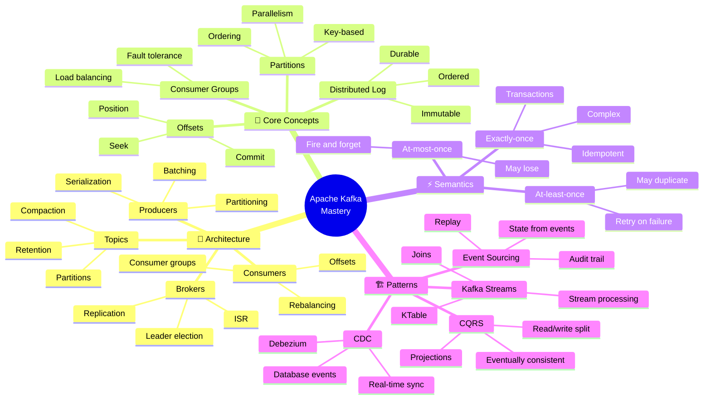

<!-- 
╔══════════════════════════════════════════════════════════════╗
║  📚 BLOQUE: APACHE KAFKA                                     ║
║  Nivel: 2 | Fase: Real-Time Streaming                       ║
╚══════════════════════════════════════════════════════════════╝
-->

# 📡 Kafka: Streaming en Tiempo Real

> **Objetivo**: Dominar Apache Kafka para streaming de datos. Entender event sourcing, exactly-once semantics, y arquitecturas event-driven.

---

## 🧠 Mapa Conceptual



---

## 🔗 First Principles: De la Teoría a la Práctica

| Concepto | Qué significa | Implementación en Kafka |
|----------|---------------|------------------------|
| **Distributed Log** | Secuencia ordenada e inmutable de eventos | Kafka es un commit log distribuido. Los mensajes se appendean, nunca se modifican. |
| **Partitions** | División del topic para paralelismo | Cada partición es una secuencia ordenada independiente. Keys determinan partición. |
| **Consumer Groups** | Múltiples consumidores cooperando | Cada partición asignada a un consumidor. Agregar consumidores = más paralelismo. |
| **Exactly-Once** | Cada mensaje procesado exactamente una vez | Requiere transacciones + idempotent producer + consumer commit atómico. |
| **Event Sourcing** | Estado derivado de secuencia de eventos | No guardas estado, guardas eventos. Estado = replay de eventos. |

> [!IMPORTANT]
> 🧠 **First Principle clave**: Kafka no es una message queue, es un **distributed commit log**. Los mensajes persisten por configuración de retención, no se borran al leer. Múltiples consumidores pueden leer los mismos mensajes.

---

## 📋 Technical Cheat Sheet

### 🖥️ Comandos CLI Críticos

```bash
# ═══════════════════════════════════════════════════
# TOPICS
# ═══════════════════════════════════════════════════

# Listar topics
kafka-topics.sh --bootstrap-server localhost:9092 --list

# Crear topic
kafka-topics.sh --bootstrap-server localhost:9092 \
  --create \
  --topic orders \
  --partitions 6 \
  --replication-factor 3 \
  --config retention.ms=604800000  # 7 días

# Describir topic
kafka-topics.sh --bootstrap-server localhost:9092 \
  --describe \
  --topic orders

# Aumentar particiones (no se puede reducir)
kafka-topics.sh --bootstrap-server localhost:9092 \
  --alter \
  --topic orders \
  --partitions 12

# ═══════════════════════════════════════════════════
# PRODUCER/CONSUMER CLI
# ═══════════════════════════════════════════════════

# Producir mensajes
kafka-console-producer.sh --bootstrap-server localhost:9092 \
  --topic orders

# Producir con key
kafka-console-producer.sh --bootstrap-server localhost:9092 \
  --topic orders \
  --property "key.separator=:" \
  --property "parse.key=true"
# Input: customer_123:{"order_id": "456"}

# Consumir desde inicio
kafka-console-consumer.sh --bootstrap-server localhost:9092 \
  --topic orders \
  --from-beginning

# Consumir con consumer group
kafka-console-consumer.sh --bootstrap-server localhost:9092 \
  --topic orders \
  --group my-consumer-group

# ═══════════════════════════════════════════════════
# CONSUMER GROUPS
# ═══════════════════════════════════════════════════

# Listar consumer groups
kafka-consumer-groups.sh --bootstrap-server localhost:9092 --list

# Describir consumer group (ver lag)
kafka-consumer-groups.sh --bootstrap-server localhost:9092 \
  --describe \
  --group my-consumer-group

# Reset offsets a inicio
kafka-consumer-groups.sh --bootstrap-server localhost:9092 \
  --group my-consumer-group \
  --topic orders \
  --reset-offsets \
  --to-earliest \
  --execute

# Reset a timestamp específico
kafka-consumer-groups.sh --bootstrap-server localhost:9092 \
  --group my-consumer-group \
  --topic orders \
  --reset-offsets \
  --to-datetime "2026-01-01T00:00:00.000" \
  --execute
```

### 📝 Producer en Python

```python
# producer.py
# 🔥 BEST PRACTICE: Idempotent producer con retry

from confluent_kafka import Producer
import json
import logging

logging.basicConfig(level=logging.INFO)
logger = logging.getLogger(__name__)

# Configuración de producción
config = {
    'bootstrap.servers': 'localhost:9092',
    
    # 🔒 Idempotencia - evita duplicados en retry
    'enable.idempotence': True,
    
    # Acknowledgments - esperar a replicas
    'acks': 'all',  # Espera a todas las replicas en ISR
    
    # Retries automáticos
    'retries': 5,
    'retry.backoff.ms': 100,
    
    # Batching para throughput
    'batch.size': 16384,  # 16KB
    'linger.ms': 5,  # Esperar hasta 5ms para batch
    
    # Compresión
    'compression.type': 'snappy'
}

producer = Producer(config)

def delivery_callback(err, msg):
    """Callback ejecutado cuando mensaje es acknowledged"""
    if err:
        logger.error(f'Delivery failed: {err}')
    else:
        logger.info(f'Message delivered to {msg.topic()}[{msg.partition()}] @ offset {msg.offset()}')

def produce_order(order: dict):
    """Producir orden con key para partitioning consistente"""
    
    # Key = customer_id para que órdenes del mismo cliente vayan a la misma partición
    key = order['customer_id']
    value = json.dumps(order)
    
    producer.produce(
        topic='orders',
        key=key.encode('utf-8'),
        value=value.encode('utf-8'),
        callback=delivery_callback
    )
    
    # Flush periódico (o al final del batch)
    producer.poll(0)  # Trigger callbacks sin bloquear

def close():
    """Flush todos los mensajes pendientes"""
    producer.flush(timeout=10)  # Esperar hasta 10 segundos

# Uso
if __name__ == '__main__':
    orders = [
        {'order_id': '1', 'customer_id': 'c100', 'amount': 99.99},
        {'order_id': '2', 'customer_id': 'c100', 'amount': 149.99},
        {'order_id': '3', 'customer_id': 'c200', 'amount': 29.99},
    ]
    
    for order in orders:
        produce_order(order)
    
    close()
```

### 📝 Consumer en Python

```python
# consumer.py
# 🔥 BEST PRACTICE: Consumer con manejo de errores y commit manual

from confluent_kafka import Consumer, KafkaError, KafkaException
import json
import logging

logging.basicConfig(level=logging.INFO)
logger = logging.getLogger(__name__)

config = {
    'bootstrap.servers': 'localhost:9092',
    'group.id': 'order-processor',
    
    # 🔒 Manual commit para control de exactly-once
    'enable.auto.commit': False,
    
    # Desde dónde empezar si no hay offset guardado
    'auto.offset.reset': 'earliest',
    
    # Aislación de transacciones
    'isolation.level': 'read_committed',
    
    # Max records por poll
    'max.poll.records': 500,
}

consumer = Consumer(config)

def process_message(msg):
    """Procesar mensaje individual"""
    try:
        key = msg.key().decode('utf-8') if msg.key() else None
        value = json.loads(msg.value().decode('utf-8'))
        
        logger.info(f"Processing order: {value['order_id']} for customer: {key}")
        
        # Tu lógica de negocio aquí
        save_to_database(value)
        
        return True
    except Exception as e:
        logger.error(f"Error processing message: {e}")
        return False

def consume_loop():
    """Loop principal de consumo"""
    consumer.subscribe(['orders'])
    
    try:
        while True:
            msg = consumer.poll(timeout=1.0)
            
            if msg is None:
                continue
            
            if msg.error():
                if msg.error().code() == KafkaError._PARTITION_EOF:
                    # End of partition - normal
                    logger.debug(f'Reached end of partition {msg.partition()}')
                else:
                    raise KafkaException(msg.error())
            else:
                # Procesar mensaje
                success = process_message(msg)
                
                if success:
                    # ✅ Commit solo si procesamos exitosamente
                    consumer.commit(msg)
                else:
                    # ❌ No commiteamos - se re-procesará
                    logger.warning("Message not committed, will retry")
                    
    except KeyboardInterrupt:
        logger.info("Shutting down...")
    finally:
        consumer.close()

if __name__ == '__main__':
    consume_loop()
```

### 📝 Exactly-Once con Transacciones

```python
# transactional_producer.py
# 🔥 BEST PRACTICE: Transacciones para exactly-once

from confluent_kafka import Producer

config = {
    'bootstrap.servers': 'localhost:9092',
    'transactional.id': 'order-processor-tx-1',  # ID único para transacción
    'enable.idempotence': True,
    'acks': 'all'
}

producer = Producer(config)

# Inicializar transacciones (una vez al inicio)
producer.init_transactions()

def process_and_produce_transactionally(input_messages):
    """
    Lee de un topic, procesa, y escribe a otro topic
    de forma atómica (exactly-once)
    """
    try:
        producer.begin_transaction()
        
        for msg in input_messages:
            # Transformar mensaje
            transformed = transform(msg)
            
            # Producir resultado
            producer.produce(
                topic='processed-orders',
                value=json.dumps(transformed).encode('utf-8')
            )
        
        # Commit de la transacción (incluye offsets del consumer)
        producer.commit_transaction()
        
    except Exception as e:
        # Abort si algo falla - nada se escribe
        producer.abort_transaction()
        raise e
```

### 🏗️ Arquitectura Event-Driven

```
┌─────────────────────────────────────────────────────────────────┐
│                    EVENT-DRIVEN ARCHITECTURE                     │
│                                                                 │
│  ┌─────────────┐         ┌─────────────────────────────────┐  │
│  │ Web App     │───────▶ │        KAFKA CLUSTER            │  │
│  └─────────────┘         │                                 │  │
│                          │  ┌───────────────────────────┐ │  │
│  ┌─────────────┐         │  │ Topic: orders              │ │  │
│  │ Mobile App  │───────▶ │  │ Partitions: 12            │ │  │
│  └─────────────┘         │  │ Replication: 3            │ │  │
│                          │  └───────────────────────────┘ │  │
│  ┌─────────────┐         │                                 │  │
│  │ API Gateway │───────▶ │  ┌───────────────────────────┐ │  │
│  └─────────────┘         │  │ Topic: inventory-events   │ │  │
│                          │  └───────────────────────────┘ │  │
│                          │                                 │  │
│                          │  ┌───────────────────────────┐ │  │
│                          │  │ Topic: notifications      │ │  │
│                          │  └───────────────────────────┘ │  │
│                          └───────┬─────────────┬──────────┘  │
│                                  │             │              │
│            ┌─────────────────────┼─────────────┼────────┐    │
│            ▼                     ▼             ▼        │    │
│   ┌─────────────────┐  ┌─────────────┐  ┌───────────┐  │    │
│   │ Order Service   │  │ Inventory   │  │ Email     │  │    │
│   │ (Kafka Streams) │  │ Service     │  │ Service   │  │    │
│   └─────────────────┘  └─────────────┘  └───────────┘  │    │
│                                                         │    │
│   ┌─────────────────┐  ┌─────────────┐  ┌───────────┐  │    │
│   │ Analytics       │  │ Data Lake   │  │ Search    │  │    │
│   │ (Flink)         │  │ (S3 Sink)   │  │ (Elastic) │  │    │
│   └─────────────────┘  └─────────────┘  └───────────┘  │    │
│            CONSUMERS                                    │    │
└─────────────────────────────────────────────────────────────┘
```

### ⚠️ Gotchas de Nivel Senior

> [!WARNING]
> **Gotcha #1: Partitions y ordering**
> 
> El orden solo está garantizado DENTRO de una partición.
> 
> ```python
> # ❌ INCORRECTO - Órdenes de mismo cliente pueden desordenarse
> producer.produce(topic='orders', value=order)  # Random partition
> 
> # ✅ CORRECTO - Key = customer_id para ordenamiento
> producer.produce(
>     topic='orders', 
>     key=customer_id.encode(),  # Mismo key → misma partición
>     value=order
> )
> ```

> [!WARNING]
> **Gotcha #2: Consumer group rebalancing**
> 
> Rebalancing causa duplicados si no manejas correctamente.
> 
> ```python
> # ✅ Commit síncrono antes de rebalance
> def on_revoke(consumer, partitions):
>     consumer.commit(asynchronous=False)
>     
> consumer.subscribe(['orders'], on_revoke=on_revoke)
> ```

> [!WARNING]
> **Gotcha #3: Lag creciente sin bound**
> 
> Si consumidores son más lentos que productores, lag crece infinito.
> 
> ```bash
> # Monitorear lag constantemente
> kafka-consumer-groups.sh --describe --group my-group
> 
> # Si lag crece: escalar consumidores (hasta # particiones)
> ```

> [!WARNING]
> **Gotcha #4: Log compaction y tombstones**
> 
> Topics compacted borran mensajes antiguos con mismo key.
> 
> ```bash
> # Para topics de state (CDC), usar compaction
> --config cleanup.policy=compact
> 
> # Delete = mensaje con value=null (tombstone)
> producer.produce(topic='users', key='user_123', value=None)
> ```

---

## 📊 Comparativa de Delivery Semantics

| Semántica | Garantía | Implementación | Cuándo usar |
|-----------|----------|----------------|-------------|
| **At-most-once** | Puede perder | Fire-and-forget, acks=0 | Logs, métricas no críticas |
| **At-least-once** | Puede duplicar | Retry + manual commit | Default, con idempotencia en consumer |
| **Exactly-once** | Exacto | Transactions + EOS | Financiero, crítico |

---

## 📚 Bibliografía Académica y Profesional

### 📖 Recursos Seminales

| Recurso | Autor | Por qué consumirlo |
|---------|-------|-------------------|
| **Kafka: The Definitive Guide** | Narkhede, Shapira & Palino | El libro completo de O'Reilly. |
| **Designing Event-Driven Systems** | Ben Stopford | Free ebook de Confluent sobre arquitecturas. |
| **Kafka Documentation** | Confluent | Referencia oficial actualizada. |

### 📄 Papers Clave

1. **"Kafka: a Distributed Messaging System for Log Processing"** (LinkedIn, 2011)
   - 🔗 [Original Paper](https://www.microsoft.com/en-us/research/wp-content/uploads/2017/09/Kafka.pdf)
   - 💡 **Insight clave**: Diseño original de Kafka como log distribuido.

2. **"Exactly-once Semantics in Apache Kafka"** (Confluent, 2017)
   - 🔗 [Confluent Blog](https://www.confluent.io/blog/exactly-once-semantics-are-possible-heres-how-apache-kafka-does-it/)
   - 💡 **Insight clave**: Implementación de exactly-once con transactions.

---

## ✅ Checklist de Dominio

Antes de avanzar, verifica que puedes:

- [ ] Crear topics con particiones y replicación adecuadas
- [ ] Escribir producers con idempotencia habilitada
- [ ] Implementar consumers con commit manual
- [ ] Explicar la diferencia entre at-least-once y exactly-once
- [ ] Usar consumer groups para paralelismo
- [ ] Monitorear lag y diagnosticar problemas
- [ ] Implementar transacciones para exactly-once
- [ ] Diseñar esquema de partitioning basado en keys
- [ ] Manejar rebalancing sin perder mensajes
- [ ] Elegir retention policy correcta (time vs size vs compact)

---

*Última actualización: Enero 2026 | Versión: 1.0.0*

