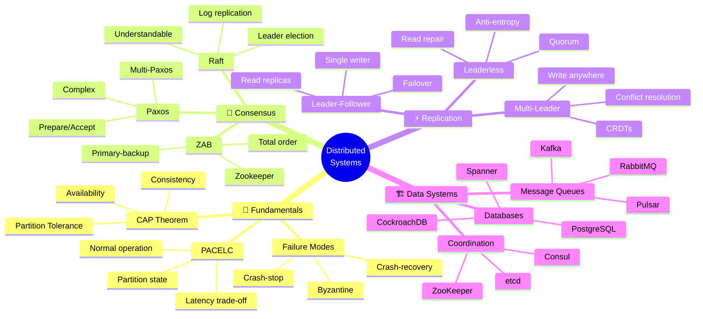

<!-- 
╔══════════════════════════════════════════════════════════════╗
║  📚 BLOQUE: DISTRIBUTED SYSTEMS                              ║
║  Nivel: 3 | Fase: Advanced Architecture                     ║
╚══════════════════════════════════════════════════════════════╝
-->

# 🌐 Distributed Systems: Consenso y Replicación

> **Objetivo**: Entender los fundamentos teóricos de sistemas distribuidos. CAP theorem, algoritmos de consenso, y patrones de replicación usados en sistemas de datos.

---

## 🧠 Mapa Conceptual



---

## 🔗 First Principles: De la Teoría a la Práctica

| Concepto | Qué significa | Sistemas que lo usan |
|----------|---------------|---------------------|
| **CAP Theorem** | Solo puedes elegir 2 de 3: Consistency, Availability, Partition tolerance | Todos los sistemas distribuidos. La partición es inevitable, eliges C o A. |
| **Consensus** | Múltiples nodos acuerdan un valor | Raft en etcd/Consul, Paxos en Spanner, ZAB en ZooKeeper. |
| **Strong Consistency** | Todos ven el mismo valor al mismo tiempo | Spanner (TrueTime), CockroachDB. Alto costo de latencia. |
| **Eventual Consistency** | Eventualmente todos convergen al mismo valor | DynamoDB, Cassandra. Baja latencia, complejidad en app. |
| **Quorum** | Mayoría necesaria para operación | R + W > N para consistencia fuerte. Cassandra, Dynamo. |

> [!IMPORTANT]
> 🧠 **First Principle clave**: En sistemas distribuidos, **las fallas son la norma, no la excepción**. Diseña asumiendo que cualquier componente puede fallar en cualquier momento.

---

## 📋 Technical Deep Dive

### 📐 CAP Theorem Visualizado

```
┌─────────────────────────────────────────────────────────────┐
│                      CAP THEOREM                            │
│                                                             │
│              Consistency                                    │
│                  /\                                         │
│                 /  \                                        │
│                /    \                                       │
│      CP      /      \      CA                              │
│   Systems   /   ❌   \   Systems                           │
│            /  (Can't  \  (Impossible                       │
│           /   have all)\  in practice)                     │
│          /      3      \                                   │
│         /________________\                                  │
│   Availability ───────── Partition                         │
│                          Tolerance                          │
│              AP Systems                                     │
│                                                             │
│  ┌──────────────────────────────────────────────────────┐ │
│  │ CP: MongoDB, HBase, Redis Cluster, Spanner          │ │
│  │ AP: Cassandra, DynamoDB, CouchDB, Riak              │ │
│  │ CA: Single-node PostgreSQL (no distribution)        │ │
│  └──────────────────────────────────────────────────────┘ │
│                                                             │
└─────────────────────────────────────────────────────────────┘
```

### 📐 Raft Algorithm Explained

```
┌─────────────────────────────────────────────────────────────┐
│                    RAFT CONSENSUS                           │
│                                                             │
│  ┌─────────────────────────────────────────────────────┐  │
│  │                 1. LEADER ELECTION                   │  │
│  │                                                      │  │
│  │    [Follower] ──timeout──▶ [Candidate]              │  │
│  │         ▲                      │                     │  │
│  │         │                      │ RequestVote        │  │
│  │         │                      ▼                     │  │
│  │    [Follower] ◀──majority──  [Leader]               │  │
│  │                   votes                              │  │
│  └─────────────────────────────────────────────────────┘  │
│                                                             │
│  ┌─────────────────────────────────────────────────────┐  │
│  │                 2. LOG REPLICATION                   │  │
│  │                                                      │  │
│  │    Client ──write──▶ [Leader]                       │  │
│  │                         │                            │  │
│  │                         │ AppendEntries             │  │
│  │                         ▼                            │  │
│  │                    [Follower 1]                      │  │
│  │                    [Follower 2]                      │  │
│  │                         │                            │  │
│  │                         │ Majority ack              │  │
│  │                         ▼                            │  │
│  │                    Commit entry                      │  │
│  │                    Apply to state machine           │  │
│  └─────────────────────────────────────────────────────┘  │
│                                                             │
│  Key Properties:                                           │
│  • Only leader handles writes                              │
│  • Entries committed when majority replicated             │
│  • Heartbeats prevent new elections                       │
│  • Log matching: same index+term = same command           │
│                                                             │
└─────────────────────────────────────────────────────────────┘
```

### 📐 Replication Strategies

```
┌─────────────────────────────────────────────────────────────┐
│              REPLICATION STRATEGIES                         │
│                                                             │
│  ┌────────────────────────────────────────────────────┐   │
│  │ LEADER-FOLLOWER (Single-Leader)                    │   │
│  │                                                     │   │
│  │     Writes ──▶ [Leader] ──replicate──▶ [Follower]  │   │
│  │                   │                     [Follower]  │   │
│  │                   │                                 │   │
│  │     Reads ◀───────┴───────────────────────────────  │   │
│  │                                                     │   │
│  │ ✅ Simple, consistent writes                       │   │
│  │ ❌ Leader bottleneck, failover complexity          │   │
│  │ Examples: PostgreSQL, MySQL, MongoDB               │   │
│  └────────────────────────────────────────────────────┘   │
│                                                             │
│  ┌────────────────────────────────────────────────────┐   │
│  │ MULTI-LEADER                                        │   │
│  │                                                     │   │
│  │    [Leader A] ◀──conflicts──▶ [Leader B]           │   │
│  │        │                           │                │   │
│  │    [Follower]                 [Follower]            │   │
│  │                                                     │   │
│  │ ✅ Geographic distribution, no single point         │   │
│  │ ❌ Conflict resolution complexity                   │   │
│  │ Examples: CouchDB, Dynamo, multi-region DBs        │   │
│  └────────────────────────────────────────────────────┘   │
│                                                             │
│  ┌────────────────────────────────────────────────────┐   │
│  │ LEADERLESS (Quorum-based)                          │   │
│  │                                                     │   │
│  │    Client ──write──▶ [Node 1]                      │   │
│  │            │          [Node 2] (quorum W)          │   │
│  │            │          [Node 3]                      │   │
│  │            │                                        │   │
│  │            └──read───▶ [Node 2]                     │   │
│  │                        [Node 3] (quorum R)          │   │
│  │                                                     │   │
│  │ R + W > N for strong consistency                   │   │
│  │                                                     │   │
│  │ ✅ High availability, no leader election           │   │
│  │ ❌ Complex, potential stale reads                   │   │
│  │ Examples: Cassandra, Riak, DynamoDB                │   │
│  └────────────────────────────────────────────────────┘   │
│                                                             │
└─────────────────────────────────────────────────────────────┘
```

### 📝 Quorum Mathematics

```python
# quorum_calculator.py
# 🔥 Entendiendo quorums para sistemas distribuidos

def analyze_quorum(n: int, w: int, r: int) -> dict:
    """
    Analiza configuración de quorum
    
    Args:
        n: Número total de nodos
        w: Write quorum (nodos que deben confirmar write)
        r: Read quorum (nodos que deben responder read)
    
    Returns:
        Análisis de la configuración
    """
    
    # Consistencia fuerte: R + W > N
    # Esto garantiza que cualquier read ve el write más reciente
    strong_consistency = (r + w) > n
    
    # Tolerancia a fallas de escritura
    # Podemos perder (N - W) nodos y seguir escribiendo
    write_fault_tolerance = n - w
    
    # Tolerancia a fallas de lectura
    read_fault_tolerance = n - r
    
    # Ejemplos de configuraciones comunes
    configs = {
        "strong_consistency": strong_consistency,
        "write_fault_tolerance": write_fault_tolerance,
        "read_fault_tolerance": read_fault_tolerance,
        "latency_impact": "Higher W = slower writes, Higher R = slower reads"
    }
    
    return configs

# Ejemplos comunes
# ═══════════════════════════════════════════════════

# QUORUM (balanceado)
# N=3, W=2, R=2 → R+W=4 > 3 ✓ Strong consistency
# Tolera 1 falla para writes y reads
analyze_quorum(n=3, w=2, r=2)

# READ-HEAVY (optimizado para reads)  
# N=3, W=3, R=1 → R+W=4 > 3 ✓ Strong consistency
# Writes lentos (todos deben confirmar), reads rápidos
analyze_quorum(n=3, w=3, r=1)

# WRITE-HEAVY (optimizado para writes)
# N=3, W=1, R=3 → R+W=4 > 3 ✓ Strong consistency
# Writes rápidos, reads lentos
analyze_quorum(n=3, w=1, r=3)

# EVENTUAL CONSISTENCY
# N=3, W=1, R=1 → R+W=2 < 3 ✗ Eventual consistency
# Muy rápido pero puede leer datos stale
analyze_quorum(n=3, w=1, r=1)
```

### 📝 Conflict Resolution Strategies

```python
# conflict_resolution.py
# 🔥 Estrategias para resolver conflictos en multi-leader/leaderless

from dataclasses import dataclass
from datetime import datetime
from typing import Any

@dataclass
class VersionedValue:
    value: Any
    timestamp: datetime
    node_id: str
    vector_clock: dict  # {node_id: counter}

# ═══════════════════════════════════════════════════
# ESTRATEGIA 1: Last Write Wins (LWW)
# ═══════════════════════════════════════════════════

def resolve_lww(values: list[VersionedValue]) -> VersionedValue:
    """
    Last Write Wins - El timestamp más reciente gana.
    
    ⚠️ PROBLEMA: Puede perder writes concurrentes.
    Usado por: Cassandra (con timestamps del cliente)
    """
    return max(values, key=lambda v: v.timestamp)

# ═══════════════════════════════════════════════════
# ESTRATEGIA 2: Vector Clocks + Application Resolution
# ═══════════════════════════════════════════════════

def detect_conflicts_vector_clock(a: dict, b: dict) -> str:
    """
    Detecta si hay conflicto usando vector clocks.
    
    Returns: 'a_newer', 'b_newer', o 'conflict'
    """
    a_newer = False
    b_newer = False
    
    all_keys = set(a.keys()) | set(b.keys())
    
    for key in all_keys:
        a_val = a.get(key, 0)
        b_val = b.get(key, 0)
        
        if a_val > b_val:
            a_newer = True
        elif b_val > a_val:
            b_newer = True
    
    if a_newer and b_newer:
        return 'conflict'  # Escrituras concurrentes
    elif a_newer:
        return 'a_newer'
    elif b_newer:
        return 'b_newer'
    else:
        return 'equal'

# ═══════════════════════════════════════════════════
# ESTRATEGIA 3: CRDTs (Conflict-free Replicated Data Types)
# ═══════════════════════════════════════════════════

class GCounter:
    """
    Grow-only Counter CRDT.
    Cada nodo incrementa su propio contador.
    El valor total es la suma.
    
    ✅ VENTAJA: Merge siempre converge, sin conflictos.
    """
    
    def __init__(self, node_id: str):
        self.node_id = node_id
        self.counts = {}  # {node_id: count}
    
    def increment(self, amount: int = 1):
        current = self.counts.get(self.node_id, 0)
        self.counts[self.node_id] = current + amount
    
    def value(self) -> int:
        return sum(self.counts.values())
    
    def merge(self, other: 'GCounter'):
        """Merge toma el máximo de cada nodo - siempre converge"""
        all_keys = set(self.counts.keys()) | set(other.counts.keys())
        for key in all_keys:
            self.counts[key] = max(
                self.counts.get(key, 0),
                other.counts.get(key, 0)
            )

# Ejemplo de uso
# Node A: 5 incrementos
# Node B: 3 incrementos
# Después de merge: ambos ven 8
```

### ⚠️ Gotchas de Nivel Senior

> [!WARNING]
> **Gotcha #1: Clock Skew en LWW**
> 
> Relojes desincronizados causan pérdida de datos.
> 
> ```python
> # ❌ Si Node A tiene reloj 5 segundos adelante:
> # - Write de Node B (timestamp T) 
> # - Write de Node A (timestamp T+5) sobrescribe
> # - Datos de Node B perdidos aunque fue "después"
> 
> # ✅ Usar Hybrid Logical Clocks (HLC) o TrueTime (Spanner)
> ```

> [!WARNING]
> **Gotcha #2: Split Brain en Leader Election**
> 
> Sin quorum, puedes tener dos leaders.
> 
> ```python
> # ❌ Network partition divide cluster en dos
> # Cada partición elige su propio leader
> # Writes conflictivos cuando se reconectan
> 
> # ✅ Requiere mayoría (quorum) para elegir leader
> # Partition sin mayoría rechaza writes
> ```

> [!WARNING]
> **Gotcha #3: Linearizability vs Serializability**
> 
> Conceptos diferentes que se confunden.
> 
> ```python
> # Linearizability: Real-time ordering de operaciones
> # - Si A completa antes de que B empiece, todos ven A antes de B
> 
> # Serializability: Transacciones aparentan ejecutar en serie
> # - No garantiza orden real-time
> 
> # Strict Serializability = Linearizable + Serializable
> # (Lo que Spanner ofrece con TrueTime)
> ```

> [!WARNING]
> **Gotcha #4: Read-your-writes no es automático**
> 
> En sistemas eventualmente consistentes, puedes no ver tu propio write.
> 
> ```python
> # ❌ Usuario hace update, refresh, ve datos viejos
> write_to_leader(data)
> read_from_follower()  # ← Puede no tener el write aún
> 
> # ✅ Estrategias:
> # 1. Read-after-write: leer del leader después de write
> # 2. Session consistency: sticky sessions al mismo nodo
> # 3. Monotonic reads: siempre leer de nodo >= último leído
> ```

---

## 📊 Comparativa de Sistemas

| Sistema | Consensus | Consistency Model | Use Case |
|---------|-----------|-------------------|----------|
| **etcd** | Raft | Linearizable | Kubernetes coordination |
| **ZooKeeper** | ZAB | Linearizable | Distributed coordination |
| **Kafka** | ISR | Eventually consistent | Streaming |
| **Cassandra** | Quorum | Tunable (eventual to strong) | High-write workloads |
| **CockroachDB** | Raft | Serializable | Distributed SQL |
| **Spanner** | Paxos + TrueTime | External consistency | Global transactions |

---

## 📚 Bibliografía Académica y Profesional

### 📖 Libros Seminales

| Libro | Autor | Por qué leerlo |
|-------|-------|----------------|
| **Designing Data-Intensive Applications** | Martin Kleppmann | LA biblia de sistemas distribuidos. Obligatorio. |
| **Distributed Systems** | Maarten van Steen | Textbook académico comprehensivo. |
| **Database Internals** | Alex Petrov | Deep dive en implementación de DBs distribuidas. |

### 📄 Papers Clásicos

1. **"In Search of an Understandable Consensus Algorithm" (Raft)**
   - 🔗 [Raft Paper](https://raft.github.io/raft.pdf)
   - 💡 **Insight clave**: Raft fue diseñado para ser entendible, a diferencia de Paxos.

2. **"The Part-Time Parliament" (Paxos)**
   - 🔗 [Lamport's Paxos](https://lamport.azurewebsites.net/pubs/lamport-paxos.pdf)
   - 💡 **Insight clave**: El paper original de Paxos, famosamente difícil de entender.

3. **"Dynamo: Amazon's Highly Available Key-value Store"**
   - 🔗 [Dynamo Paper](https://www.allthingsdistributed.com/files/amazon-dynamo-sosp2007.pdf)
   - 💡 **Insight clave**: Diseño de DynamoDB, eventually consistent, quorum-based.

4. **"Spanner: Google's Globally-Distributed Database"**
   - 🔗 [Spanner Paper](https://research.google/pubs/pub39966/)
   - 💡 **Insight clave**: TrueTime para external consistency global.

5. **"Time, Clocks, and the Ordering of Events"**
   - 🔗 [Lamport Clocks](https://lamport.azurewebsites.net/pubs/time-clocks.pdf)
   - 💡 **Insight clave**: Fundamentos de ordenamiento en sistemas distribuidos.

---

## ✅ Checklist de Dominio

Antes de avanzar, verifica que puedes:

- [ ] Explicar CAP theorem y sus implicaciones prácticas
- [ ] Describir cómo funciona Raft (leader election + log replication)
- [ ] Calcular quorums para diferentes guarantees (R + W > N)
- [ ] Diferenciar entre strong y eventual consistency
- [ ] Explicar vector clocks y cómo detectan conflictos
- [ ] Describir estrategias de conflict resolution (LWW, CRDTs)
- [ ] Diferenciar entre linearizability y serializability
- [ ] Explicar por qué partition tolerance es obligatorio
- [ ] Identificar consistency model de sistemas como Kafka, Cassandra, Spanner
- [ ] Diseñar sistemas considerando failure modes

---

*Última actualización: Enero 2026 | Versión: 1.0.0*

