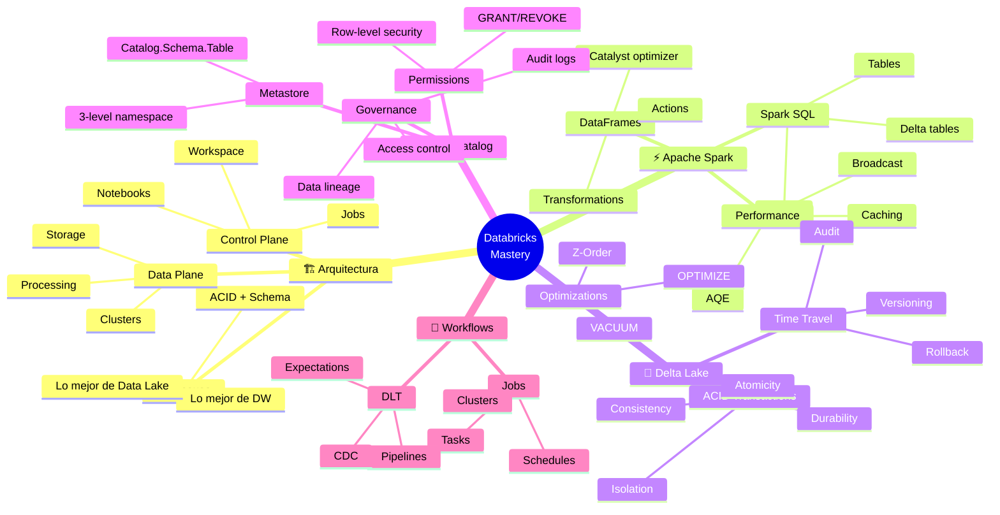

<!-- 
╔══════════════════════════════════════════════════════════════╗
║  📚 ESPECIALIZACIÓN: DATABRICKS                              ║
║  La plataforma unificada más demandada del mercado           ║
╚══════════════════════════════════════════════════════════════╝
-->

# 🔶 Databricks: La Plataforma Unificada de Datos

> **Objetivo**: Dominar Databricks desde cero hasta la certificación DE Associate. Incluye Spark optimizado, Delta Lake, Unity Catalog, y Workflows.

---

## 🧠 Mapa Conceptual



---

## 🔗 First Principles: De la Teoría a la Práctica

| Concepto | Qué significa | Implementación en Databricks |
|----------|---------------|------------------------------|
| **Lakehouse** | Combinar DW (estructura, ACID) + Data Lake (escala, formatos) | Delta Lake añade ACID y schema enforcement sobre Parquet en cloud storage. Lo mejor de ambos mundos. |
| **ACID en Data Lake** | Transacciones atómicas sobre archivos | Delta mantiene transaction log. Writes son atómicos. Reads son consistentes. No más archivos corruptos. |
| **Time Travel** | Acceder a versiones anteriores de datos | Delta guarda historial. `SELECT * FROM table VERSION AS OF 5` o `TIMESTAMP AS OF '2024-01-01'`. Audit y rollback fácil. |
| **Unity Catalog** | Governance centralizada | Un metastore para todo: tablas, ML models, dashboards. Permisos, lineage, audit en un solo lugar. |
| **Photon** | Engine C++ para queries | Reemplaza JVM para operaciones SQL. 2-8x más rápido para workloads analíticos. |

> [!IMPORTANT]
> 🧠 **First Principle clave**: Databricks es la evolución de Spark. Añade **Delta Lake** para reliability, **Unity Catalog** para governance, y **Photon** para performance. Es Spark con las rough edges pulidas.

---

## 📋 Technical Cheat Sheet

### 🖥️ Comandos Críticos en Notebooks

```python
# ═══════════════════════════════════════
# CONFIGURACIÓN Y CONTEXTO
# ═══════════════════════════════════════

# SparkSession ya está disponible como 'spark'
# No necesitas crear SparkSession en Databricks

# Ver configuración del cluster
spark.conf.get("spark.executor.memory")

# Ver catálogos disponibles (Unity Catalog)
spark.catalog.listCatalogs()

# Cambiar a un catálogo/schema
spark.sql("USE CATALOG my_catalog")
spark.sql("USE SCHEMA my_schema")

# O con 3-level namespace
spark.sql("USE my_catalog.my_schema")

# ═══════════════════════════════════════
# LECTURA Y ESCRITURA
# ═══════════════════════════════════════

# Leer Delta table
df = spark.read.table("catalog.schema.table_name")
df = spark.table("my_table")  # Si ya estás en el schema

# Leer desde path
df = spark.read.format("delta").load("/path/to/delta")
df = spark.read.parquet("/path/to/parquet")
df = spark.read.csv("/path/to/csv", header=True, inferSchema=True)

# Escribir como Delta table (managed)
df.write.mode("overwrite").saveAsTable("my_table")

# Escribir como Delta (external)
df.write.format("delta").mode("overwrite").save("/path/to/delta")

# Merge (upsert)
from delta.tables import DeltaTable

target = DeltaTable.forName(spark, "target_table")
target.alias("t").merge(
    source_df.alias("s"),
    "t.id = s.id"
).whenMatchedUpdate(
    set={"name": "s.name", "updated_at": "current_timestamp()"}
).whenNotMatchedInsert(
    values={"id": "s.id", "name": "s.name", "created_at": "current_timestamp()"}
).execute()
```

### 📝 Snippets de Alta Densidad

#### Patrón 1: Delta Lake Operations

```python
# 🔥 BEST PRACTICE: Operaciones Delta que debes dominar

from delta.tables import DeltaTable

# ═══ TIME TRAVEL ═══
# Por versión
df_v5 = spark.read.format("delta").option("versionAsOf", 5).load("/path/delta")

# Por timestamp
df_yesterday = spark.sql("""
    SELECT * FROM my_table TIMESTAMP AS OF '2024-01-15 10:00:00'
""")

# Ver historial
spark.sql("DESCRIBE HISTORY my_table").show()

# Restaurar a versión anterior
spark.sql("RESTORE TABLE my_table TO VERSION AS OF 5")

# ═══ OPTIMIZE ═══
# Compactar archivos pequeños (critical para performance)
spark.sql("OPTIMIZE my_table")

# Con Z-ORDER para queries frecuentes
spark.sql("OPTIMIZE my_table ZORDER BY (date, region)")

# ═══ VACUUM ═══
# Eliminar archivos viejos (default: 7 días retention)
spark.sql("VACUUM my_table")  # Dry run primero
spark.sql("VACUUM my_table RETAIN 168 HOURS")  # 7 días

# ⚠️ CUIDADO: Después de VACUUM, no puedes hacer time travel a versiones eliminadas

# ═══ SCHEMA EVOLUTION ═══
# Agregar columnas automáticamente
df.write.option("mergeSchema", "true").mode("append").saveAsTable("my_table")

# O permitir overwrite de schema
df.write.option("overwriteSchema", "true").mode("overwrite").saveAsTable("my_table")
```

#### Patrón 2: Optimización de Queries

```python
# 🔥 BEST PRACTICE: Performance tuning en Databricks

# ═══ CACHING ═══
# Cache en memoria (para reutilización)
df.cache()
df.count()  # Materializar cache

# Uncache cuando no se necesita
df.unpersist()

# ═══ BROADCAST ═══
from pyspark.sql.functions import broadcast

# Forzar broadcast para tablas pequeñas
df_result = df_large.join(broadcast(df_small), "key")

# Verificar en plan
df_result.explain()  # Debe mostrar BroadcastHashJoin

# ═══ PARTITION PRUNING ═══
# Particionar por columnas de filtro frecuente
df.write.partitionBy("year", "month").saveAsTable("partitioned_table")

# Query se beneficia automáticamente
df = spark.sql("SELECT * FROM partitioned_table WHERE year = 2024 AND month = 1")
# Solo lee particiones relevantes

# ═══ Z-ORDER ═══
# Para columnas de filtro que no son partition columns
spark.sql("""
    OPTIMIZE my_table 
    ZORDER BY (customer_id, product_id)
""")
# Queries con WHERE customer_id = X serán mucho más rápidas

# ═══ ADAPTIVE QUERY EXECUTION (AQE) ═══
# Habilitado por defecto en Databricks
spark.conf.set("spark.sql.adaptive.enabled", "true")
spark.conf.set("spark.sql.adaptive.skewJoin.enabled", "true")

# AQE automáticamente:
# - Combina particiones pequeñas post-shuffle
# - Convierte sort-merge joins a broadcast si una tabla es pequeña
# - Maneja data skew
```

#### Patrón 3: Delta Live Tables (DLT)

```python
# 🔥 BEST PRACTICE: DLT para pipelines declarativos

import dlt
from pyspark.sql.functions import *

# ═══ STREAMING TABLE (append-only) ═══
@dlt.table(
    comment="Raw events from Kafka",
    table_properties={"quality": "bronze"}
)
def raw_events():
    return (
        spark.readStream
        .format("kafka")
        .option("kafka.bootstrap.servers", "...")
        .option("subscribe", "events")
        .load()
        .select(
            col("key").cast("string"),
            from_json(col("value").cast("string"), schema).alias("data"),
            col("timestamp")
        )
    )

# ═══ MATERIALIZED VIEW (con transformación) ═══
@dlt.table(
    comment="Cleaned events",
    table_properties={"quality": "silver"}
)
@dlt.expect_or_drop("valid_user", "user_id IS NOT NULL")
@dlt.expect("valid_amount", "amount > 0")  # Solo warn, no drop
def cleaned_events():
    return (
        dlt.read_stream("raw_events")
        .select(
            "data.user_id",
            "data.event_type",
            "data.amount",
            "timestamp"
        )
        .withColumn("processed_at", current_timestamp())
    )

# ═══ AGGREGATED TABLE ═══
@dlt.table(
    comment="Daily metrics",
    table_properties={"quality": "gold"}
)
def daily_metrics():
    return (
        dlt.read("cleaned_events")
        .groupBy(to_date("timestamp").alias("date"))
        .agg(
            count("*").alias("event_count"),
            sum("amount").alias("total_amount"),
            countDistinct("user_id").alias("unique_users")
        )
    )
```

#### Patrón 4: Unity Catalog

```sql
-- 🔥 BEST PRACTICE: Governance con Unity Catalog

-- ═══ CREAR ESTRUCTURA ═══
CREATE CATALOG IF NOT EXISTS production;
CREATE SCHEMA IF NOT EXISTS production.sales;

-- ═══ PERMISOS ═══
-- Dar acceso de lectura a un grupo
GRANT SELECT ON SCHEMA production.sales TO `data-analysts`;

-- Dar acceso completo a un usuario
GRANT ALL PRIVILEGES ON SCHEMA production.sales TO `john.doe@company.com`;

-- Ver permisos
SHOW GRANTS ON SCHEMA production.sales;

-- ═══ ROW-LEVEL SECURITY ═══
-- Crear función de filtro
CREATE FUNCTION production.sales.region_filter()
RETURNS STRING
RETURN CASE 
    WHEN is_member('latam-team') THEN 'LATAM'
    WHEN is_member('emea-team') THEN 'EMEA'
    WHEN is_member('admin') THEN NULL  -- Sin filtro
    ELSE 'NONE'
END;

-- Aplicar a tabla
ALTER TABLE production.sales.orders
SET ROW FILTER production.sales.region_filter ON (region);

-- ═══ COLUMN MASKING ═══
CREATE FUNCTION production.sales.mask_email(email STRING)
RETURNS STRING
RETURN CASE
    WHEN is_member('pii-access') THEN email
    ELSE CONCAT(LEFT(email, 3), '***@***.com')
END;

ALTER TABLE production.sales.customers
ALTER COLUMN email SET MASK production.sales.mask_email;

-- ═══ LINEAGE ═══
-- Unity Catalog trackea lineage automáticamente
-- Ver en UI: Catalog Explorer > Table > Lineage tab
```

### 🏗️ Patrones de Diseño Aplicados

#### 1. Medallion Architecture

```
┌─────────────────────────────────────────────────────────────────────────┐
│                     MEDALLION ARCHITECTURE                              │
├─────────────────────────────────────────────────────────────────────────┤
│                                                                         │
│   BRONZE (Raw)              SILVER (Cleaned)         GOLD (Business)   │
│   ┌──────────────┐         ┌──────────────┐         ┌──────────────┐   │
│   │ raw_events   │   ───▶  │ cleaned_     │   ───▶  │ daily_       │   │
│   │              │         │ events       │         │ metrics      │   │
│   │ - As-is from │         │              │         │              │   │
│   │   source     │         │ - Deduped    │         │ - Aggregated │   │
│   │ - Schema on  │         │ - Validated  │         │ - Business   │   │
│   │   read       │         │ - Enriched   │         │   logic      │   │
│   │ - Append only│         │ - Typed      │         │ - Ready for  │   │
│   │              │         │              │         │   BI/ML      │   │
│   └──────────────┘         └──────────────┘         └──────────────┘   │
│                                                                         │
│   Características:                                                      │
│   - Cada capa en Delta Lake                                            │
│   - Bronze: Retención larga, schema flexible                           │
│   - Silver: Retención media, schema estricto                           │
│   - Gold: Optimizado para queries, Z-Order en columnas de filtro       │
└─────────────────────────────────────────────────────────────────────────┘
```

#### 2. Incremental Processing Pattern

```python
# Patrón para procesamiento incremental eficiente

from delta.tables import DeltaTable

def incremental_load(source_path: str, target_table: str, merge_keys: list):
    """
    Carga incremental con merge.
    Asume que source tiene columna 'updated_at'.
    """
    target = DeltaTable.forName(spark, target_table)
    
    # Obtener última marca de agua
    max_updated = spark.sql(f"""
        SELECT COALESCE(MAX(updated_at), '1900-01-01') 
        FROM {target_table}
    """).collect()[0][0]
    
    # Leer solo datos nuevos
    new_data = (
        spark.read.parquet(source_path)
        .filter(f"updated_at > '{max_updated}'")
    )
    
    if new_data.count() == 0:
        print("No new data to process")
        return
    
    # Merge
    merge_condition = " AND ".join([f"t.{k} = s.{k}" for k in merge_keys])
    
    target.alias("t").merge(
        new_data.alias("s"),
        merge_condition
    ).whenMatchedUpdateAll(
    ).whenNotMatchedInsertAll(
    ).execute()
    
    # Optimizar si hay muchos archivos nuevos
    spark.sql(f"OPTIMIZE {target_table}")
```

### ⚠️ Gotchas de Nivel Senior

> [!WARNING]
> **Gotcha #1: VACUUM y Time Travel**
> 
> VACUUM elimina archivos viejos. Después no puedes hacer time travel a esas versiones.
> 
> ```python
> # ❌ PELIGROSO si necesitas audit histórico
> spark.sql("VACUUM my_table RETAIN 0 HOURS")  # Elimina TODO
> 
> # ✅ Mantener retención apropiada
> # 7 días es el default y mínimo seguro
> spark.sql("VACUUM my_table RETAIN 168 HOURS")
> 
> # ✅ Para compliance, considera retención más larga
> # O guarda snapshots en storage separado
> ```

> [!WARNING]
> **Gotcha #2: Small files problem**
> 
> Muchos archivos pequeños = queries lentas.
> 
> ```python
> # Ver número y tamaño de archivos
> spark.sql("DESCRIBE DETAIL my_table").show()
> 
> # Si numFiles es muy alto y avgFileSize muy bajo:
> spark.sql("OPTIMIZE my_table")
> 
> # Configurar auto-optimize para escrituras frecuentes
> spark.sql("""
>     ALTER TABLE my_table 
>     SET TBLPROPERTIES (
>         'delta.autoOptimize.optimizeWrite' = 'true',
>         'delta.autoOptimize.autoCompact' = 'true'
>     )
> """)
> ```

> [!WARNING]
> **Gotcha #3: Cluster sizing**
> 
> Cluster muy grande = caro. Cluster muy pequeño = lento o falla.
> 
> ```
> REGLAS DE THUMB:
> 
> - 1 core = 1 task en paralelo
> - 4GB RAM por core mínimo para Spark
> - Para ETL batch: i3.xlarge o similar
> - Para SQL analytics: Photon habilitado
> 
> PARA ESTIMAR:
> - Datos a procesar / 128MB = número mínimo de particiones
> - Particiones / 2 = cores mínimos para paralelismo
> 
> SIEMPRE:
> - Usar autoscaling para workloads variables
> - Usar spot instances para jobs tolerantes a fallos
> ```

---

## 📚 Bibliografía y Certificación

### 📖 Recursos Oficiales

| Recurso | Tipo | Por qué leerlo |
|---------|------|----------------|
| **Databricks Academy** | Cursos gratis | Preparación oficial para certificación |
| **Delta Lake Documentation** | Docs | Referencia completa de Delta |
| **Databricks Blog** | Blog técnico | Best practices y features nuevas |

### 🎓 Certificación Databricks DE Associate

```
TEMAS DEL EXAMEN:

1. Databricks Lakehouse Platform (24%)
   - Arquitectura lakehouse
   - Delta Lake features
   - Photon

2. ELT with Spark SQL and Python (29%)
   - DataFrames y SQL
   - Delta Lake operations
   - Structured Streaming

3. Incremental Data Processing (22%)
   - Auto Loader
   - COPY INTO
   - Streaming

4. Production Pipelines (16%)
   - Delta Live Tables
   - Jobs
   - Scheduling

5. Data Governance (9%)
   - Unity Catalog
   - Permisos
   - Lineage

FORMATO:
- 45 preguntas
- 90 minutos
- 70% para aprobar
- Múltiple choice y múltiple respuesta
```

### 📋 Recursos de Práctica

- **Databricks Free Edition** - 🔗 [databricks.com/try-databricks-free](https://www.databricks.com/try-databricks-free) - Gratis para aprender (serverless, Unity Catalog, DLT, AI Assistant)
- **Databricks Academy** - 🔗 [databricks.com/learn/training](https://www.databricks.com/learn/training) - Cursos oficiales gratuitos
- **Delta Lake Documentation** - 🔗 [docs.delta.io](https://docs.delta.io/)

---

## ✅ Checklist de Dominio

Antes de la certificación, verifica que puedes:

- [ ] Explicar la arquitectura Lakehouse
- [ ] Crear y manipular Delta tables
- [ ] Usar Time Travel y RESTORE
- [ ] Optimizar tablas con OPTIMIZE y Z-ORDER
- [ ] Implementar Medallion architecture
- [ ] Escribir DLT pipelines con expectations
- [ ] Configurar Unity Catalog (catalogs, schemas, grants)
- [ ] Usar Auto Loader para ingesta incremental
- [ ] Crear y schedular Jobs
- [ ] Debuggear queries con Spark UI

---

*Última actualización: Enero 2026 | Versión: 2.0.0*

